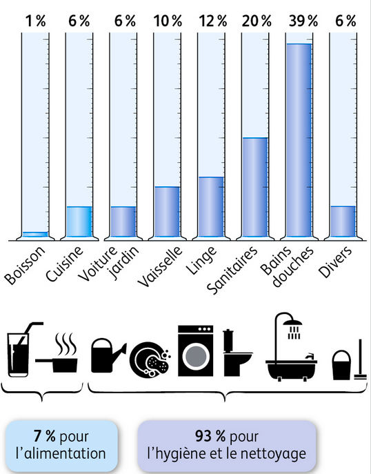

# Activité : Utilisation de l'eau

!!! note "Compétences"

    Utiliser l'outil mathématique

!!! warning "Consignes"

    1. Calculer le volume d’eau utilisée par l’alimentation en France et par les bains et les douches. (documents 1 et 2)
    2. Calculer combien d'eau peut être économiser en France par an en limitant l'utilisation d'eau lors du brossage de dents (document 3)

??? bug "Critères de réussite"
    Quantité d'eau consommée par une personne qui coupe le robinet à chaque brossage : 
    Quantité d'eau consommée par une personne qui ne coupe pas le robinet à chaque brossage : 

    Quantité d'eau consommée par une personne qui coupe le robinet par an : 
    Quantité d'eau consommée par une personne qui ne coupe pas le robinet par an : 

    Quantité d'eau consommée par toute la France si tout le monde  coupe le robinet par an : 
    Quantité d'eau consommée par par toute la France si personne ne coupe le robinet par an : 

**Document 1 les usages de l’eau en France.**

{:style="height:500px;"}

Chaque Français utilise en moyenne 137L d’eau par jour.

**Document 2 Utiliser les pourcentages.**

On peut à partir des pourcentages retrouver une quantité.

Quantité = pourcentage de la quantité * Total /100.

Par exemple dans le document 2, si on veut la quantité d’eau utilisée par la vaisselle.

Le pourcentage correspondant est 10 %.

Le total est de 137 L

Donc la quantité = 10 * 137 / 100 = 13,7 L

On utilise donc 13,7 L par jour pour la vaisselle.

**Document 3 Exemple de consommation d'eau**

Un robinet avec un économiseur d'eau a un débit de 3L/min 

Le brossage de dents doit durer 2 min, pendant ce brossage, on a besoin d'eau durant au maximum 30 secondes. 

??? note-prof "Correction"
    
    Consigne 1 : Décrire l’utilisation de l’eau du document1. (document 1)
    Ce graphique décrit l’évolution l’utilisation de l’eau dans le monde de 1900 à 2010.
    De 1900 à 2010, l’utilisation de l’eau a augmenté de 500 km3/ an à 4250km3/an.
    Consigne 2 : Calculer le volume d’eau utilisée par l’alimentation en France et par les bains et les douches. (document 2 et 3)
    Le pourcentage d’eau utilisé par l’alimentation est de 7 %, donc le volume d’eau utilisé est de 7*137/100 = 9,59L
    le pourcentage d’eau utilisé par les bains et les douches est de 39 %, donc le volume d’eau utilisé est de 39*137/100 = 53,43L
    
