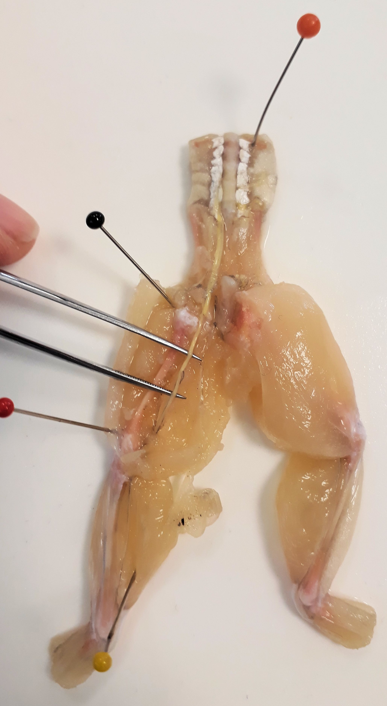
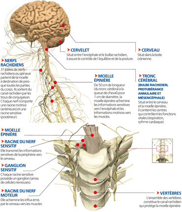
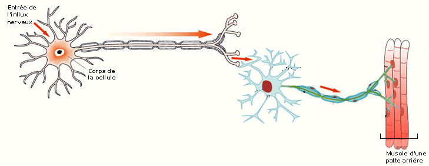
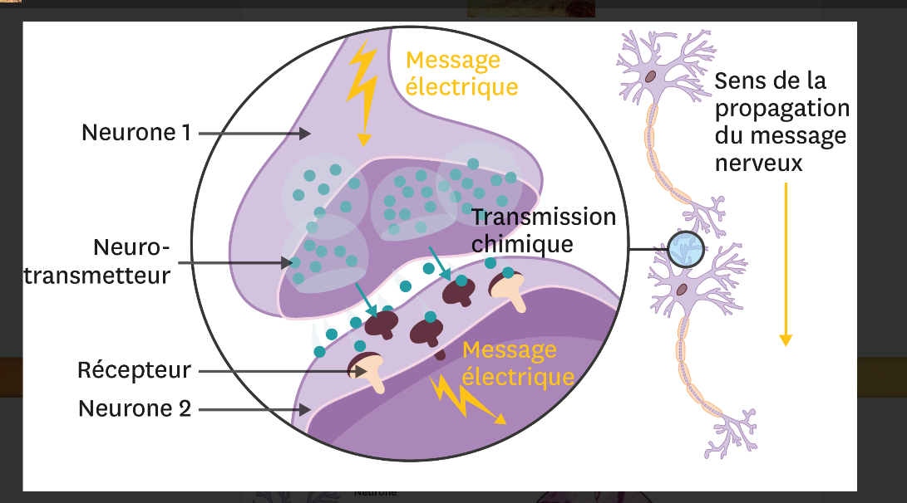
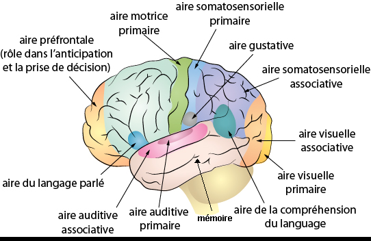
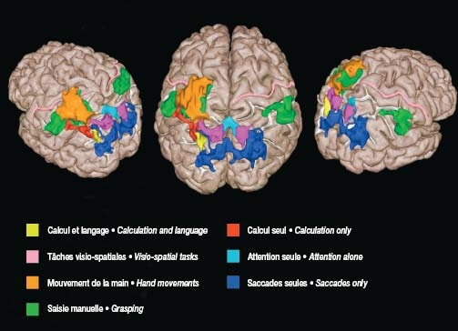

# Séquence : Le système nerveux

!!! note-prof
    si besoin d'infos

!!! question "Problématique"
    Comment fonctionne le système nerveux ?

    
### Document d’appel :

## Séance 1 : Le mouvement

!!! question "Problématique"
    Quels sont les organes impliqués dans la commande des mouvements ?

[Activité Les organes du mouvement](../organesMvt)

??? abstract "Bilan"
    La commande du mouvement se fait grâce à différents organes :
    
    - les muscles qui sont des organes effecteurs.
    - Le cerveau et la moelle épinière qui sont des centres nerveux.
    - Des organes sensoriels (par exemple, les yeux)
    
    L’information dans le corps est transmise par les nerfs.
    
    Lors d’une stimulation, l’organe sensoriel envoie l’information vers le cerveau à travers un nerf sensitif.
    Le cerveau transmet la commande du mouvement par un nerf moteur qui traverse la moelle épinière et va jusqu’aux muscles.

## Séance 2 : Les nerfs

{: style="width: 400px"}

[https://vimeo.com/263053418](https://vimeo.com/263053418)

!!! question "Problématique"
    De quoi sont composés les nerfs et les centres nerveux ?

[Activité Les cellules des nerfs](../nerfs)

??? abstract "Bilan"
    Un nerf est un organe en forme de tube qui contient un très grand nombre de fibres nerveuses (= axones).
    Une fibre nerveuse correspond au prolongement d’une cellule appelée neurone.

    Les centres nerveux sont eux aussi composés de neurones.

    Des organes récepteurs jusqu’au cerveau, et du cerveau jusqu’aux organes effecteurs, le message nerveux parcourt des nerfs.

## Séance 3 : La communication nerveuse

On a vu que la succession d’étapes entre le stimulus et la réaction.   
Le message qui va de l’œil au cerveau puis du cerveau au muscle.  
Ce message circule grâce à des nerfs.  
C’est le message nerveux.  
Les nerfs sont constitués de plusieurs neurones.  
Le message passe de neurone en neurone jusqu’aux muscles.

!!! question "Problématique"
    Comment se réalise la communication nerveuse entre neurones ?

[Activité Transmission du message de neurone en neurone](../commNerveuse)

??? abstract "Bilan"
    Les neurones sont des cellules qui permettent la transmission des messages nerveux.
    Le message nerveux circule de neurone en neurone jusqu’aux organes effecteurs (exemple : muscles).

    Dans un neurone, le message est de nature électrique.

    Au niveau des synapses neurone-neurone et des synapses neurone-muscle, le message nerveux est transmis par des substances chimiques, les neurotransmetteurs.

    Les messages nerveux sensitifs sont envoyés par les organes récepteurs vers le cerveau (= centre nerveux) via les nerfs sensitifs.
    Les messages nerveux moteurs sont envoyés par le cerveau  vers les organes effecteurs via les nerfs moteurs.

    

## Séance 4 : Le cerveau, élément central du système nerveux

!!! question "Problématique"
    Comment le cerveau traite-t-il les informations ?

[Activité Traitement des informations par le cerveau](../cerveauInfos)

??? abstract "Bilan"
    Les messages nerveux sensitifs sont envoyés par les organes récepteurs vers le cerveau (= centre nerveux) via les nerfs sensitifs.
    Les messages nerveux moteurs sont envoyés par le cerveau vers les organes effecteurs via les nerfs moteurs.
    
    Les messages nerveux sensitifs arrivent dans des aires cérébrales précises. Les aires cérébrales communiquent entre elles et traitent les informations reçues pour produire une réponse adaptée. Ce sont les neurones qui permettent ces communications dans le cerveau.

    Pour percevoir une sensation, le cerveau tient compte des différentes informations provenant des organes des sens, mais aussi des informations stockées dans la mémoire, chacun perçoit donc l’environnement différemment.

    Le réseau de neurones peut évoluer avec l’expérience, c’est la plasticité cérébrale.

    

    