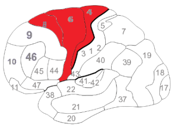
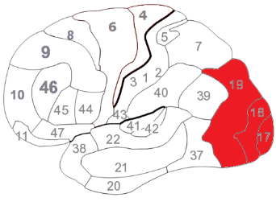
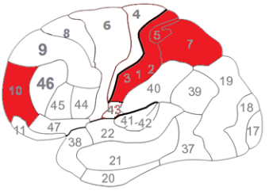
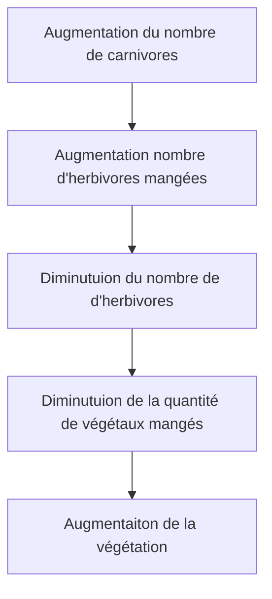
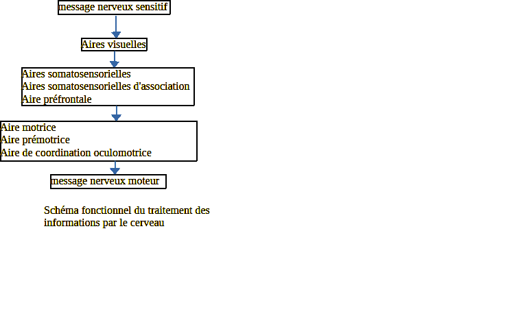

# Activité : Traitement des informations par le cerveau

!!! note "Compétences"

    Construire un schéma fonctionnel
 

!!! warning "Consignes"

    À partir des documents, construire un schéma fonctionnel expliquant comment le cerveau traite le message nerveux sensitif pour former un message nerveux moteur, dans le cas d'un élève qui voit une balle et va frapper dedans.
    
??? bug "Critères de réussite"
    - 

**Document 1 Les aires du cerveau**

Aires 1, 2 et 3 : Aires somatosensorielles

Aire 4 : Aire motrice

Aires 5 et 7 : Aires somatosensorielles d'association

Aire 6 : Aire prémotrice

Aire 8 : Aire de coordination oculomotrice

Aire 10 : Aire préfrontale

Aires 17, 18 et 19 : Aires visuelles

**Document 2 Activité du cerveau lorsqu'un individu frappe dans la balle.**

**Document 3 Activité du cerveau lorsqu'un individu voit le ballon.**

**Document 4 Activité du cerveau lorsqu'un individu pense au mouvement qu'il va réaliser pour frapper la balle.**

**Document 5 Réaliser un schéma fonctionnel :**

- Il explique le FONCTIONNEMENT DE QUELQUE CHOSE.
- On utilise des formes géométriques et des flèches pour les déplacements.  
- La légende reprend les formes utilisées et en donne leur signification.  
- La légende peut être indiquée par des flèches, directement sur le schéma ou dans une légende à part.

Étapes de réalisation :
1. lister les éléments indispensables à mettre dans le schéma
2. réfléchir à l'ordre des éléments
3. représenter de façon simple les éléments en utilisant des formes géométriques
4. établir des relations entre les éléments par des flèches (attention au sens des flèches)
5. Mettre un titre

Exemple de schéma fonctionnel

Schéma fonctionnel de l'influence du nombre de carnivores sur la végétation

??? note-prof "Correction"
    

