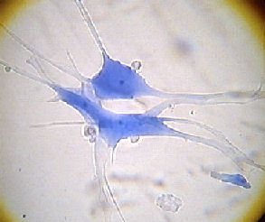
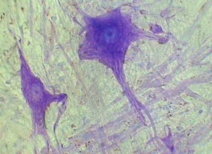

# Activité : Les cellules des nerfs

!!! note "Compétences"

    - Utiliser un microscope
    - Faire une dessin d'observation 

!!! warning "Consignes"

    1. Observer au microscope une lame de nerfs dissociés
    Faire un dessin d’un neurone, cellule composant les nerfs et les centres nerveux.

    Votre dessin comportera les légendes suivantes :
    <ul>
    <li>Corps cellulaire (qui est la zone contenant le noyau)</li>
    <li>Noyau</li>
    <li>Fibre nerveuse (zone allongée du neurone)</li>
    <li>Cytoplasme</li>
    <li>Membrane</li>
    <ul>
    2. Rédiger une phrase expliquant de quoi est composé un centre nerveux ou un nerf.
    
??? bug "Critères de réussite"
    - 

**Document 1 Photos de neurones (MO x600)**

[https://vimeo.com/263053418](https://vimeo.com/263053418)

**Document 2 Utiliser un microscope**

Le microscope est un outil qui permet d’observer des objets ou des êtres vivants microscopiques qui sont généralement invisibles à l’oeil nu. Comme les loupes il va permettre de grossir ce que l’on observe à l’aide d’objectifs.
Il est important de connaître les différentes parties du microscope pour bien comprendre comment l’utiliser et le ranger.
C’est un outil fragile : il est donc primordial d’en prendre le plus grand soin !

Utilisation :

- On transporte toujours le microscope en le prenant par la potence avec une main en dessous
- La lame doit être bloquée par les valets sur la platine, l'objet doit être placé au dessus du trou de la platine
- Allumer le microscope
- On commence toujours à observer à l’objectif rouge (x4)
- La mise au point se fait avec les vis macroscopique (les grosses) à l’objectif rouge, on tourne la vis jusqu'à observer nettement l'objet
- La mise au point se fait avec les vis microscopique (les petites) à partir de l’objectif jaune (x10) et bleu (x40/x60)

Rangement: 

1. On enlève la lame et on la dépose sur le bureau
2. On remet l’objectif sur le rouge (x4)
3. On range le câble soit autour du microscope, soit à l’arrière
4. On range le microscope là où on l’a trouvé

Calculer le grossissement
Pour savoir combien de fois on a grossi l’échantillon que l’on observe, il faut regarder le grossissement de l’oculaire (généralement x10) et celui de l’objectif (x4, x10 ou x40/x60). On les multiplie alors ensemble.

**Document 3 Réaliser un dessin d'observation**

Le dessin se fait au crayon )à papier
au centre de la feuille on dessine l'objet observé ou une partie de façon assez grosse pour que le dessin soit lisible
on met un titre avec  TYPE / NATURE du document  + ce qu’il REPRÉSENTE / MONTRE (+ Mode d’obtention : microscope, loupe avec le grossissement)

LÉGENDE :
mettre des flèches  ou des traits :

- faits à la règle
- parallèles (ne se croisent pas)
- horizontaux 

mettre mots de légende :

- au bout des traits
- dans la zone de légende.
