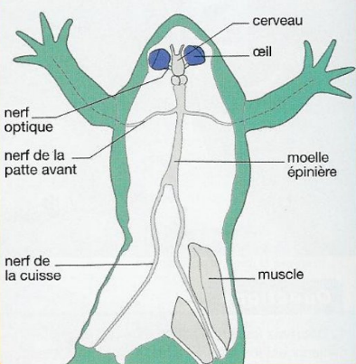
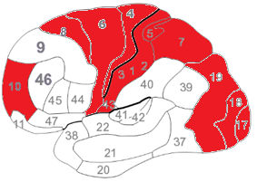
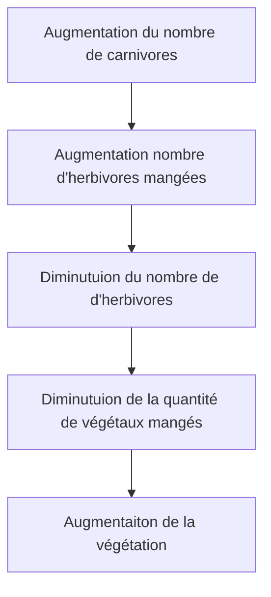

# Activité : Les organes du mouvement

!!! note "Compétences"

    Construire un schéma fonctionnel 

!!! warning "Consignes"

    1. Construisez un schéma fonctionnel pour expliquer ce qui se
    passe dans le corps du footballeur depuis le moment où il voit le ballon
    jusqu'à l'instant où il frappe la balle.

    2. Après avoir fait votre schéma, placer les termes suivants
    sur le schéma : réaction, organes sensoriels, stimulus et organes
    effecteurs.

    3. Ajouter nerf sensitif et nerf moteur sur les flèches
    concernées.
    
??? bug "Critères de réussite"
    - 


**Document 1 le système nerveux de la grenouille**



**Document 2 Les nerfs et la moelle épinière.**

Les nerfs sont reliés à différents organes de notre corps. Certains sont
reliés à des organes sensoriels, ce sont les nerfs sensitifs.

D'autres sont reliés à des organes effecteurs, ce sont les nerfs
moteurs.

Lorsqu'un nerf est endommagé par une maladie ou un accident, il n'est
plus possible de bouger le muscle relié par ce nerf moteur ou de
ressentir les informations de l'organe sensoriel

Lorsque la moelle épinière est endommagée, il n'est plus possible ni de
ressentir, ni de bouger, certaines parties de notre corps.


**Document 3 Activité cérébrale du footballeur lors du mouvement. Les zones du cerveau en activité sont colorées.**



**Document 4 Définitions.**

Organe sensoriel : organe contenant des récepteurs capables de détecter
des stimuli

Organe effecteur : organe qui effectue la réponse suite à un ou
plusieurs stimuli.

Stimulus (des stimuli) : signal qui peut provoquer une réponse de
l'organisme.


**Document 5 Réaliser un schéma fonctionnel :**

- Il explique le FONCTIONNEMENT DE QUELQUE CHOSE.
- On utilise des formes géométriques et des flèches pour les déplacements.  
- La légende reprend les formes utilisées et en donne leur signification.  
- La légende peut être indiquée par des flèches, directement sur le schéma ou dans une légende à part.

Étapes de réalisation :

1. lister les éléments indispensables à mettre dans le schéma
2. réfléchir à l'ordre des éléments
3. représenter de façon simple les éléments en utilisant des formes géométriques
4. établir des relations entre les éléments par des flèches (attention au sens des flèches)
5. Mettre un titre

Exemple de schéma fonctionnel

Schéma fonctionnel de l'influence du nombre de carnivores sur la végétation

??? note-prof "correction"

    Schéma fonctionnel de la commande du mouvement

    ```mermaid
        flowchart TD
            A[Ballon : stimulus ] --> B[Œil :organe sensoriel ] 
            B --> C[Cerveau ] 
            C --> D[Moelle épinière ]
            D --> E[Muscle : organe effecteur ]
            E --> F[Taper dans le ballon : réaction ]
    ```
