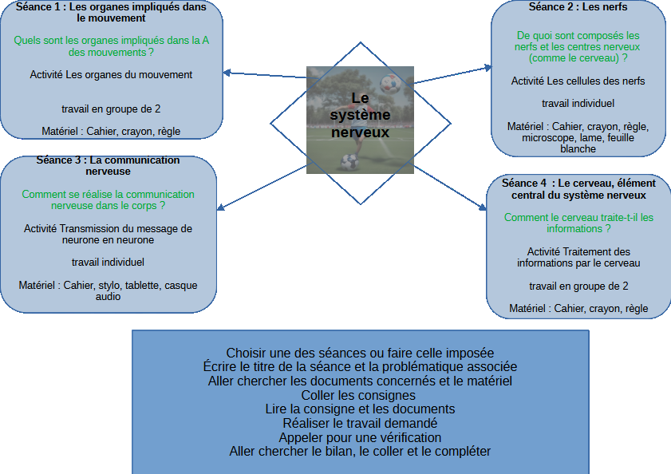

# Séquence : Le système nerveux


!!! question "Problématique"
    Comment fonctionne le système nerveux ?



```markmap
#  Le système nerveux

## Séance : Les organes impliqués dans le mouvement

* Quels sont les organes impliqués dans la commande des mouvements ?
* Activité Les organes du mouvement
* travail en groupe de 2

## Séance : Les nerfs

* De quoi sont composés les nerfs et les centres nerveux (comme le cerveau) ?
* Activité Les cellules des nerfs
* travail individuel
  
## Séance : La communication nerveuse

* Comment se réalise la communication nerveuse dans le corps ?
* Activité Transmission du message de neurone en neurone
* travail individuel

## Séance : Le cerveau, élément central du système nerveux

* Comment le cerveau traite-t-il les informations ?

* Activité Traitement des informations par le cerveau
* travail en groupe de 2

```


??? note-prof


    ```mermaid
            flowchart TD
                A[Le système nerveux] --> B[Les nerfs] & C["Les organes impliqués dans le mouvement"] & D["La communication nerveuse"]
                C --> E["Activité Les organes du mouvement"] & F("Quels sont les organes impliqués dans la commande des mouvements ?")
                B --> G["Activité  Les cellules des nerfs"] & H("De quoi sont composés les nerfs et les centres nerveux (comme le cerveau) ?")
                D -->  I["Activité Transmission du message de neurone en neurone"] & J("Comment se réalise la communication nerveuse dans le corps ?")

    ```
