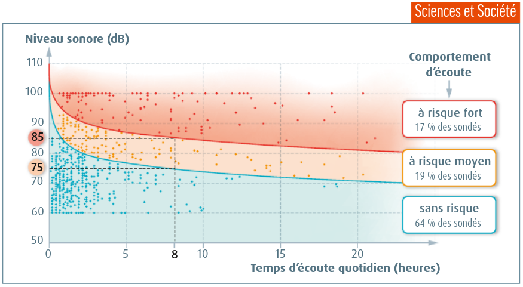

# Séquence : Le système nerveux et notre mode de vie

!!! note-prof
    si besoin d'infos

!!! question "Problématique"
    Quel est l'impact de notre mode de vie sur notre système nerveux ? 

    
### Document d’appel :

## Séance 1 : Vision et cerveau

!!! question "Problématique"
    Comment le cerveau intervient-il dans la perception des images ?

[Activité Le cerveau et la vision](../cerveauVision)

??? abstract "Bilan"
    Lors de la vision, le message sensitif provenant de l'œil est traité par
    différentes aires du cerveau :

    -   Une aire traite la forme de l'objet regardé
    -   Une aire traite la couleur de l'objet regardé
    -   Une aire traite le mouvement de l'objet regardé

    Ces différentes aires communiquent entre elles, permettant au cerveau de
    voir l'objet comme un tout (forme + couleur + mouvement) : on parle
    d'intégration cérébrale.

[Activité La vision et IRM](../visionCheese)

## Séance 2 : Le sommeil et l'apprentissage

!!! question "Problématique"
    En quoi le sommeil favorise-t-il l'apprentissage ?

[Activité Le sommeil et la mémoire](../sommeil)

??? abstract "Bilan"
    Le sommeil a un rôle important pour le cerveau :

    - il permet la mémorisation des choses apprises durant la période
    d'éveil qui précède ;

    - il facilite de nouveaux apprentissages durant la période d'éveil qui suit.

    Le sommeil permet aussi de préserver l'ensemble des fonctions du cerveau qui permettent le fonctionnement du corps lors de l'éveil.

## Séance 3 : L'impact de notre mode de vie sur nos organes sensoriels

!!! question "Problématique"
    Quels sont les effets de nos comportements sur le système nerveux ?

[Activité Impact du bruit sur notre système nerveux](../bruit)

??? abstract "Bilan"

    Plus le niveau sonore d'un bruit est important, plus sa durée d'écoute doit être brève. Une exposition à un niveau sonore trop important peut endommager l'oreille de façon irréversible et entraîner une perte d'audition.

    Réduire le volume du casque, s'éloigner des enceintes lors d'un concert et mettre des bouchons auditifs permet de réduire les risques de lésions de l'oreille et donc de perte d'audition.

    Document 4 : habitudes d'écoute chez les 12-17 ans.
    Une enquête Bruitparif, réalisée en 2015-2016 sur 1178 élèves d'Île-de-France de 12 à 17 ans, a permis de mettre en évidence différents profils d'utilisateurs, et notamment des utilisateurs qui cumulent les pratiques à risque pour l'audition. Chaque point correspond à un individu sondé.

    

[Activité Les conduites addictives](../addictions)

??? abstract "Bilan"

    Une mauvaise hygiène de vie comme un manque de sommeil, le bruit, les addictions... peuvent modifier le fonctionnement du système nerveux et entraîner une baisse des performances cérébrales.

    L'addiction à certains jeux, applications ou activités stimulent le circuit de la récompense et créent des dépendances. Il est important d'avoir une bonne hygiène de vie pour préserver le bon fonctionnement du système nerveux.

    Les drogues, comme l'alcool ou le cannabis, peuvent également modifier le fonctionnement du système nerveux, entrainer une baisse des performances cérébrales et créer une dépendance.
