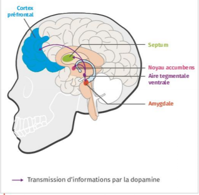
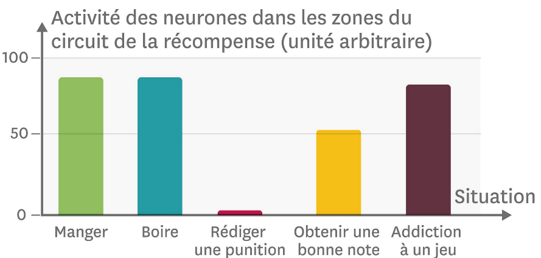

# Activité : Les conduites addictives

!!! note "Compétences"

    - Extraire et mettre en relations des informations   

!!! warning "Consignes"

    À partir des documents et de la vidéo, expliquer comment nous pouvons développer des addictions en utilisant certaines applications.

??? bug "Critères de réussite"

**Document 1 L'expérience d'Olds et Mlner.**

En 1954, James Olds et Peter Milner mènent des recherches sur le cerveau des rats. Ils stimulent par des électrodes électriques le centre nerveux de la vigilance, dans l'hypothalamus. Tous les rats évitent alors certains coins de leur cage, associés à des stimulations électriques.

Cependant, un rat fait d'exception : contrairement aux autres, il semble rechercher la stimulation et se place là où les chocs électriques sont envoyés ! Lors de la dissection de l'animal, Olds découvre que l'électrode n'était pas implantée dans l'hypothalamus, mais dans une zone voisine, le circuit de la récompense.

**Document 2 Les aires cérébrales du « circuit de la récompense ».**

Il existe dans le cerveau un réseau de neurones impliqué dans la sensation de plaisir : le circuit de la récompense. Il s'active quand on réussit ou qu'on fait quelque chose qui nous plaît.

Ces structures interagissent grâce à des messagers chimiques comme la dopamine.

**Document 3 L'activité des neurones du circuit de la récompense.**

**Document 4 : émission Dopamine d'Arte**

[émission dopamine sur snapchat](https://www.arte.tv/fr/videos/085801-006-A/dopamine/)
[émission dopamine sur youtube](https://www.arte.tv/fr/videos/085801-005-A/dopamine/)
