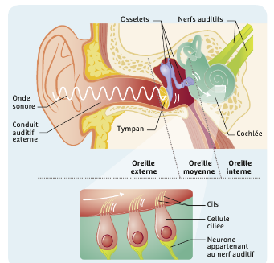
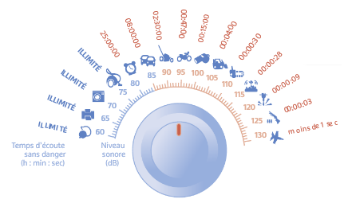
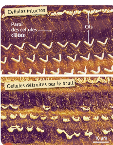
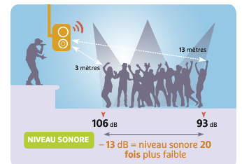
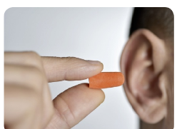

# Activité : Impact du bruit sur notre système nerveux

!!! note "Compétences"

    - Extraire et mettre en relations des informations   
    - Autonomie du travail

!!! warning "Consignes"

    1. Expliquer les risques liés à une exposition importante au bruit. 
    2. Expliquer les conseils donnés par la campagne de sensibilisation du document 4.

??? bug "Critères de réussite"

**Document 1 L'oreille, organe de l'audition.**

Le son correspond à des vibrations de l'air, conduites jusqu'au tympan qui entre à son tour en vibration. Ces vibrations sont à l'origine des mouvements des cils de cellules dans l'oreille interne. Cela génère un message nerveux sensitif qui se propage le long du nerf auditif vers le cerveau.

**Document 2 Niveau sonore et durée maximum admissibles d'exposition quotidienne au bruit selon l'Organisation mondiale de la santé (OMS).**

{: style="width:400px; flex-shrink: 0;  " }

Pour préserver au mieux les capacités d'audition, l'OMS préconise de ne pas dépasser un niveau d'écoute de 75 dB sur 8 heures.

Une différence de +10 dB correspond à un niveau sonore 10 fois plus fort.

**Document 3 Effet d'un bruit intense sur les cellules ciliées (vue au MEB)**

Ces cellules peuvent être détruites sous l'effet d'un bruit intense.
Elles ne se renouvellent pas ensuite. Les sifflements, les bourdonnements et l'hypersensibilité au bruit traduisent des lésions des cellules ciliées.

**Document 4 Campagne de sensibilisation à la protection de l'ouïe.**

{: style="width: 400px"}

**Document 5 Exposition au volume sonore dans un concert.**

**Document 6 : Des bouchons auditifs.**

Suivant les modèles et s'ils sont insérés correctement, ils atténuent l'intensité du bruit parvenant aux cellules ciliées de 21 à 30 dB.

??? note-prof "correction"
    1. On voit dans le document 2 que pour notre santé le bruit ne doit pas être trop fort ou trop long.
    On peut donc en conclure qu'une exposition importante est un bruit trop fort ou trop long.
    On voit dans le document 3 que si on est exposé à un bruit intense, les cellules ciliées sont détruites.
    On voit dans le document 1 que ces cellules servent à capter le son pour entendre. 
    On peut donc conclure que si elles sont détruites, on entendra moins bien ou plus du tout.
    On apprend dans le document 3, que ces cellules ne se renouvellent pas.

    Donc en cas d'exposition à un bruit, les cellules ciliées qui servent à entendre sont détruites, on entendra moins. Et cette destruction est définitive donc la surdité le sera aussi.

    2. Dans le document 4, on nous dit qu'il faut s'éloigner de la source sonore, cela s'explique car le volume capté sera moins élevé et donc moins dangereux pour nos oreilles.
    On nous dit aussi de porter des bouchons d'oreilles, car ceux-ci permettent de réduire le volume sonore arrivant aux cellules ciliées.

