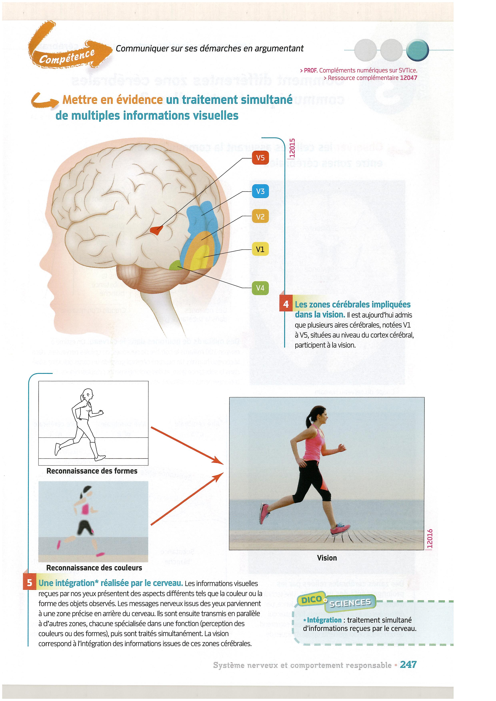

# Activité : Le cerveau et la vision

!!! note "Compétences"

    Extraire et mettre en relations des informations   
    Autonomie du travail

!!! warning "Consignes"

    Phase individuelle (5 minutes) et phase collaborative (10 minutes) :

    -   utiliser le document 1 pour identifier le problème visuel du
        patient.
    -   Identifier le rôle du cerveau dans la vision mis en évidence par ce
        cas médical;
    -   identifier quelle zone du cerveau permet ce rôle, justifier.

    Phase coopérative (20 minutes) :

    -   en utilisant les informations des différents groupes, construire une
        réponse expliquant le rôle du cerveau dans la vision et l'impact que
        peut avoir un dommage cérébral.

??? bug "Critères de réussite"
    |  			Niveau 			I : Maîtrise insuffisante 		 |  			Niveau 			F : Maîtrise fragile 		                                                    |  			Niveau 			S : Maîtrise satisfaisante 		                                                                  |  			Niveau 			TB : Très bonne maîtrise 		                                                                                                                                |
    |------------------------------------|----------------------------------------------------------------------------------|------------------------------------------------------------------------------------------------------|------------------------------------------------------------------------------------------------------------------------------------------------------------------|
    |  			   			 		                              |  			2 			documents sont analysés, la réponse indique le rôle de l’aire 			concerné.     			 		 |  			3 			documents sont analysés, la réponse indique le rôle de l’aire 			concerné en justifiant la réponse. 		 |  			3 			documents sont analysés, la réponse indique le rôle de l’aire 			concerné en justifiant la réponse.  Un texte indique répond 			au problème.  Autonomie du travail 		 |

## Groupe 1

**Document 1 Cas clinique n° 1 : Patient souffrant d'une lésion d'une aire cérébrale**

À la suite d'une intoxication au monoxyde de carbone, un patient souffre
d'une destruction des cellules nerveuses localisées dans une zone
particulière de son cerveau.

On demande au patient de cocher la forme qu'il considère comme identique
au premier dessin de chaque ligne.

    

**Document 2  Localisation de la lésion cérébrale du patient.**

**Document 3 : Zones cérébrales impliquées dans la vision.**

Il est aujourd'hui admis que plusieurs aires cérébrales, notées V1 à V5,
situées au niveau du cortex cérébral, participent à la vision.

## Groupe 2

**Document 1  Cas clinique n° 2 : Patient souffrant d'une lésion d'une aire cérébrale**

On a demandé à un patient souffrant d'une lésion du cortex cérébral d'essayer de reproduire un tableau de Mondrian associant des formes et des couleurs variées.

Le dessin effectué par le patient est présenté ici à droite du tableau :

**Document 2 : Localisation de la lésion cérébrale du patient.**

**Document 3 : Zones cérébrales impliquées dans la vision.**

Il est aujourd'hui admis que plusieurs aires cérébrales, notées V1 à V5, situées au niveau du cortex cérébral, participent à la vision.

## Groupe 3

**Document 1 Cas clinique n° 3 : Patient souffrant d'une lésion de l'aire cérébrale.**

Suite à un AVC (accident vasculaire cérébral), une patiente a subi une destruction des cellules dans une zone de son cerveau. Elle ressent des « arrêts sur image » de plusieurs secondes tout au long desquels elle ne perçoit qu'une image immobile en perdant toute conscience visuelle des mouvements dans son environnement.

Traverser une rue est pour elle très dangereux puisqu'une voiture qu'elle a vu « arrêtée », à une grande distance de l'endroit où elle est, peut se retrouver tout près d'elle après qu'elle eut commencé à traverser. Se verser un verre d'eau est tout aussi problématique puisqu'elle voit l'eau qui coule comme gelée et qu'elle comprend qu'elle en a trop versé quand elle découvre soudain l'eau répandue sur la table.

*D'après Françoise Jauzein et Aude Richter*

http://acces.inrp.fr/acces/ressources/neurosciences/vision/cas_anomalies_vision/cas10/cas10

**Document 2 Localisation de la lésion cérébrale du patient.**

**Document 3 Zones cérébrales impliquées dans la vision.**

Il est aujourd'hui admis que plusieurs aires cérébrales, notées V1 à V5,
situées au niveau du cortex cérébral, participent à la vision.

{

**Document 3b : Le cerveau nous permet de former une image.**

