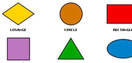
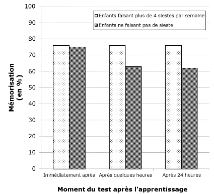
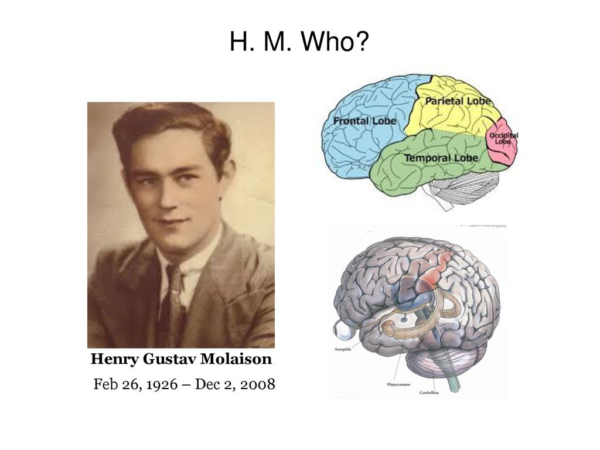
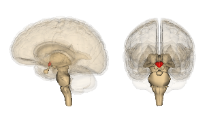
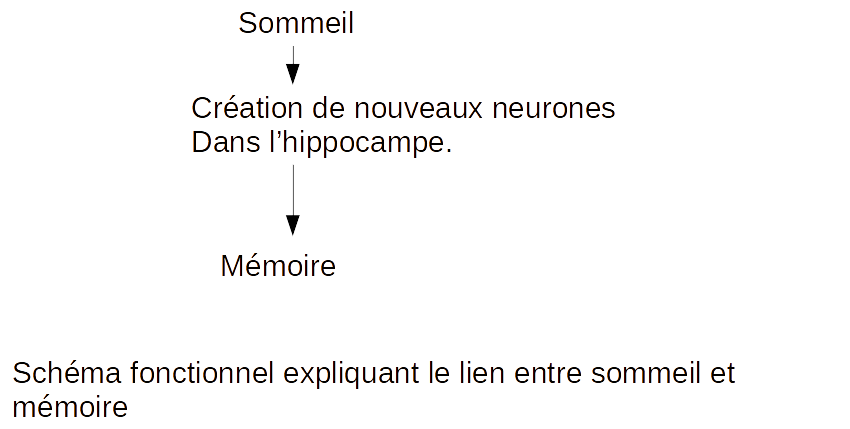

# Activité : Le sommeil et la mémoire

!!! note "Compétences"

    - Interpréter les résultats de l'expérience
    - Construire un schéma fonctionnel

!!! warning "Consignes"

    Phase individuelle (5 minutes) et phase collaborative (10 minutes) :

    - Analyser le document, quelle conclusion peut-on tirer ?

    Phase coopérative (20 minutes) :

    - À partir de l'analyse des trois documents, réalisez un schéma
    fonctionnel expliquant le lien entre sommeil et mémoire.

??? bug "Critères de réussite"
    

## Groupe 1

**Document 1 : Une expérience sur la mémorisation des enfants**

Protocole de l'expérience :

Cette expérience est réalisée avec des enfants de 3 à 6 ans ayant l'habitude de faire plus de 4 siestes par semaine (groupe témoin) et des enfants ne faisant pas de siestes (groupe test).

On présente des images aux enfants et on leur demande de retenir la localisation t la forme de chacune.

On teste les enfants immédiatement après l'apprentissage, plusieurs heures après l'apprentissage et enfin 24 heures après.

Résultats de l'expérience :

**Document 2 : MÉTHODE POUR INTERPRÉTER UNE EXPÉRIENCE**

- Décrire le protocole de l'expérience (comparer le test et le témoin, quel paramètre change).
- Décrire les résultats de l'expérience (décrire les résultats du test et du témoin).
- Interpréter les résultats de l'expérience

## Groupe 2

**Document 1 : Un patient célèbre**

Le patient H. M. (Henri Molaison) est l'un des plus célèbres patients dans l'histoire des neurosciences.

Avant 1953, le patient H. M. souffrait régulièrement de crises d'épilepsie. Les médecins ont localisé la zone de son cerveau responsable de ses crises. Il s'agissait d'une partie de ses lobes temporaux.

Malgré plusieurs tentatives de traitements médicamenteux, le patient H. M. continuait d'avoir des crises d'épilepsie.

En 1953, les médecins ont décidé de retirer la zone du cerveau responsable de ses crises d'épilepsie. Une partie des lobes temporaux du patient H. M. a donc été retirée lors d'une opération chirurgicale.

Après cette opération, le patient H. M. ne souffrait plus de crises d'épilepsie, mais était devenu incapable d'enregistrer de nouveaux souvenirs.

Les examens d'imagerie réalisés les années suivantes indiquaient que cette ablation incluait une large portion de l'hippocampe. On ignorait alors la fonction de cette zone du cerveau.

## Groupe 3

**Document 1 : Une expérience sur la formation de l'hippocampe.**

Protocole de l'expérience :
On dispose d'un groupe de rats ayant eu un sommeil normal (groupe témoin) et d'un groupe de rats ayant été privés de sommeil pendant 72 heures (groupe test). Quelques jours plus tard, on estime le nombre de nouveaux neurones formés dans l'hippocampe.

Résultats de l'expérience

| | Nombre de nouveaux neurones dans l'hippocampe |
|-----|-----------|               
| Groupe témoin | 4000|
| Groupe test (rats privés de sommeil) | 2200|

**Document 2 : MÉTHODE POUR INTERPRÉTER UNE EXPÉRIENCE**

- Décrire le protocole de l'expérience (comparer le test et le témoin, quel paramètre change).
- Décrire les résultats de l'expérience (décrire les résultats du test et du témoin).
- Interpréter les résultats de l'expérience

??? note-prof "Correction "
    Document 1 : Le groupe témoin a dormi normalement alors que le groupe test a été privé de sieste. Le paramètre qui change est la sieste.

    Immédiatement après avoir présenté les images, les enfants     faisant plus de 4 siestes par semaine et les enfants ne faisant pas de siestes se souviennent aussi bien des images qui leur ont été montrées.

    Quelques heures après et 24 h après avoir présenté les     images, les enfants faisant plus de 4 siestes par semaine se souviennent mieux de la localisation et de la forme des images que ceux ne faisant pas de siestes.

    Conclusion : Le fait de faire des siestes augmente les capacités de mémorisation, le sommeil facilité la mémoire.

    Document 2 : On remarque que si l'on enlève les lobes temporaux, où se situe l'hippocampe, on ne souffre plus de crises d'épilepsie, mais on est incapable d'enregistrer des souvenirs. L'hippocampe est le lieu du cerveau impliqué dans la mémoire.

    Document 3 : Le groupe témoin a dormi normalement alors que le groupe test a été privé de sommeil. Le paramètre qui change est le sommeil. Le groupe témoin ayant dormi normalement, a formé dans l'hippocampe 4000 nouveaux neurones alors que le groupe test a été privé de sommeil pendant 72 h et a formé dans l'hippocampe que 2200 nouveaux neurones. Ces résultats nous permettent de monter qu'un rat ayant dormi fabrique plus de neurones dans l'hippocampe qu'un rat n'ayant pas dormi. 

    Donc le sommeil permet la formation de neurone dans l'hippocampe.

    