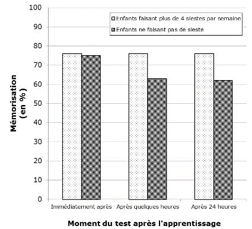
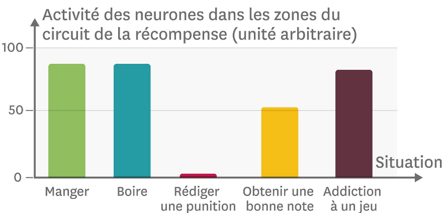

1.  #### Activité : Chez Miss Cheese à l'heure du thé

Miss Cheese, gauchère, a été victime d'un accident vasculaire cérébral
(AVC). Depuis son accident, à chaque tea time il se passe la même
chose : le thé qu'elle est en train de servir se répand sur le napperon
brodé. Dans son entourage, d'aucuns supposent que Miss Cheese a un
problème de motricité consécutif à l'AVC. D'autres pensent que le
problème de Miss Cheese est dû à l'absence de perception visuelle du
remplissage (mouvement) de la tasse lorsqu'elle verse le thé, en
relation avec son AVC.

Problématique : On veut déterminer, par une étude d'images d'IRM, si la
maladresse de Miss Cheese est due à une atteinte d'une aire motrice ou
d'une aire visuelle.

Consigne 1 : Ouvrir, le fichier de l'IRM de Miss Cheese à gauche et
l'IRM de l'individu sain à droite.

Consigne 2 : Repérer quelle zone du cerveau a été touchée
(gauche/droite, avant/arrière, haut/bas) justifier votre réponse. (1
point)

Consigne 3 : Ajouter les différents fichiers IRMf sur l'IRM de
l'individu sain en pensant à bien régler le seuil(document 3).

Consigne 4 : Indiquer pour chaque fonction quelle zone du cerveau est
activée. (1,5 points)

Consigne 5 : Répondre à la problématique en expliquant votre
raisonnement. (2,5 points)

Document 1 : Les accidents vasculaires cérébraux ( AVC).

Un AVC est lié à une perturbation de l'irrigation de certaines cellules
du cerveau ce qui conduit à un déficit neurologique localisé. Les
cellules nerveuses de la zone sont endommagées et périssent. Les
fonctions corporelles liées aux zones dont les cellules sont endommagées
sont perturbées après une attaque cérébrale et la sévérité des séquelles
dépendent de l\'étendue et de la situation de la région touchée.

Document 2 : L'IRM (Imagerie par résonance magnétique) :

-- L'IRM anatomique :

Appliquée à l'encéphale, cette technique permet de visualiser les
structures cérébrales.

Cette technique permet aussi de visualiser les structures endommagées
qui apparaissent comme des taches noires ou blanches.

-- L'IRM fonctionnelle (IRMf) :

Pendant qu'un individu accomplit une tâche simple, sensorielle ou
motrice, l'IRMf permet de localiser dans son cerveau les zones activées
par la tâche réalisée. L'image obtenue représente les zones du cerveau
statistiquement plus actives entre des conditions « ON » (avec
stimulation ou mouvement) et « OFF » (sans stimulation ou mouvement).

Document 3 : Liste des fichiers disponibles.

Vous pouvez ouvrir les différents fichiers avec le logiciel EduAnat2
(<http://acces.ens-lyon.fr/logiciels/EduAnat2Online/>)

-- IRM de Miss Cheese = IRM_CHEESE.nii.gz

-- IRM d'un indivdu sain = IRM_sain.nii.gz

-- IRMf lors d'un mouvement de la main droite =
IRMf_MotriciteMainDroite.nii.nii.gz (seuil 75)

-- IRMf lors d'un mouvement de la main gauche =
IRMf_MotriciteMainGauche.nii.nii.gz (seuil 70)

-- IRMf lors de la vision d'un mouvement = IRMf_VisionMouvements.nii.gz
(seuil 70)

### En quoi le sommeil favorise-t-il l'apprentissage ?

{width="8.812cm" height="6.784cm"}

MÉTHODE POUR INTERPRÉTER UNE EXPÉRIENCE

Décrire le protocole de l'expérience (comparer le test et
le témoin, quel paramètre change).

Décrire les résultats de l'expérience (décrire les
résultats du test et du témoin).

Interpréter les résultats de l'expérience

1.  #### Le sommeil et la mémoire

Consigne :

Phase individuelle (5 minutes) et phase collaborative (10 minutes) :

-   **Analyser le document, quelle conclusion peut-on tirer ?**;

Phase coopérative (15 minutes) :

-   À partir de l'analyse des trois documents, réalisez un schéma
    fonctionnel expliquant le lien entre sommeil et mémoire.

Compétence travaillée : Construire un schéma fonctionnel

Groupe 1 

**Document 1 : Une expérience sur la mémorisation des enfants**

Protocole de l'expérience :

Cette expérience est réalisée avec des enfants de 3 à 6 ans ayant
l'habitude de faire plus de 4 siestes par semaine (groupe témoin) et des
enfants ne faisant pas de siestes (groupe test).

On présente des images aux enfants et on leur demande de retenir la localisation et la forme de chacune.

On teste les enfants immédiatement après l'apprentissage, plusieurs heures après l'apprentissage et enfin 24 heures après.

Résultats de l'expérience

**Document 2 : MÉTHODE POUR INTERPRÉTER UNE EXPÉRIENCE**

[]{#anchor-43}Décrire le protocole de l'expérience (comparer le test et
le témoin, quel paramètre change).

[]{#anchor-44}Décrire les résultats de l'expérience (décrire les
résultats du test et du témoin).

[]{#anchor-45}Interpréter les résultats de l'expérience

Consigne :

Phase individuelle (5 minutes) et phase collaborative (10 minutes) :

-   **Analyser le document, quelle conclusion peut-on tirer ?**;

Phase coopérative (15 minutes) :

-   À partir de l'analyse des trois documents, réalisez un schéma
    fonctionnel expliquant le lien entre sommeil et mémoire.

Compétence travaillée : Construire un schéma fonctionnel

Groupe 2

Document 1 : Un patient célèbre

Le patient H. M. (Henri Molaison) est l'un des plus célèbres patients
dans l'histoire des neurosciences.

Avant 1953, le patient H. M. souffrait régulièrement de crises
d'épilepsie. Les médecins ont localisé la zone de son cerveau
responsable de ses crises. Il s'agissait d'une partie de ses lobes
temporaux.

Malgré plusieurs tentatives de traitements médicamenteux, le patient
H. M. continuait d'avoir des crises d'épilepsie.

En 1953, les médecins ont décidé de retirer la zone du cerveau
responsable de ses crises d'épilepsie. Une partie des lobes temporaux du
patient H. M. a donc été retirée lors d'une opération chirurgicale.

Après cette opération, le patient H. M. ne souffrait plus de crises
d'épilepsie, mais était devenu incapable d'enregistrer de nouveaux
souvenirs.

Les examens d'imagerie réalisés les années suivantes indiquaient que
cette ablation incluait une large
po{width="11.375cm"
height="7.754cm"}rtion de l'hippocampe. On ignorait alors la fonction de
cettezone du cerveau.

**

Consigne :

Phase individuelle (5 minutes) et phase collaborative (10 minutes) :

-   **Analyser le document, quelle conclusion peut-on tirer ?**;

Phase coopérative (15 minutes) :

-   À partir de l'analyse des trois documents, réalisez un schéma
    fonctionnel expliquant le lien entre sommeil et mémoire.

Compétence travaillée : Construire un schéma fonctionnel

Groupe 3

{width="3.575cm"
height="2.032cm"}Document 1 : Une expérience sur la formation de
l'hippocampe.

**Protocole de l'expérience : **On dispose d'un groupe de rats ayant eu
un sommeil normal (groupe témoin) et d'un groupe de rats ayant été
privés de sommeil pendant 72 heures (groupe test). Quelques jours plus
tard, on estime le nombre de nouveaux neurones formés dans l'hippocampe.

Résultats de l'expérience

  -------------------------------------- ------------------------------------------------
                                         Nombre de nouveaux neurones dans l'hippocampe
  Groupe témoin                          4000
  Groupe test (rats privés de sommeil)   2200
  -------------------------------------- ------------------------------------------------

Document 2 : MÉTHODE POUR INTERPRÉTER UNE EXPÉRIENCE

[]{#anchor-46}Décrire le protocole de l'expérience (comparer le test et
le témoin, quel paramètre change).

[]{#anchor-47}Décrire les résultats de l'expérience (décrire les
résultats du test et du témoin).

[]{#anchor-48}Interpréter les résultats de l'expérience

Correction :

[]{#anchor-49}**Document 1 :** Le groupe témoin a dormi normalement
alors que le groupe test a été privé de sieste. Le paramètre qui change
est la sieste.

[]{#anchor-50}Immédiatement après avoir présenté les images, les enfants
faisant plus de 4 siestes par semaine et les enfants ne faisant pas de
siestes se souviennent aussi bien des images qui leur ont été montrées.

[]{#anchor-51}Quelques heures après et 24 h après avoir présenté les
images, les enfants faisant plus de 4 siestes par semaine se souviennent
mieux de la localisation et de la forme des images que ceux ne faisant
pas de siestes.

[]{#anchor-52}Conclusion : Le fait de faire des siestes augmente les
capacités de mémorisation, le sommeil facilité la mémoire.

[]{#anchor-53}**Document 2 : **On remarque que si l'on enlève les lobes
temporaux, où se situe l'hippocampe, on ne souffre plus de crises
d'épilepsie, mais on est incapable d'enregistrer des souvenirs.
L'hippocampe est le lieu du cerveau impliqué dans la mémoire.

[]{#anchor-54}**Document 3 : **Le groupe témoin a dormi normalement
alors que le groupe test a été privé de sommeil. Le paramètre qui change
est le sommeil. Le groupe témoin ayant dormi normalement, a formé dans
l'hippocampe 4000 nouveaux neurones alors que le groupe test a été privé
de sommeil pendant 72 h et a formé dans l'hippocampe que 2200 nouveaux
neurones. Ces résultats nous permettent de monter qu'un rat ayant dormi
fabrique plus de neurones dans l'hippocampe qu'un rat n'ayant pas
dormi. 

[]{#anchor-55}Donc le sommeil permet la formation de neurone dans
l'hippocampe.

{width="18.461cm"
height="9.317cm"}

Bilan :

Le sommeil a un rôle important pour le cerveau :

-- il permet la mémorisation des choses apprises durant la période
d'éveil qui précède ;

-- il facilite de nouveaux apprentissages durant la période d'éveil qui
suit.

Le sommeil permet aussi de préserver l'ensemble des fonctions du cerveau
qui permettent le fonctionnement du corps lors de l'éveil.

I.  ### []{#anchor-56}[]{#anchor-57}Quels sont les effets de nos comportements sur le système nerveux ?

{width="9.613cm"
height="10.271cm"}

1.  #### L'impact de notre mode de vie sur nos organes sensoriels

#### Consigne 1 : Expliquer **les risques liés à une exposition importante au bruit**. 

#### Consigne 2 : Expliquer les conseils donnés par la campagne de sensibilisation du document 4.

**D**{width="6.567cm"
height="7.029cm"}**ocument 1 : L'oreille, organe de l'audition.**

Le son correspond à des vibrations de l'air, conduites jusqu'au tympan
qui entre à son tour en vibration. Ces vibrations sont à l'origine des
mouvements des cils de cellules dans l'oreille interne. Cela génère un
message nerveux sensitif qui se propage le long du nerf auditif vers le
cerveau.

***Document 2 : ****N****iveau sonore et durée maximum admissibles
d'exposition quotidienne au bruit selon l'Organisation mondiale de la
santé (OMS).***

{width="9.001cm"
height="5.203cm"}

Pour préserver au mieux les capacités d'audition, l'OMS préconise de ne
pas dépasser un niveau d'écoute de 75 dB sur 8 heures.

Une différence de +10 dB correspond à un niveau sonore 1à fois plus
fort.

{width="6.209cm"
height="7.832cm"}Document 3 : Effet d'un bruit intense sur les cellules
ciliées (vue au MEB)

Ces cellules peuvent être détruites sous l'effet d'un bruit intense.
Elles ne se renouvellent pas ensuite. Les sifflements, les
bourdonnements et l'hypersensibilité au bruit traduisent des lésions des
cellules ciliées.

***Document ****4**** : Campagne de sensibilisation ****à la
protecti***{width="6.047cm"
height="9.163cm"}***on de l'ouïe.***

***D****ocument 5 : Exposition au volume sonore dans un concert.***

{width="9.001cm"
height="6.057cm"}

Document 6 : Des bouchons auditifs.

{width="6.747cm"
height="4.655cm"}Suivant les modèles et s'ils sont insérés correctement,
ils atténuent l'intensité du bruit parvenant aux cellules ciliées de 21
à 30 dB.

1.  #### []{#anchor-58}Les conduites addictives

Consigne : À partir des documents et de la vidéo, expliquer comment nous
pouvons développer des addictions en utilisant certaines applications.

Compétence travaillée : Extraire et mettre en relations des
informations.

{width="9.208cm"
height="5.477cm"}Document 1 : L'expérience d'Olds et Mlner.

En 1954, James Olds et Peter Milner mènent des recherches sur le cerveau
des rats. Ils stimulent par des électrodes électriques le centre nerveux
de la vigilance, dans l'hypothalamus. Tous les rats évitent alors
certains coins de leur cage, associés à des stimulations électriques.

Cependant, un rat fait d'exception : contrairement aux autres, il semble
rechercher la stimulation et se place là où les chocs électriques sont
envoyés ! Lors de la dissection de l'animal, Olds découvre que
l'électrode n'était pas implantée dans l'hypothalamus, mais dans une
zone voisine, le circuit de la récompense.

{width="6.964cm"
height="6.749cm"}Document 2 : Les aires cérébrales du « circuit de la
récompense ».

Il existe dans le cerveau un réseau de neurones impliqué dans la
sensation de plaisir : le circuit de la récompense. Il s'active quand on
réussit ou qu'on fait quelque chose qui nous plaît.

Ces structures interagissent grâce à des messagers chimiques comme la
dopamine.

***Document 3 : L'activité des neurones du circuit de la
récompense.***{width="15.028cm"
height="7.17cm"}

<https://www.arte.tv/fr/videos/085801-006-A/dopamine/> snapchat

<https://www.arte.tv/fr/videos/085801-005-A/dopamine/> youtube

Bilan :

Une mauvaise hygiène de vie comme un manque de sommeil, le bruit, les
addictions... peuvent modifier le fonctionnement du système nerveux et
entraîner une baisse des performances cérébrales.

Plus le niveau sonore d'un bruit est important, plus sa durée d'écoute
doit être brève. Une exposition à un niveau sonore trop important peut
endommager l'oreille de façon irréversible et entraîner une perte
d'audition.

Réduire le volume du casque, s'éloigner des enceintes lors d'un concert
et mettre des bouchons auditifs permet de réduire les risques de lésions
de l'oreille et donc de perte d'audition.

L'addiction à certains jeux, applications ou activités stimulent le
circuit de la récompense et créent des dépendances. Il est important
d'avoir une bonne hygiène de vie pour préserver le bon fonctionnement du
système nerveux.

Document 4 : habitudes d'écoute chez les 12-17 ans.

Une enquête Bruitparif, réalisée en 2015-2016 sur 1178 élèves
d'Île-de-France de 12 à 17 ans, a permis de mettre en évidence
différents profils d'utilisateurs, et notamment des utilisateurs qui
cumulent les pratiques à risque pour l'audition. Chaque point correspond
à un individu sondé.

{width="16.572cm"
height="8.16cm"}

## 
