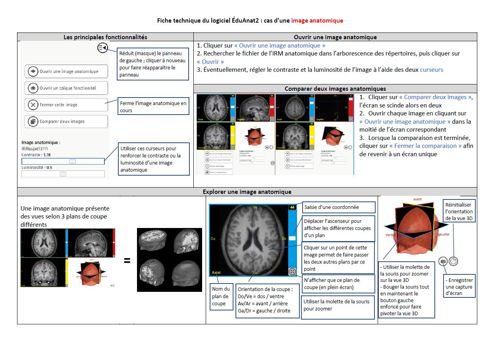
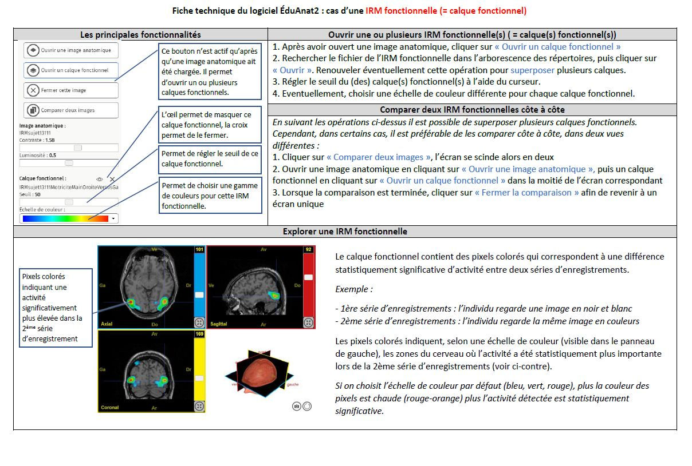

# Activité : Chez Miss Cheese à l'heure du thé

Miss Cheese, gauchère, a été victime d'un accident vasculaire cérébral (AVC). Depuis son accident, à chaque tea time il se passe la même chose : le thé qu'elle est en train de servir se répand sur le napperon brodé. Dans son entourage, d'aucuns supposent que Miss Cheese a un problème de motricité consécutif à l'AVC. D'autres pensent que le problème de Miss Cheese est dû à l'absence de perception visuelle du remplissage (mouvement) de la tasse lorsqu'elle verse le thé, en relation avec son AVC.

On veut déterminer, par une étude d'images d'IRM, si la maladresse de Miss Cheese est due à une atteinte d'une aire motrice ou d'une aire visuelle.

!!! note "Compétences"

    - Interpréter
    - utiliser l'outil numérique

!!! warning "Consignes"

    1. Ouvrir, le fichier de l'IRM de Miss Cheese à gauche et l'IRM de l'individu sain à droite.
    2. Repérer quelle zone du cerveau a été touchée (gauche/droite, avant/arrière, haut/bas) justifier votre réponse. (1 point)
    3. Ajouter les différents fichiers IRMf sur l'IRM de l'individu sain en pensant à bien régler le seuil(document 3).
    4. Indiquer pour chaque fonction quelle zone du cerveau est activée. (1,5 points)
    5. Répondre à la problématique en expliquant votre raisonnement. (2,5 points)

    
??? bug "Critères de réussite"
    - 

**Document 1 Les accidents vasculaires cérébraux ( AVC).**

Un AVC est lié à une perturbation de l'irrigation de certaines cellules du cerveau ce qui conduit à un déficit neurologique localisé. Les cellules nerveuses de la zone sont endommagées et périssent. Les fonctions corporelles liées aux zones dont les cellules sont endommagées sont perturbées après une attaque cérébrale et la sévérité des séquelles dépendent de l'étendue et de la situation de la région touchée.

**Document 2 L'IRM (Imagerie par résonance magnétique)**

- L'IRM anatomique : Appliquée à l'encéphale, cette technique permet de visualiser les structures cérébrales.

Cette technique permet aussi de visualiser les structures endommagées qui apparaissent comme des taches noires ou blanches.

- L'IRM fonctionnelle (IRMf) : Pendant qu'un individu accomplit une tâche simple, sensorielle ou motrice, l'IRMf permet de localiser dans son cerveau les zones activées par la tâche réalisée. L'image obtenue représente les zones du cerveau statistiquement plus actives entre des conditions « ON » (avec stimulation ou mouvement) et « OFF » (sans stimulation ou mouvement).

**Document 3 Liste des fichiers disponibles.**

Vous pouvez ouvrir les différents fichiers avec le logiciel EduAnat2
(<http://acces.ens-lyon.fr/logiciels/EduAnat2Online/>)

- IRM de Miss Cheese = IRM_CHEESE.nii.gz
- IRM d'un indivdu sain = IRM_sain.nii.gz
- IRMf lors d'un mouvement de la main droite = IRMf_MotriciteMainDroite.nii.nii.gz (seuil 75)
- IRMf lors d'un mouvement de la main gauche = IRMf_MotriciteMainGauche.nii.nii.gz (seuil 70)
- IRMf lors de la vision d'un mouvement = IRMf_VisionMouvements.nii.gz (seuil 70)

**Document 4 Fiches méthodes EduAntomist.**

