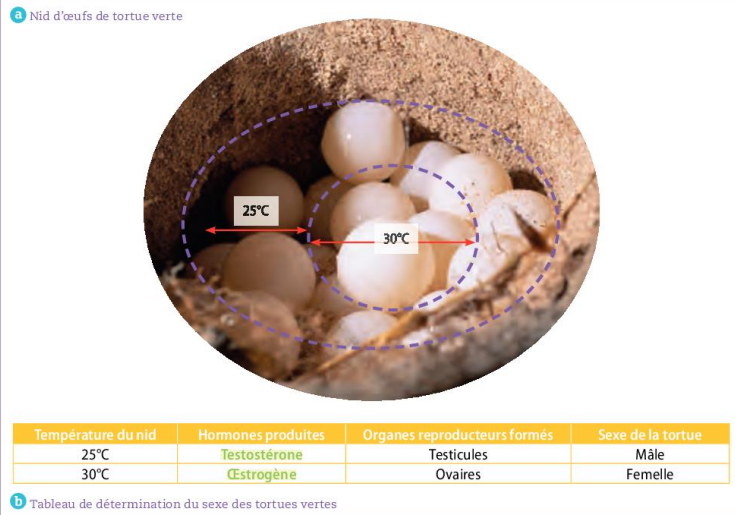

# Séquence : La transmission de l'information génétique

!!! note-prof
    si besoin d'infos

!!! question "Problématique"
    COmment se transmet l'information génétique entre cellules ? Entre individus ?
    
### Document d’appel :

## Séance 1 : Conservation de la 'information génétique 

??? abstract "Bilan"
    La majorité des cellules de l'organisme possèdent la même information génétique que la cellule-œuf, dont elles proviennent par divisions.

!!! question "Problématique"
    Comment expliquer que l'information génétique est conservée au cours de la multiplication cellulaire ?

[Activité Conservation de l'information génétique ](../conservInfoGen)

??? abstract "Bilan"
    La division cellulaire permet la formation de nouvelles cellules qui vont permettre la formation d'un nouvel être vivant et le renouvellement de ses cellules.

    La division cellulaire (ou multiplication cellulaire ou mitose) d'une cellule-mère donne deux cellules-filles identiques.

    Avant la division, chaque chromosome simple est copié et forme des chromosomes doubles dont les deux parties sont identiques. La quantité d'ADN double, mais le nombre de chromosomes reste le même.

    Lors de la division cellulaire, les deux parties de chaque chromosome double se séparent et se répartissent dans les deux cellules-filles.

    Les deux cellules-filles reçoivent le même nombre de paires de chromosomes identiques à ceux de la cellule-mère.

    
    

[Activité Schéma de la Division Cellulaire](../schDivCell)

## Séance 2 : La formation des cellules reproductrices.

!!! question "Problématique"
    Comment la formation des cellules reproductrices participe-t- à la diversité génétique ?
    
[Activité La formation des cellules reproductrices.](../meiose)

??? abstract "Bilan"

    Les spermatozoïdes et les ovules sont des gamètes (=cellules reproductrices).

    Lors de la formation des gamètes, les chromosomes de chaque paire se séparent et les gamètes reçoivent au hasard un seul des deux chromosomes de chacune des 23 paires.

    Les gamètes contiennent 23 chromosomes (1 seul par paire).

    Les chromosomes étant génétiquement différents (ils possèdent les mêmes gènes, mais pas les mêmes allèles), la répartition au hasard des chromosomes fait qu'un individu peut fabriquer de très nombreux gamètes génétiquement différents.

    En théorie, avec 23 paires de chromosomes, il y a 8,3 millions de spermatozoïdes différents et 8,3 millions d'ovules différents.

    Comment expliquer la diversité des individus ?[]{#anchor-17}

{width="16.193cm"
height="15.981cm"}

1.  #### []{#anchor-18}[]{#anchor-19}La diversité génétique

Consigne : Un couple, Caroline et Karim, va avoir un enfant, ils se
demandent de quels groupes sanguins sera cet enfant et quelles sont les
chances d'avoir une fille ou un garçon. À partir de la formation des
spermatozoïdes et des ovules. Réponds à leur question.

Pour répondre, il est conseillé de faire un tableau à double entrée (une
avec les différents ovules et une avec les différents spermatozoïdes).

Compétences travaillées : Extraire et mettre en relation des
informations pour répondre à un problème

Chromosomes 9 et sexuels d'une cellule de Caroline

{width="6.033cm"
height="4.567cm"}

Chromosomes 9 et sexuels d'une cellule de Karim

{width="6.327cm"
height="4.563cm"}

Correction

  -------------------- ---------- ---------- --------- ----------
  Spermatozoïdes de\   A/ X       A/ Y       O/ X      O/ Y
  Karim\                                               
  \                                                    
  Ovule de Caroline                                    

  B/ X                  A//B XX    A//B XY   B//O XX    B//O XY

  O/ X                  A//O XX   A//O XY    O//O XX   O//O Y
  -------------------- ---------- ---------- --------- ----------

Il y a 8 possibilités d'enfants différents, il y a une chance sur deux
que ce soit un garçon et une chance sur deux que ce soit une fille.

Leur enfant pourra être de différents groupes sanguins :

¼ d'être AB

¼ d'être A

¼ d'être B

¼ d'être O[]{#anchor-20}

Bilan :

Pour chaque gène, un des allèles provient de la mère, l'autre du père

Lors de la fécondation, les informations génétiques des deux cellules
reproductrices se réunissent au hasard, la cellule-œuf obtenue contient
donc 46 chromosomes. (23 du père et 23 de la mère)

Les cellules reproductrices d'un individu étant différentes
génétiquement, ses enfants seront différents.

Chaque individu issu de la reproduction sexuée est unique.

En théorie, avec 23 paires de chromosomes, il y a 8,3 millions de
cellules reproductrices par individu, ce qui fait 70 mille milliards de
cellules-œufs différentes pour un même
couple.[]{#anchor-21}[]{#anchor-22}

I.  ### []{#anchor-23}[]{#anchor-24}Comment certains caractères non génétiques peuvent-ils être transmis ou modifiés ? 

{width="16.371cm"
height="18.203cm"}
{width="15.332cm"
height="5.713cm"}

{width="15.482cm"
height="10.846cm"}

Document 5 : Des baleines à bosse.

L'étude du chant des cétacés et de certains oiseaux e relevé l'existence
de langages qui se modifient au cours des générations.

Ainsi, sur la côte est de l'Australie, le chant des groupes de baleines
à bosse a subi des modifications. Suite à la migration de quelques
individus, toutes les baleines de la côte est ont adopté le chant des
baleines de la côte ouest. Ce chant s'est transmis aux générations
suivantes.

Document 6 : Transmissions culturelles chez les macaques. Japonais

<https://www.youtube.com/watch?v=0Lk8Ra7PWdw>

Bilan :

Des éléments de l'environnement, tels que la température, le vent, les
UV, la teneur en dioxygène du milieu influent sur le phénotype des
individus qui y sont exposés et le modifient.

Ces modifications ne sont pas transmises à la descendance. Le phénotype
d'un individu est donc le résultat de l'interaction entre son génotype
et l'action de l'environnement.

Certains caractères ne sont pas inscrits dans le patrimoine génétique et
sont transmis entre générations via l'apprentissage (chants des
baleines, comportements nouveaux ...)
