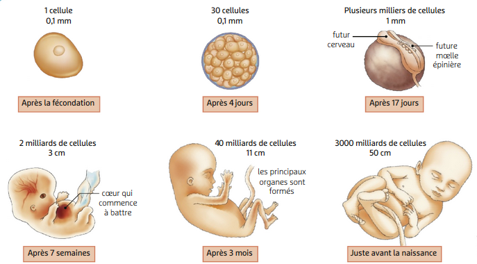
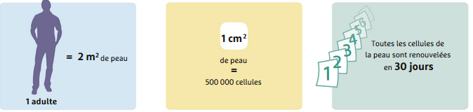
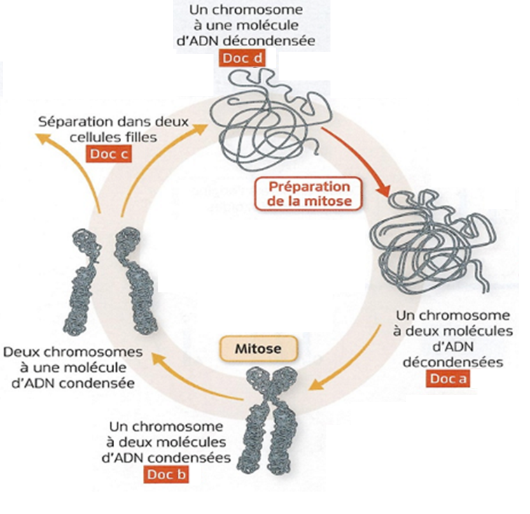
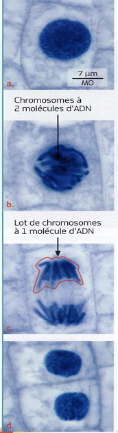
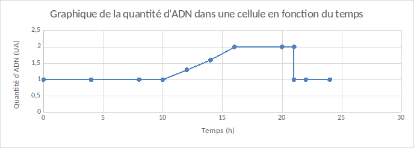

# Activité : La division cellulaire et la conservation de l'information génétique.

!!! note "Compétences"

    - Extraire et mettre en relation des informations 
    - construire un graphique 

!!! warning "Consignes"

    1. Explique l'importance des divisions cellulaires au cours du développement et du fonctionnement de l'organisme.
    2. À l'aide des documents, réaliser un graphique montrant l'évolution de la quantité d'ADN dans une cellule au cours du temps.
    3. Décrire ensuite ce graphique.
    4. Expliquer comment, lors d'une division cellulaire, une cellule maintient son information génétique.
    
??? bug "Critères de réussite"
    - 

**Document 1 La théorie cellulaire**

Un des points fondamentaux en biologie est qu'une cellule provient toujours d'une autre cellule grâce à la division cellulaire.

***Document 2 De la cellule-œuf à la naissance.**

**Document 3 Le renouvellement cellulaire : l'exemple de la peau.**

**Document 4 Tableau du nombre de chromosomes et de la quantité d'ADN au cours du temps dans une cellule qui se divise. (ici 1 UA = 6,6 pg d'ADN)**

  |Temps (h) |0 |4 |8 |10 | 12 |14 |16 |20 |21 |21 |22 | 24|
|------------------------------------ |---- |---- |----| ----| -----| -----| ---- |----| ----| ----| ---- |----|
  |Nombre de chromosomes par cellule |46 | 46| 46 | 46 | 46| 46| 46| 46| 46| 46| 46 | 46|
  |Quantité d'ADN par cellule (en UA) | 1 | 1 | 1 | 1 | 1,3 | 1,6 | 2 | 2 | 2 | 1 | 1 | 1|
  ------------------------------------ ---- ---- ---- ---- ----- ----- ---- ---- ---- ---- ---- ----

**Document 5 Aspect d'un chromosome au cours de la vie d'une cellule.**

Un chromosome à une molécule d'ADN est appelé chromosome simple et un chromosome à deux molécules d'ADN est appelé chromosome double.         

**Document 6 Le déroulement de la mitose dans une racine d'oignon.**

La mitose permet de conserver le nombre de chromosomes et donc le génotype dans les cellules nouvellement formées. Elle assure ainsi la stabilité génétique des cellules d'un individu     

??? note-prof "Correction de l'activité" 

    Consigne 1 : Une cellule est toujours formée par la division d'une autre
    cellule par division cellulaire.

    Un être vivant est formé de plusieurs milliards de cellules, ces
    milliards de cellules sont formées par de très nombreuses divisions
    cellulaires.

    Chez un adulte, il y a un renouvellement des cellules régulièrement.
    Pour renouveler ces cellules, de nouvelles cellules doivent être formées
    par divisions cellulaires.

    La division cellulaire est donc très importante, car elle permet de
    former toutes les cellules du corps et de renouveler ces cellules.

    Consigne 2 :
    
    Ce graphique représente la quantité d'ADN dans une cellule en fonction
    du temps.

    De 0 à 10h, la quantité d'ADN est stable à 1 UA.

    De 10 à 16h, la quantité d'ADN augmente de 1 à 2 UA.

    De 16 à 21h, la quantité d'ADN est stable à 2 UA.

    A 21h, la quantité d'ADN diminue de 2 à 1 UA.

    De 21 à 24h, la quantité d'ADN est stable à 1 UA.

    Consigne 3 :

    Voir bilan