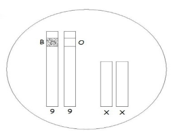
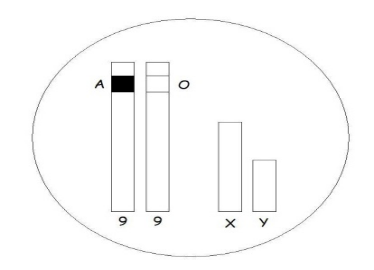

# Activité : La diversité génétique
!!! note Compétences

    Extraire et mettre en relation des informations pour répondre à un problème 

!!! warning Consignes

    1. Un couple, Caroline et Karim, va avoir un enfant, ils se demandent de quels groupes sanguins sera cet enfant et quelles sont les chances d'avoir une fille ou un garçon. À partir de la formation des spermatozoïdes et des ovules. Réponds à leur question.
    
??? bug Critères de réussite
    - Pour répondre, il est conseillé de faire un tableau à double entrée (une avec les différents ovules et une avec les différents spermatozoïdes).

**Document 1 Chromosomes 9 et sexuels d'une cellule de Caroline**

**Document 2 Chromosomes 9 et sexuels d'une cellule de Karim**

??? note-prof "Correction"

    <table><thead>
    <tr>
        <td>Spermatozoïdes de Karim\ Ovule de Caroline</td>
        <td>A/ X</td>
        <td>A/ Y</td>
        <td>O/ X</td>
        <td>O/ Y</td>
    </tr></thead>
    <tbody>
    <tr>
        <td>B/ X</td>
        <td>A//B XX</td>
        <td>A//B XY</td>
        <td>B//O XX</td>
        <td>B//O XY</td>
    </tr>
    <tr>
        <td>O/ X</td>
        <td>A//O XX</td>
        <td>A//O XY</td>
        <td>O//O XX</td>
        <td>O//O Y</td>
    </tr>
    </tbody>
    </table>

    Il y a 8 possibilités d'enfants différents, il y a une chance sur deux que ce soit un garçon et une chance sur deux que ce soit une fille.

    Leur enfant pourra être de différents groupes sanguins :

    - ¼ d'être AB
    - ¼ d'être A
    - ¼ d'être B
    - ¼ d'être O