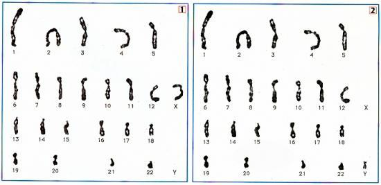
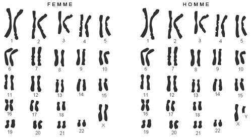
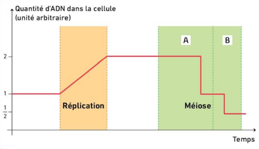
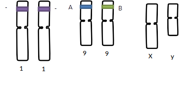
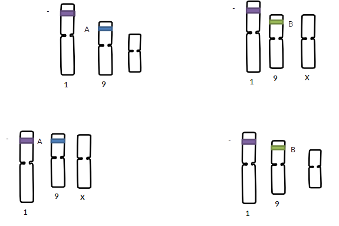

# Activité : La formation des cellules reproductrices.

!!! note "Compétences"

    Interpréter 

!!! warning "Consignes"

    1. Comparer les caryotypes des cellules reproductrices (document 1) avec celui d'une cellule somatique (document 2).
    2. Expliquer le nombre de chromosomes dans les cellules reproductrices grâce aux informations des documents 3 et 4
    3. Indiquer les différentes combinaisons possibles pour les cellules reproductrices d'un homme de groupe AB- du document 5.
    4. Indiquer pour chaque caryotype de gamète du document 1 s'il provient d'un homme et/ou une femme.
    
??? bug "Critères de réussite"
    - 

**Document 1 Caryotypes de gamètes (=cellules reproductrices)**

**Document 2 Caryotypes d'une cellule somatique d'une femme et d'un homme.**

**Document 3 Répartition des allèles lors de la formation des gamètes.**

**Document 4 Évolution de la quantité d'ADN dans une cellule reproductrice au cours de la méiose.**

La méiose est une succession de deux divisions
cellulaires qui permet la formation de cellules reproductrices.

- Au cours de la première division A, les deux chromosomes de chaque paire se séparent.

- Au cours de la division B, chaque chromosome double se sépare en deux chromosomes simples.

**Document 5 Représentation des chromosomes d'un homme de groupe  sanguin AB-**

Le gène déterminant le rhésus (+ ou – du groupe sanguin) est situé sur le chromosome 1.
Le gène déterminant le système ABO est situé sur le chromosome 9.

??? note-prof "Correction :"

    Consigne 1 : On voit que les caryotypes des cellules germinales n'ont qu'un seul chromosome de chaque type, alors que dans les cellules somatiques il y a deux chromosomes à chaque fois.

    Il y a donc 46 chromosomes dans une cellule somatique, mais seulement 23 chromosomes dans une cellule germinale.

    Consigne 2 :

    Pour former les cellules germaines, une cellule va subir une duplication de l'ADN, ce qui va former des chromosomes doubles. Lors de la première division cellulaire, les chromosomes doubles de chaque paire vont se séparer, les deux cellules formées n'auront donc pas les chromosomes et il n'y aura plus que 23 chromosomes doubles.

    Lors de la seconde division, les chromosomes doubles vont se séparent en deux chromosomes simples, un dans chaque cellule. Il y a 23 chromosomes simples dans les cellules.

    Consigne 3 :

    

    Consigne 4

    Le caryotype 2 comprend un chromosome Y, il vient donc forcément d'un spermatozoïde.

    Le caryotype 1 comprend un chromosome X, il vient donc soit d'un ovule ou soit d'un spermatozoïde.