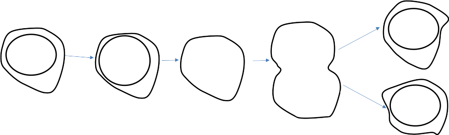
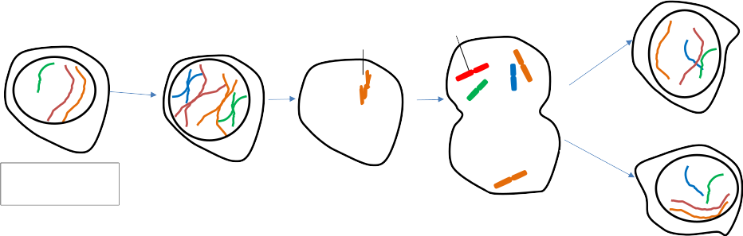

# Activité : Schéma de la division cellulaire

!!! note Compétences

    Faire un schéma 

!!! warning Consignes

    Compléter le schéma-bilan de la division cellulaire en 5 étapes avec 2 paires de chromosomes
    
??? bug Critères de réussite
    - Chacun des chromosomes d'une couleur
    - Bien différencier les 2 paires par des tailles différentes.

??? note-prof "Correction"

    