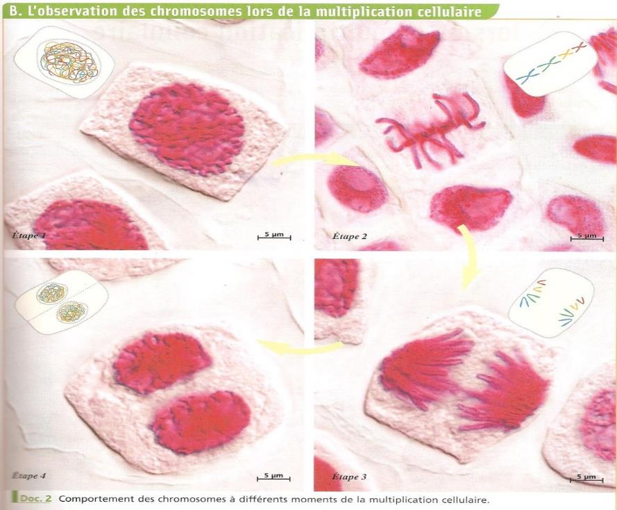
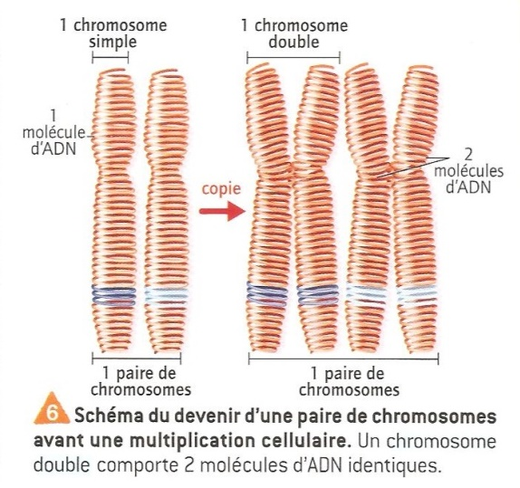
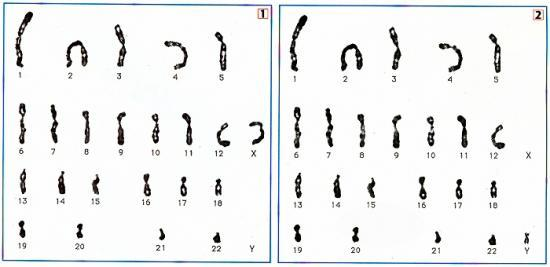
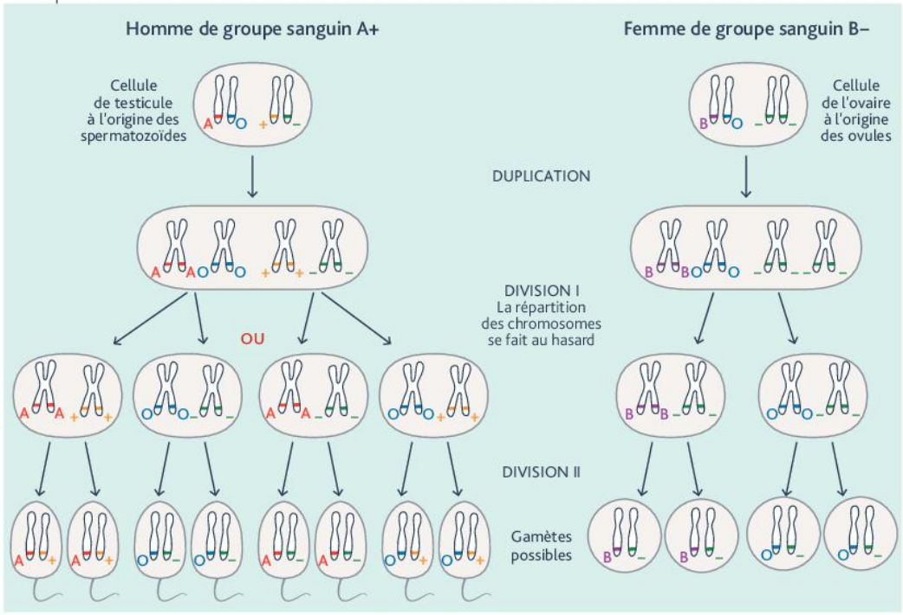
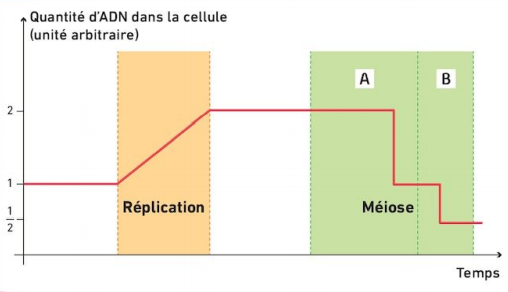

## []{#anchor}[]{#anchor-1}Chapitre 3 : Conservation et transmission de l'information génétique au cours des générations.

1.  #### []{#anchor-6} []{#anchor-7}Schéma de la division cellulaire

Consigne : Compléter le schéma-bilan de la division cellulaire en 5
étapes avec 2 paires de chromosomes

Aides :

-   Chacun des chromosomes d'une couleur
-   Bien différencier les 2 paires par des tailles différentes.

Correction :

{width="15.023cm"
height="12.453cm"}{width="11.178cm"
height="7.858cm"}

I.  ### []{#anchor-8}[]{#anchor-9}Comment la formation des cellules reproductrices participe-t- à la diversité génétique ?[]{#anchor-10}

1.  #### []{#anchor-11} []{#anchor-12}La formation des cellules reproductrices.

Consigne 1 : Comparer les caryotypes des cellules reproductrices
(document 1) avec celui d'une cellule somatique (document 2).

Consigne 2 : Expliquer le nombre de chromosomes dans les cellules
reproductrices grâce aux informations des documents 3 et 4

Consigne 3 : indiquer les différentes combinaisons possibles pour les
cellules reproductrices d'un homme de groupe AB- du document 5.

Consigne 4 : Indiquer pour chaque caryotype de gamète du document 1 s'il
provient d'un homme et/ou une femme.

Document 1 : Caryotypes de gamètes (=cellules reproductrices)

{width="18.461cm"
height="6.705cm"}

Document 2 : Caryotypes d'une cellule somatique d'une femme et d'un
homme.

{width="13.213cm"
height="7.257cm"}

***Document 3 : Répartition des allèles lors de la formation des
gamètes.***{width="18.461cm"
height="12.596cm"}

Document 4 : Évolution de la quantité d'ADN dans une cellule
reproductrice au cours de la méiose.

{width="11.217cm"
height="6.44cm"}La méiose est une succession de deux divisions
cellulaires qui permet la formation de cellules reproductrices.

-   Au cours de la première division A, les deux chromosomes de chaque
    > paire se séparent.

-   Au cours de la division B, chaque chromosome double se sépare en
    > deux chromosomes simples.

Document 5 : Représentation des chromosomes d'un homme de groupe sanguin
AB-

Correction :

Consigne 1 : On voit que les caryotypes des cellules germinales n'ont
qu'un seul chromosome de chaque type, alors que dans les cellules
somatiques il y a deux chromosomes à chaque fois.

Il y a donc 46 chromosomes dans une cellule somatique, mais seulement 23
chromosomes dans une cellule germinale.

Consigne 2 :

Pour former les cellules germaines, une cellule va subir une duplication
de l'ADN, ce qui va former des chromosomes doubles. Lors de la première
division cellulaire, les chromosomes doubles de chaque paire vont se
séparer, les deux cellules formées n'auront donc pas les chromosomes et
il n'y aura plus que 23 chromosomes doubles.

Lors de la seconde division, les chromosomes doubles vont se séparent en
deux chromosomes simples, un dans chaque cellule. Il y a 23 chromosomes
simples dans les cellules.

Consigne 3 :

Consigne 4

Le caryotype 2 comprend un chromosome Y, il vient donc forcément d'un
spermatozoïde.

Le caryotype 1 comprend un chromosome X, il vient donc soit d'un ovule
ou soit d'un spermatozoïde.[]{#anchor-13}

Bilan :

Les spermatozoïdes et les ovules sont des gamètes (=cellules
reproductrices).

Lors de la formation des gamètes, les chromosomes de chaque paire se
séparent et les gamètes reçoivent au hasard un seul des deux chromosomes
de chacune des 23 paires.

Les gamètes contiennent 23 chromosomes (1 seul par paire).

Les chromosomes étant génétiquement différents (ils possèdent les mêmes
gènes, mais pas les mêmes allèles), la répartition au hasard des
chromosomes fait qu'un individu peut fabriquer de très nombreux gamètes
génétiquement différents.

En théorie, avec 23 paires de chromosomes, il y a 8,3 millions de
spermatozoïdes différents et 8,3 millions d'ovules différents.

[]{#anchor-14}

I.  ### []{#anchor-15}[]{#anchor-16}Comment expliquer la diversité des individus ?[]{#anchor-17}

{width="16.193cm"
height="15.981cm"}

1.  #### []{#anchor-18}[]{#anchor-19}La diversité génétique

Consigne : Un couple, Caroline et Karim, va avoir un enfant, ils se
demandent de quels groupes sanguins sera cet enfant et quelles sont les
chances d'avoir une fille ou un garçon. À partir de la formation des
spermatozoïdes et des ovules. Réponds à leur question.

Pour répondre, il est conseillé de faire un tableau à double entrée (une
avec les différents ovules et une avec les différents spermatozoïdes).

Compétences travaillées : Extraire et mettre en relation des
informations pour répondre à un problème

Chromosomes 9 et sexuels d'une cellule de Caroline

{width="6.033cm"
height="4.567cm"}

Chromosomes 9 et sexuels d'une cellule de Karim

{width="6.327cm"
height="4.563cm"}

Correction

  -------------------- ---------- ---------- --------- ----------
  Spermatozoïdes de\   A/ X       A/ Y       O/ X      O/ Y
  Karim\                                               
  \                                                    
  Ovule de Caroline                                    

  B/ X                  A//B XX    A//B XY   B//O XX    B//O XY

  O/ X                  A//O XX   A//O XY    O//O XX   O//O Y
  -------------------- ---------- ---------- --------- ----------

Il y a 8 possibilités d'enfants différents, il y a une chance sur deux
que ce soit un garçon et une chance sur deux que ce soit une fille.

Leur enfant pourra être de différents groupes sanguins :

¼ d'être AB

¼ d'être A

¼ d'être B

¼ d'être O[]{#anchor-20}

Bilan :

Pour chaque gène, un des allèles provient de la mère, l'autre du père

Lors de la fécondation, les informations génétiques des deux cellules
reproductrices se réunissent au hasard, la cellule-œuf obtenue contient
donc 46 chromosomes. (23 du père et 23 de la mère)

Les cellules reproductrices d'un individu étant différentes
génétiquement, ses enfants seront différents.

Chaque individu issu de la reproduction sexuée est unique.

En théorie, avec 23 paires de chromosomes, il y a 8,3 millions de
cellules reproductrices par individu, ce qui fait 70 mille milliards de
cellules-œufs différentes pour un même
couple.[]{#anchor-21}[]{#anchor-22}

I.  ### []{#anchor-23}[]{#anchor-24}Comment certains caractères non génétiques peuvent-ils être transmis ou modifiés ? 

{width="16.371cm"
height="18.203cm"}
{width="15.332cm"
height="5.713cm"}

{width="15.482cm"
height="10.846cm"}

Document 5 : Des baleines à bosse.

L'étude du chant des cétacés et de certains oiseaux e relevé l'existence
de langages qui se modifient au cours des générations.

Ainsi, sur la côte est de l'Australie, le chant des groupes de baleines
à bosse a subi des modifications. Suite à la migration de quelques
individus, toutes les baleines de la côte est ont adopté le chant des
baleines de la côte ouest. Ce chant s'est transmis aux générations
suivantes.

Document 6 : Transmissions culturelles chez les macaques. Japonais

<https://www.youtube.com/watch?v=0Lk8Ra7PWdw>

Bilan :

Des éléments de l'environnement, tels que la température, le vent, les
UV, la teneur en dioxygène du milieu influent sur le phénotype des
individus qui y sont exposés et le modifient.

Ces modifications ne sont pas transmises à la descendance. Le phénotype
d'un individu est donc le résultat de l'interaction entre son génotype
et l'action de l'environnement.

Certains caractères ne sont pas inscrits dans le patrimoine génétique et
sont transmis entre générations via l'apprentissage (chants des
baleines, comportements nouveaux ...)
