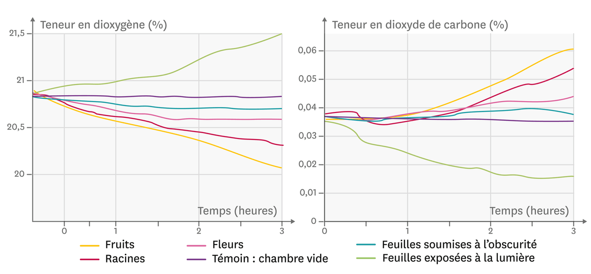

# Séquence : Les besoins de végétaux

!!! note-prof
    si besoin d'infos

!!! question "Problématique"
    Quels sont les besoins des végétaux ?
    
### Document d’appel :

## Séance 1 : Les échanges des végétaux avec leur milieu.

**La serre de Mark Watney dans le film Seul sur Mars (2015)**

L'astronaute Mark Watney cultive des pommes de terre pour survivre sur Mars. Très vite, l'atmosphère confinée de sa serre est modifiée par les plantes. Ainsi, une simple étincelle dans les réseaux électriques va suffire pour provoquer une violente explosion détruisant toute la serre.

Votre mission : En décrivant le fonctionnement d'un organisme végétal, expliquez l'origine de l'explosion de la serre de Mark.

!!! question "Problématique"
    Quelles sont les modifications de l’organisme lors d’un effort ?

[Activité Une agriculture explosive](../effortsPhysiques)

??? abstract "Bilan"
    Les végétaux prélèvent uniquement de la matière minérale.

    - Les plantes prélèvent de l'eau et des sels minéraux au niveau des racines et du dioxyde de carbone au niveau des feuilles. Cette matière minérale est transformée en matière organique grâce à l'énergie lumineuse captée. Elles rejettent alors du dioxygène.
    - Tous les organes d'un végétale respirent, seules les feuilles éclairées réalisent en plus la photosynthèse.

    A. Les échanges gazeux des organes des plantes

Doc. 2 : Des mesures des échanges gazeux de différents organes végétaux à la lumière ou à l'obscurité

Le dioxygène est un gaz pouvant provoquer des explosions ou incendies en présence d'un combustible.

    B. Une transformation chimique dans les feuilles

Doc. 3 Des résultats d'une expérience sur la production de matière à la lumière et à l'obscurité

L'eau iodée est un liquide brun orangé qui permet de détecter une substance organique : l'amidon. En présence d'amidon, une coloration bleu sombre apparaît.

Doc. 4 : Qu'est-ce que la photosynthèse ?
Contrairement aux animaux qui se nourrissent directement de matière organique, les végétaux ne prélèvent que de la matière minérale pour vivre. Une transformation se déroule au niveau des feuilles : c'est la photosynthèse. L'eau puisée dans le sol et le dioxyde de carbone de l'atmosphère sont transformés sous l'action de la lumière et forment des sucres (matière organique). Cette réaction produit un déchet que les plantes évacuent dans l'atmosphère : le dioxygène.

    C. Les zones d'échange

Doc. 5 : Un épiderme de feuille observé au microscope optique
Les stomates permettent de réaliser des échanges gazeux avec l'atmosphère et d'y rejeter de la vapeur d'eau. Ils peuvent se refermer en cas de forte chaleur et de sécheresse.

Doc. 6 : Une observation d'une racine de chou commun
Si on enlève les poils absorbants d'un végétal, celui-ci prélève très mal l'eau et les sels minéraux présents dans le sol et meurt.

Vocabulaire
    • L'amidon : matière organique de la catégorie des glucides. 
    • La photosynthèse : fabrication de matière organique par une feuille verte éclairée.

## Séance 2 : L’approvisionnement des organes des végétaux.

Situation déclenchante : Produire des fruits plus gros
Doc. 1 : Une astuce de jardinier

Les végétaux absorbent l'eau et les sels minéraux par leurs racines et du dioxyde de carbone par les feuilles, mais ne prélèvent pas de matière organique qui se retrouve pourtant dans les organes comme les pommes.

Votre mission
L'objectif est d'aider Maëlle à gagner le concours de la plus belle pomme. À partir des documents et de vos connaissances, expliquez-lui, sous la forme de votre choix, comment sont approvisionnés les organes des végétaux.

!!! question "Problématique"
    Quelles sont les modifications de l’organisme lors d’un effort ?

[Activité Une agriculture explosive](../effortsPhysiques)

??? abstract "Bilan"

    D. Une circulation dans la plante

Doc. 2 : Suivi de la circulation d'une eau colorée dans une feuille de chou

L'eau colorée suit le même trajet que la sève brute.

    E. Des vaisseaux conducteurs dans la plante
Doc. 3 : Une coupe longitudinale de tige montrant des vaisseaux conducteurs des sèves observée au microscope optique

Cette coupe est observée après coloration en rose ou en bleu des substances des parois qui entourent les cellules végétales.

Doc. 4 : Une coupe transversale des vaisseaux conducteurs des sèves observée au microscope optique

Les sèves jouent les mêmes rôles que le sang ou l'hémolymphe.

    F. La composition des sèves et l'origine de la matière
Doc. 5 : Une manipulation permettant de suivre le devenir du dioxyde de carbone absorbé

On fournit du dioxyde de carbone dont le carbone est radioactif à quelques feuilles de la plante, puis on suit la localisation de ce carbone radioactif dans la plante grâce à une autoradiographie : le carbone radioactif apparait en noir. Dans la plante, le carbone est sous forme de glucides.

Doc. 6 : La composition des sèves d'un végétal
La sève élaborée circule des feuilles jusqu'aux organes qui stockent la matière organique ou qui l'utilisent.
Type de sève
Composition
Sève brute
99 % eau
1 % sels minéraux
Sève élaborée
80 % eau
19 % matière organique (sucre essentiellement)
1 % sels minéraux

Vocabulaire
    • La sève : liquide qui circule dans des vaisseaux entre les différents organes de la plante.

Activité SVT 3.6 : L’approvisionnement des organes des végétaux.
• La sève brute contient de l'eau et des sels minéraux. Elle est fabriquée dans les racines et
circule des racines vers les autres organes.
• La sève élaborée contient les glucides (sucres). Elle est fabriquée dans les feuilles et
circule des feuilles vers les organes qui stockent (racine, fruit) ou qui utilisent (fleur, jeune
feuille) ces glucides.
• Les sèves circulent dans différents vaisseaux conducteurs.

