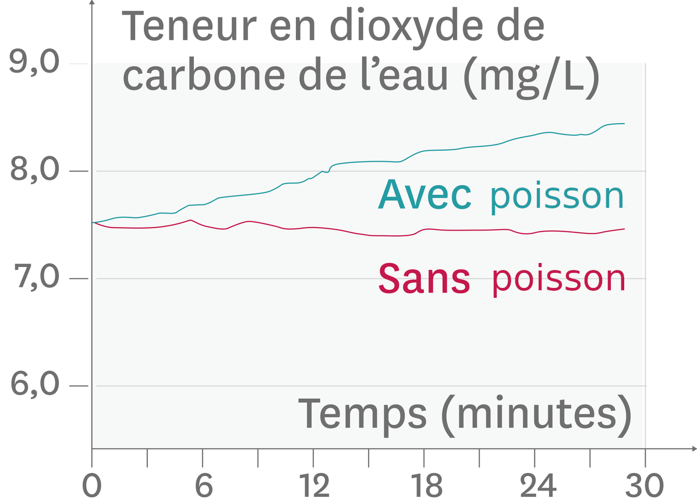

# Activité : Les échanges gazeux lors de la respiration.

!!! note "Compétences"

    Extraire et mettre en relation 

!!! warning "Consignes"

    1. Consigne collaborative : indiquer en justifiant les gaz qui sont échangés par l’être vivant de votre document.  
    2. Consigne collaborative : retrouver dans quel milieu les échanges se font et comparer la surface de l’organe respiratoire à celle du corps.   
    3. Consigne coopérative : Présentez dans un tableau, les gaz échangés par les êtres vivants, le milieu de respiration,  les différents organes, les caractéristiques des organes qui permettent aux animaux de respirer.
    4. Consigne coopérative : Faire une phrase comparant la respiration de ces êtres vivants.
    
??? bug "Critères de réussite"
    - identifier les échanges gazeux
    - représenter ces échanges sous une forme compréhensible par tous
    - communiquer mes conclusions en les argumentant

## Équipe 1 : Les échanges gazeux respiratoires d’une souris

**Document 1 La composition de l’air.**

L’air est un mélange de plusieurs gaz que l’on peut détecter avec différents appareils de mesure. Dans l’eau, ces gaz existent à l’état dissous, mais en quantité beaucoup plus faible.

**Document 2 Les mesures des échanges gazeux chez une souris.**

On mesure la teneur en dioxyde de carbone et en dioxygène dans l’air d’une enceinte contenant ou non une souris.

**Document 3 L’organisation des poumons chez les mammifères**

{: style="width: 300px;"}

Les souris ont des poumons comme les humains.
Lors de l’inspiration, le diaphragme, situé sous les poumons, se contracte. La cage thoracique s’agrandit et l’air est aspiré dans les voies respiratoires. À l’expiration, ce muscle se relâche et l’air est repoussé vers l’extérieur.

**Document 4 Le détail des alvéoles à l’intérieur des poumons**

Chaque bronchiole débouche sur de minuscules alvéoles dont la fine paroi contient des vaisseaux sanguins. Cette paroi est 300 fois plus fine qu’un cheveu et réalise avec les vaisseaux sanguins une surface de 75 m², ce qui est plus grand qu’une salle de classe. La surface de la peau chez un humain est de 2 m².

{: style="width: 300px;"}

**Document 5  Les échanges**

Les échanges entre un organe et le sang se font plus facilement si  différentes conditions sont réunis :

- la surface doit être grande
- la distance entre le sang et l'organe doit être faible (épaisseur)
  

## Équipe 2 : Les échanges gazeux respiratoires des criquets

**Document 1 La composition de l’air.**

L’air est un mélange de plusieurs gaz que l’on peut détecter avec différents appareils de mesure. Dans l’eau, ces gaz existent à l’état dissous, mais en quantité beaucoup plus faible.

**Document 2 Les variations de la teneur en dioxygène dans l’eau en présence ou non d’un criquet.**

On mesure, à l’aide d’un oxymètre, la quantité de dioxygène dissous dans l’air d’une enceinte contenant ou non des criquets.

**Document 3 Des tests de la présence de dioxyde de carbone en présence ou non de criquets.**

L’eau de chaux, un liquide incolore, se trouble et devient blanchâtre en présence de dioxyde de carbone.
L’eau de chaux dans les deux enceintes est incolore au début de l’expérience et la photo ci-contre représente les résultats au bout de 30 minutes.

**Document 4 Les trachées d’un criquet**

Chez les insectes, l’air circule dans un réseau de trachées. Chaque organe de l’animal est connecté aux trachées par de petites trachéoles.
Le réseau de trachée peut représenter un volume d’air égale à la moitié du volume total de l’insecte.

**Document 5  Les échanges**

Les échanges entre un organe et le sang se font plus facilement si  différentes conditions sont réunis :

- la surface doit être grande
- la distance entre le sang et l'organe doit être faible (épaisseur)
  

## Équipe 3 : Les échanges gazeux respiratoires des poissons

**Document 1 La composition de l’air.**

L’air est un mélange de plusieurs gaz que l’on peut détecter avec différents appareils de mesure. Dans l’eau, ces gaz existent à l’état dissous, mais en quantité beaucoup plus faible.

**Document 2 Les variations de la teneur en dioxyde de carbone en présence ou non du poisson dans de l’eau de mer.**

**Document 3 La recherche du dioxygène dans l’eau en présence ou non du poisson.**

Le bleu de méthylène devient incolore lorsque le milieu est dépourvu de dioxygène.

**Document 4 Une observation de branchies de truite**

La surface des branchies est de 200 cm².
La surface du corps d’une truite est de 200 cm².
Chaque filament branchial est couvert de fines lamelles contenant des petits vaisseaux sanguins. Les branchies récupèrent 70 à 90 % d’un gaz dissous dans l’eau. L’eau circule entre les lamelles branchiales.

**Document 5 Les échanges**

Les échanges entre un organe et le sang se font plus facilement si  différentes conditions sont réunis :

- la surface doit être grande
- la distance entre le sang et l'organe doit être faible (épaisseur)
  