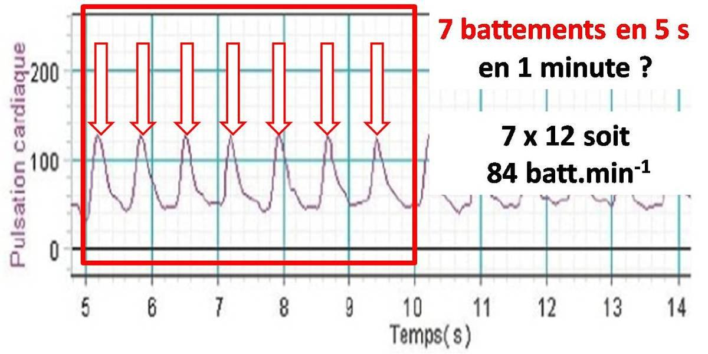
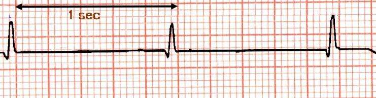

# Activité : Importance du tri des déchets

!!! note "Compétences"

    Interpréter 

!!! warning "Consignes"

    Consigne 1 : 
    
??? bug "Critères de réussite"
    - 

**Exercice  3 calculer une fréquence cardiaque à partir d'un électrocardiogramme**

!!! warning "Consignes"
    Calculer les fréquences cardiaques des deux patients du document 3.
   
Le cœur bat périodiquement c’est-à-dire que les battements se répètent dans le temps. On obtient alors une courbe avec des ondulations comme celles des électrocardiogrammes (ECG) pour l’activité électrique du cœur. Un pic est une décharge électrique du cœur qui se contracte.

Par exemple en comptant le nombre de pic en 5, 10, 15 ou 20 sec et en multipliant par 12, 6, 4 ou 3 pour ramener la valeur à 60 sec, on obtient la fréquence cardiaque du patient.

Exercice 2 : Représenter l’évolution de la fréquence cardiaque 	

Trois élèves font un footing d’échauffement pendant 4 minutes et un capteur enregistre les battements cardiaques ramenés à une valeur par minute. (unité bat./min)
!!! warning "Consignes"
    Consigne : en utilisant les données ci-dessous, sur votre cahier, tracez les 3 courbes représentant l’évolution de la fréquence cardiaque chez ces trois élèves au cours du temps.
    Les 3 courbes sont à réaliser sur le même graphique.

    Indiquer à quel moment commence l'exercice physique et à quel moment il termine 
    Pour les différencier, vous repasserez la courbe de Pierre en bleu, celle de Ines en vert et celle de Nath en rouge.

    Aide : Sur l’axe des abscisses, il y aura le temps (en minutes) ; sur l’axe des ordonnées, il y aura la fréquence cardiaque (battements/min).

| Minutes |  0 |  2 |  4 |  6  |  8 | 10 | 12 | 14 | 16 |
|:-------:|:--:|:--:|:--:|:---:|:--:|:--:|:--:|:--:|:--:|
|  Pierre | 78 | 78 | 84 | 102 | 92 | 78 | 78 | 76 | 76 |
|   Ines  | 80 | 82 | 92 | 108 | 98 | 86 | 80 | 82 | 80 |
|   Nath  | 76 | 76 | 82 |  96 | 86 | 76 | 76 | 76 | 76 |

Exercice 3 . La fréquence respiratoire

On mesure la fréquence cardiaque et la fréquence respiratoire de quelques élèves au repos et en activité (15 flexions-extensions des jambes en 30 secondes).

élèves
Lucas
Youssra
Julie
fréquence respiratoire
au repos
15
18
21
fréquence respiratoire pendant une activité physique
29
28
34
Fréquence respiratoire
après  2 minutes de repos
15
18
21
!!! warning "Consignes"
    1. Comment évolue la fréquence respiratoire au cours d’un effort ?  
    Pendant un effort ………………………………………………………………………………….

    2. Comment évolue la fréquence respiratoire après un effort ?
    Après un effort …………………………………………………………………………………….

    3. Que peux-tu constater quand tous ont pris 2 minutes de repos ?
    Après 2 minutes de repos, on remarque que …………………………………………………………

