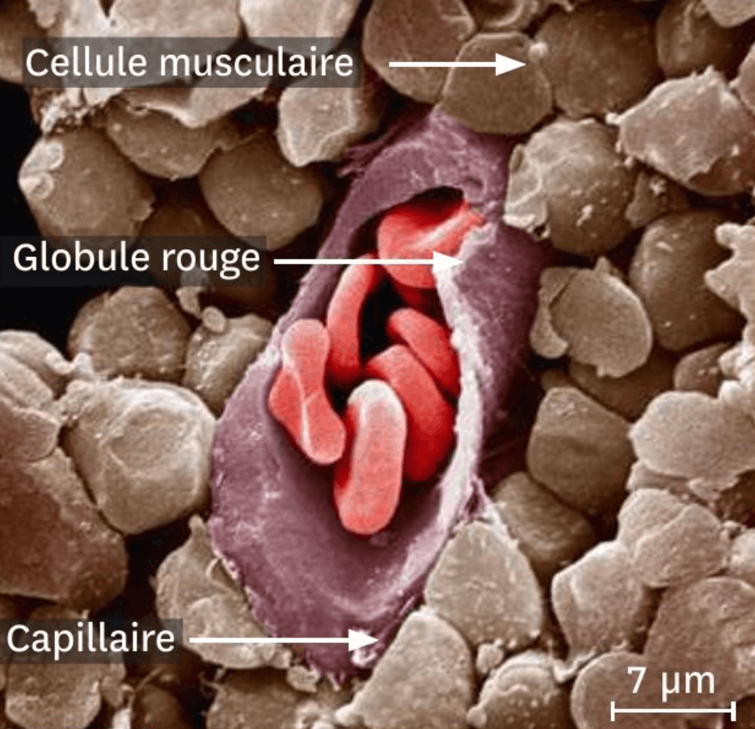

# Activité : La nutrition des cellules animales

!!! note "Compétences"

    Extraire et mettre en relation 

!!! warning "Consignes"

    1. Présentez les échanges entre une cellule et son milieu de vie.
    2. Présentez, sous la forme d'un schéma, les échanges entre les cellules et le sang et la réaction ayant lieu dans la cellule.
    3. Mesurez la distance qui sépare le sang des cellules musculaires.
    4. Indiquez de quelles molécules proviennent le dioxyde de carbone et l’urée.

    
??? bug "Critères de réussite"
    - identifier les échanges gazeux
    - représenter ces échanges sous une forme compréhensible par tous
    - communiquer mes conclusions en les argumentant

**Document 1 Composition du sang entrant et sortant d’un tissu musculaire**

Les échanges entre le sang et les cellules sont possibles, car les capillaires sont très fins.

| Molécules mesurées dans le sang d’un capillaire | Sang entrant dans le tissu (pour 1 L de sang) | Sang sortant dans le tissu (pour 1 L de sang) |
| --|--|---|
| Dioxygène (mL)  | 200 | 150  |
| Dioxyde de carbone (mL) | 490 | 560 |
|Glucose (g)  |  900 | 800 |
| Urée (g) | 0  | 4,5 |

**Document 2 Le devenir des nutriments absorbés par les cellules**

Les nutriments absorbés par la cellule servent à produire ses propres molécules qui lui permettent de fonctionner ou de se multiplier grâce à des réactions chimiques. 
La respiration cellulaire est une réaction chimique qui permet aux cellules d'avoir de l’énergie en transformant des nutriments et du dioxygène en dioxyde de carbone et en eau.

**Document 3 Une observation au microscope électronique à balayage d’un capillaire sanguin coupé au niveau d’un muscle**

**Document 4 Le devenir des molécules utilisées par les cellules**

Ces résultats montrent par exemple que la cellule transforme le dioxygène en eau.

| Atome marqué | Molécules marquées obtenues après quelques minutes | Molécules marquées obtenues après 1h | 
| --|--|---|
| Carbone du glucose  | Dioxyde de carbone | Dioxyde de carbone | 
| Azote de protides | Protéines de la cellule | 
Urée et protéine de la cellule | 
| Oxygène du dioxygène | Eau | Eau | 
