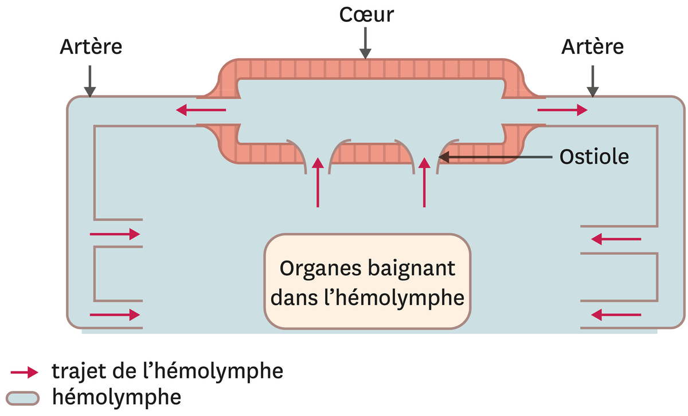
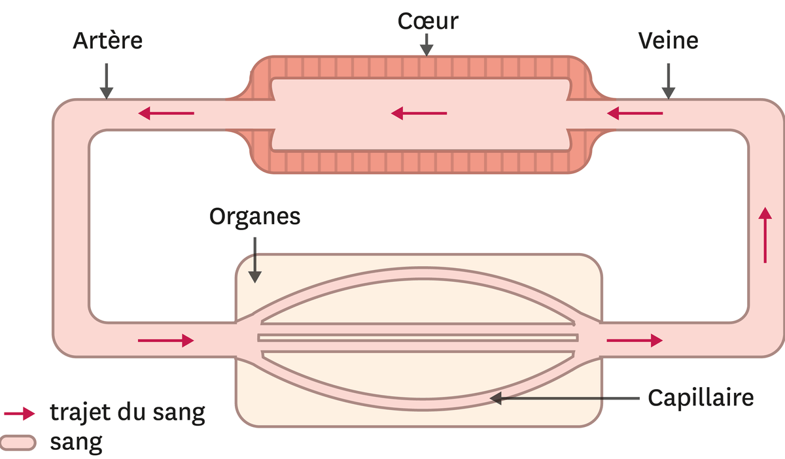
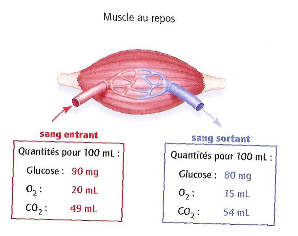
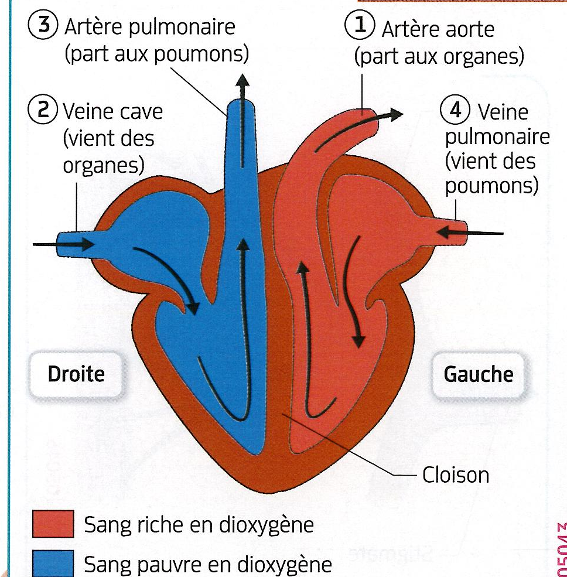
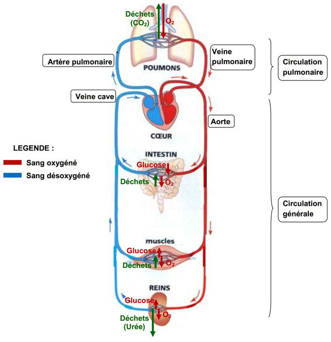
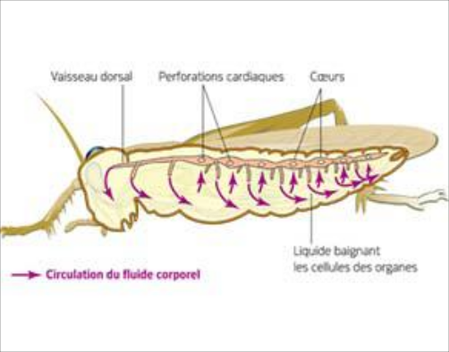

# Activité : Le système circulatoire

!!! note "Compétences"

    Interpréter 

!!! warning "Consignes"

    1. Compléter le tableau  du document 1, en indiquant pour chaque rôle les différents composants du système circulatoire.
    2. Indiquer pour chaque animal quel organe assure les fonctions dans le doc 1.
    3. 
    2
    
??? bug "Critères de réussite"
    - 

| Fonctions |  Humain    |   crevettes  |
|---|---|---|
| transport du sang du coeur aux organes |    |    |   
| transport du sang des organes aux coeur |    |    |  
| mise en mouvement du sang |    |    |    
| echanges entre le sang et les organes |    |    | 
| liquide  |    |    | 

Doc. 5 : Le système circulatoire de la crevette
La carapace transparente de cette crevette permet de voir l'hémolymphe bleue chez les
arthropodes.

Doc. 6 : L'appareil circulatoire des arthropodes comme l'écrevisse

Organes Rôle
capillaires : vaisseaux sanguins permettant les échanges entre le sang et les organes
artères : vaisseaux sanguins amenant le sang du cœur aux organes
cœur  : muscle permettant de mettre en mouvement le sang
veines : vaisseaux sanguins amenant le sang des organes au cœur

Doc. 4 : L'appareil circulatoire simplifié d'un organisme vertébré comme la grenouille

Un appareil circulatoire clos est composé d'un coeur, d'artères, de capillaires et de veines.

**Document 1 Le système circulatoire des mammifères. Chez les mammifères, le système circulatoire est composé de trois éléments :**
— le sang
— Les vaisseaux sanguins
— le cœur

**Document 2 : Les relations entre les vaisseaux sanguins le cœur et les autres organes.**
En observant un organe, par exemple un muscle, au microscope, on peut distinguer des vaisseaux très fins et ramifiés, nommés capillaires. Les capillaires permettent les échanges entre les cellules des organes et le sang. Ils relient les artères, amenant le sang du cœur à l’organe, et les veines, amenant le sang de l’organe au cœur.
On peut prélever du sang à l’entrée et à la sortie d’un organe, pour mesurer la quantité de certaines substances.
Le sang est approvisionné en dioxygène au niveau des alvéoles pulmonaires et en nutriments (glucose, par exemple) au niveau de l’intestin grêle.

**Document 3 Schéma des échanges sanguins entre le sang et des organes**

**Document 4 Schéma du cœur en face ventrale.**
Le cœur est une pompe qui expulse le sang des oreillettes vers les ventricules, puis des ventricules vers les artères. En se relâchant, il se remplit de sang provenant des veines. Le sang se contracte environ 70 fois par minute au repos, en une journée, il propulse près de 8000 litres de sang en se contractant plus de 100 000 fois.

**Document 5 : Représentation schématique de la circulation sanguine**

Schéma du système circulatoire du criquet. Le système circulatoire est composé d’un vaisseau dorsal constitué de plusieurs cœurs. Le liquide circulant est envoyé dans la cavité de l’insecte et baigne directement les cellules des organes.
Il revient au vaisseau dorsal par des perforations au niveau des cœurs.
