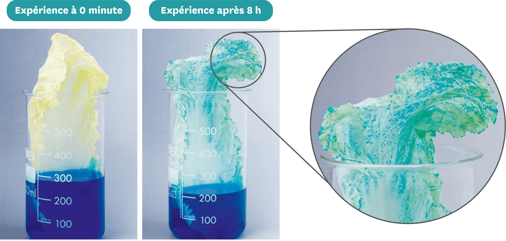
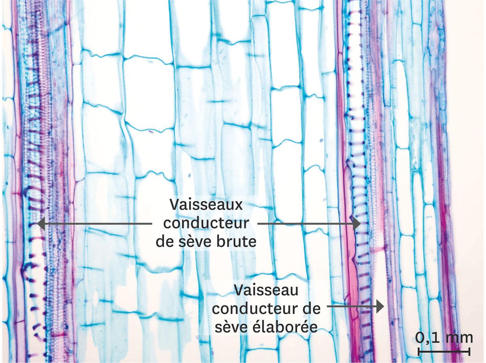
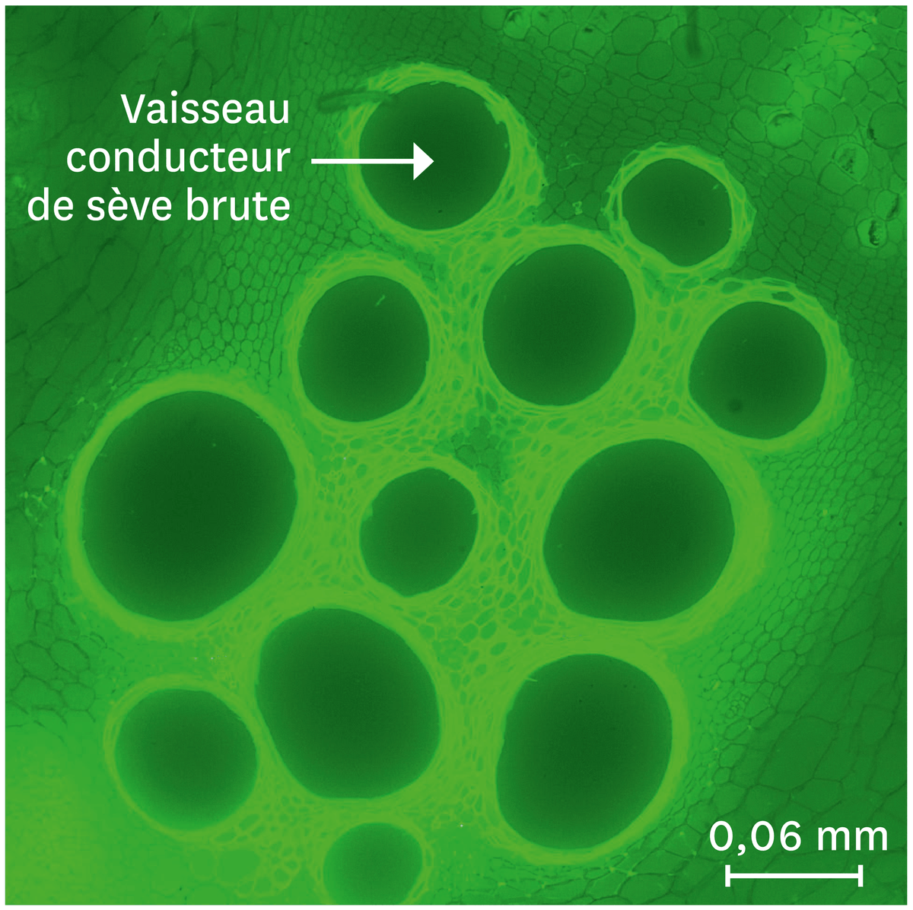
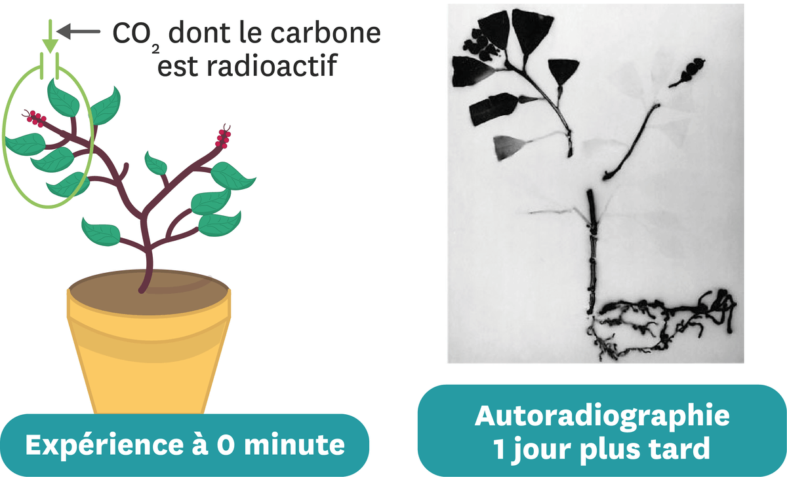

# Activité : Les échanges des végétaux avec leur milieu.

!!! note "Compétences"

    Extraire et mettre en relation 

!!! warning "Consignes"

    Expliquer, sous la forme de votre choix, comment sont approvisionnés les organes des végétaux.

??? bug "Critères de réussite"
    - identifier les gaz échangés par les feuilles à la lumière
    - identifier les gaz échangés par les feuilles à l'obscurité
    - identifier les gaz échangés par les autres organes
    - indiquer la caractéristique du dioxygène
    - que fabrique une plante à la lumière 
    - Indiquer comment sont absorbés les gaz
    - Indiquer comment est absorbée l'eau

**Document 1 : Suivi de la circulation d'une eau colorée dans une feuille de chou**

L'eau colorée suit le même trajet que la sève brute.

**Document 2 Une coupe longitudinale de tige montrant des vaisseaux conducteurs des sèves observée au microscope optique**

Cette coupe est observée après coloration en rose ou en bleu des substances des parois qui entourent les cellules végétales.

**Document 3 Une coupe transversale des vaisseaux conducteurs des sèves observée au microscope optique**

Les sèves jouent les mêmes rôles que le sang ou l'hémolymphe.

**Document 4 Une manipulation permettant de suivre le devenir du dioxyde de carbone absorbé**

On fournit du dioxyde de carbone dont le carbone est radioactif à quelques feuilles de la plante, puis on suit la localisation de ce carbone radioactif dans la plante grâce à une autoradiographie : le carbone radioactif apparaît en noir. Dans la plante, le carbone est sous forme de glucides.

**Document 5 La composition des sèves d'un végétal**

La sève élaborée circule des feuilles jusqu'aux organes qui stockent la matière organique ou qui l'utilisent.

<table><thead>
  <tr>
    <th> Type de sève </th>
    <th> Composition </th>
  </tr></thead>
<tbody>
  <tr>
    <td rowspan="2"> Sève brute </td>
    <td> 99 % eau</td>
  </tr>
  <tr>
    <td>1 % sels minéraux</td>
  </tr>
  <tr>
    <td rowspan="3">Sève élaborée</td>
    <td>80 % eau</td>
  </tr>
  <tr>
    <td>19 % matière organique (sucre essentiellement)</td>
  </tr>
  <tr>
    <td>1 % sels minéraux 		</td>
  </tr>
</tbody>
</table>

**Document 6 Vocabulaire**

La sève : liquide qui circule dans des vaisseaux entre les différents organes de la plante.

