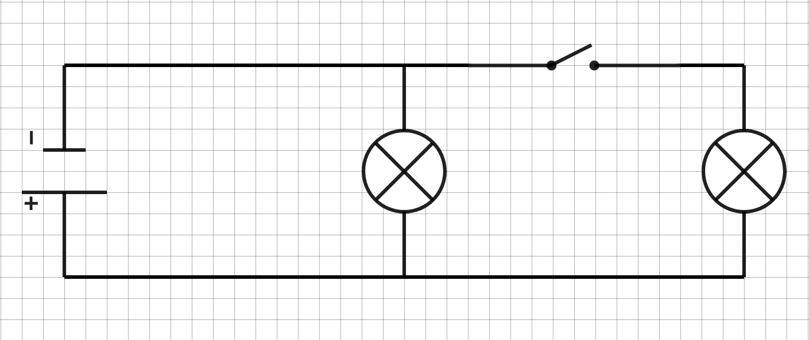

# Fiche de révision

## Compétences travaillées dans la séquence
- Retenir des idées essentielles d’une leçon
- Trouver et exploiter des informations
- Manipuler, expérimenter
- Organiser un travail en groupe
- Réaliser un schéma, un graphique

## Site internet

Pour s'entrainer un site à construire des circuits électriques :
[site](https://phet.colorado.edu/sims/html/circuit-construction-kit-dc-virtual-lab/latest/circuit-construction-kit-dc-virtual-lab_fr.html)

## Flashcards

1. 
    - A quelle composant correspond cette image ? 
    - Une ampoule
2. 
    - Dans un circuit quel élément reçoit de l'énergie ?
    - C'est le récepteur
3. 
    - Qu'est-ce que l'intensité ?
    - C'est la quantité de charges électriques qui se déplacent pendant un temps donné
4. 
    - Le circuit est-il en dérivation ou en série ? Justifier. 
    - Le circuit contient deux boucles, donc c'est un circuit en dérivation

