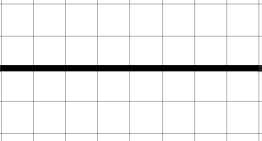

# Séquence : Electricité 

L'électricité est une  énergie que l'on utilise tous les jours. Une de ces utilisations est l'éclairage. 

!!! question "Problématique"
    De quoi a-t-on besoin pour assurer l’éclairage électrique d’une pièce ?    

## Séance 1 : Modélisation d'une lampe de poche

C’est en 1879 que l’américain Thomas Edison provoque une révolution dans le quotidien des gens. Grâce à lui, les bougies et les lampes à pétrole qui provoquaient de nombreux incendies dans les foyers ont été remplacées par les premières ampoules électriques. Aujourd’hui, une simple pression sur un bouton et nous pouvons avoir de la lumière.

!!! question "Problématique"
    Quels sont les composants électriques constituant la lampe aujourd'hui ?  
    Comment modéliser un circuit électrique ?

[Activité sur la modélisation d'une lampe](../modelisationLampe)

??? abstract "Bilan"
    Un circuit électrique est une chaîne d'objets électriques. Il contient :
    - un générateur qui fournit l'énergie électrique
    - des récepteurs qui la reçoivent (lampe, moteur, fils électrique, interrupteur).

    Pour faire fonctionner des appareils électriques, il faut au minimum que le circuit :
    - ait un générateur
    - soit une boucle fermée.

    Un dipôle est un composant d’un circuit électrique disposant de deux extrémités. Chaque dipôle est représenté dans un circuit par un symbole normalisé.

    
    <table markdown class="tg">
    <thead>
    <tr>
        <th class="tg-c3ow" rowspan="2">Pile</th>
        <th class="tg-c3ow" rowspan="2">Générateur idéal</th>
        <th class="tg-c3ow" rowspan="2">Ampoule</th>
        <th class="tg-c3ow" colspan="2">Interrupteur</th>
        <th class="tg-c3ow" rowspan="2">Moteur</th>
        <th class="tg-c3ow" rowspan="2">Fil électrique</th>
    </tr>
    <tr>
        <th class="tg-c3ow">ouvert</th>
        <th class="tg-c3ow">fermé</th>
     </tr>
    </thead>
    <tbody>
        <tr>
            <td class="tg-c3ow"></td>
            <td class="tg-c3ow"></td>
            <td class="tg-c3ow"></td>
            <td class="tg-c3ow"></td>
            <td class="tg-c3ow"></td>
            <td class="tg-c3ow"></td>
            <td class="tg-c3ow"></td>
      </tr>
    </tbody>
    </table>

*On parle d’électrisation lorsque le corps humain reçoit une décharge électrique et d’électrocution lorsque cela provoque un arrêt cardiaque.*

## Séance 2 : Intensité du courant électrique

[Activité sur la modélisation d'une lampe](../modelisationLampe)

??? abstract "Bilan"
    L’intensité du courant électrique est la quantité de charges électriques qui se déplacent pendant un temps donné. 

    Elle se mesure avec un ampèremètre. 
    {: style="width:150px"}

    L’unité de mesure est l’ampère (notée A).  

## Séance 3 : Installation électrique d'une pièce 

[Activité sur la modélisation d'une lampe](../modelisationLampe)

??? abstract "Bilan"
    Tout comme un interrupteur, une ampoule grillée (ou tout autre dipôle défectueux) ouvre le circuit. Le courant ne peut plus circuler

 
    Il existe deux types de circuit électrique :   
    <table markdown class="tg">
    <tbody markdown>
    <tr markdown>
    <td class="tg-lboi">le circuit en série&nbsp;&nbsp;:</td>
    <td  class="tg-lboi">le circuit en dérivation : </td>
    </tr>
    <tr markdown>
    <td markdown class="tg-lboi">{: style="width:300px"} </td>
    <td markdown class="tg-lboi"> {: style="width:300px"} </td>
    </tr>
    </tbody>
    </table>

    Dans un circuit en série, il y a une seule boucle. 
    Les dipôles sont dépendants les uns des autres.
    Ils sont branchés les uns à la suite des autres.

    {: style="width:300px"}

    Dans un circuit en dérivation, il y a au moins deux boucles.
    Les dipôles sont indépendants les uns des autres.
    Ils sont branchés les uns aux bornes des autres.

