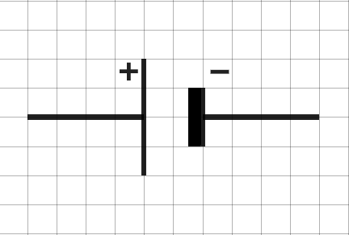
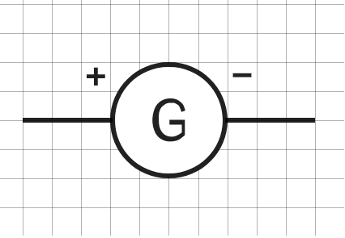
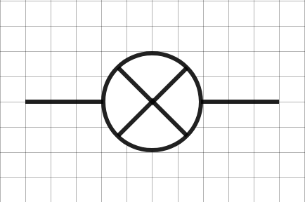
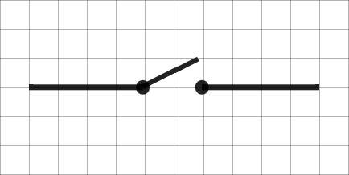
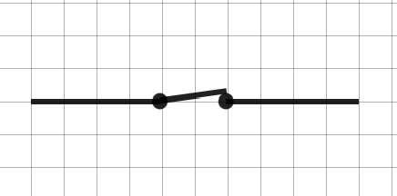
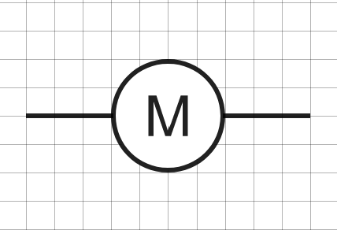
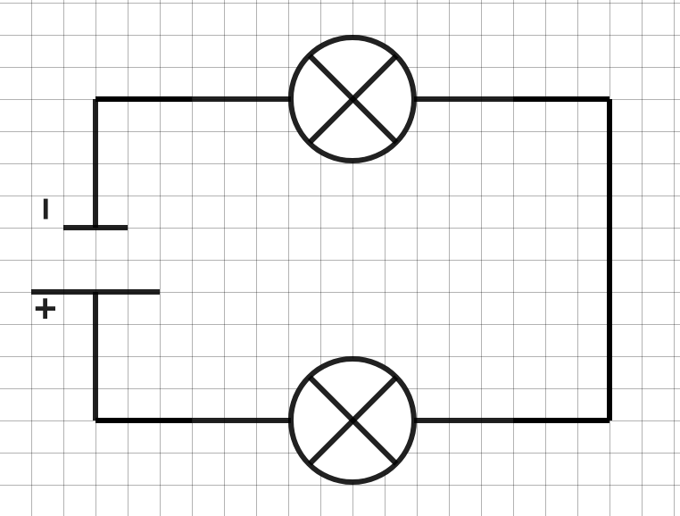
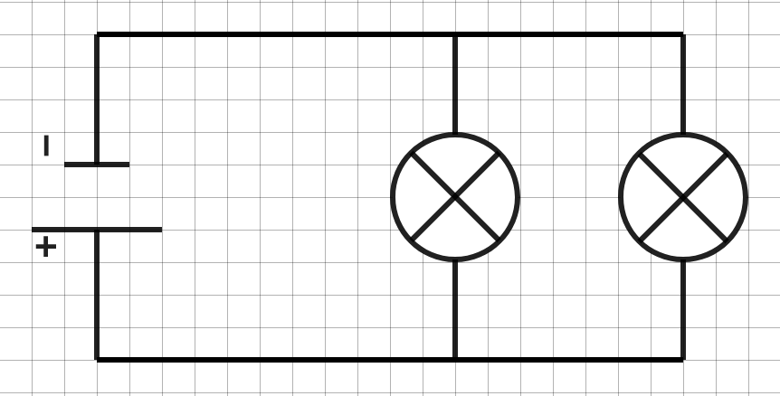
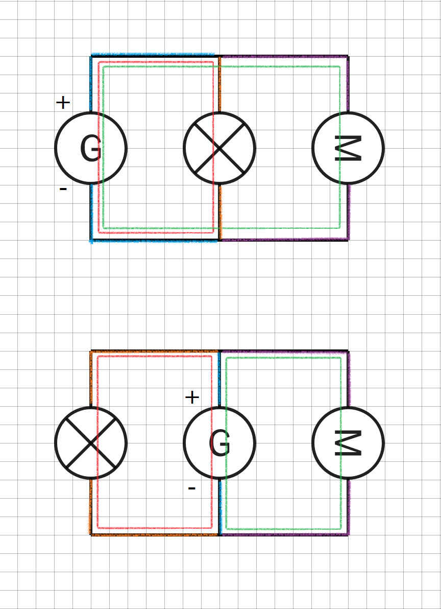

La salle de classe que vous imaginez a besoin d’éclairage. Plusieurs
solutions existent mais nous allons nous concentrer sur la plus utilisée
: l’ampoule électrique.

<u>Problématique</u> :

> De quoi a-t-on besoin pour assurer l’éclairage électrique d’une pièce
> ?

### [<u>Activité n°PC1.1 : Fonctionnement d’une lampe de poche</u>](https://docs.google.com/document/u/0/d/1wETxh-ixPKDr2ihPi2E70824NVddIOL_CSm4tPMZf70/edit) 

<u>Conclusion</u> :

Un **circuit électrique** est une chaîne d'objets électriques. Il
contient :

un **générateur** qui fournit l'énergie électrique

des **récepteurs** qui la reçoivent (lampe, moteur, fils électrique,
interrupteur).

Pour faire fonctionner des appareils électriques, il faut au minimum que
le circuit :

ait un générateur

soit une boucle fermée.

### [<u>Activité n°PC1.2 : Schématisation normalisée des circuits électriques</u>](https://docs.google.com/document/u/0/d/1j99Ocf6ENz4IA9t9Ikl1KIltX1KjfeHYjr_OUZ-Wsl0/edit)

<u>Conclusion</u> :

Un **dipôle** est un composant d’un circuit électrique disposant de deux
extrémités. Chaque dipôle est représenté dans un circuit par un symbole
normalisé.

| Pile                                        | Générateur idéal                            | Ampoule                                     | Interrupteur                               |                                            | Moteur                                     | Fil électrique                            |
|---------------------------------------------|---------------------------------------------|---------------------------------------------|--------------------------------------------|--------------------------------------------|--------------------------------------------|-------------------------------------------|
|                                             |                                             |                                             | ouvert                                     | fermé                                      |                                            |                                           |
|   |   |   |   |   |   |   |

### [<u>Activité n°PC1.3 : Intensité du courant électrique</u>](https://docs.google.com/document/u/0/d/1zL7peFmhjehM6KFoNUX8_ikcUDAzO1ojldFDFY2OrMs/edit)

<u>Conclusion</u> :

L’**intensité du courant électrique** est la quantité de charges
électriques qui se déplacent pendant un temps donné.

Elle se mesure avec un **ampèremètre**.

L’unité de mesure est l’**ampère (notée A)**.

### [<u>Activité n°PC1.4 : Installation électrique d’une pièce</u>](https://docs.google.com/document/u/0/d/15gUR6J1aLozbBffhzWKpqP4yHZ2LoTw4FhFKDfJFgdM/edit)

<u>Conclusion</u> :

Tout comme un interrupteur, une ampoule grillée (ou tout autre dipôle
défectueux) ouvre le circuit. Le courant ne peut plus circuler

Il existe deux types de circuit électrique :

le circuit **en série** 

le circuit **en dérivation**

Dans un circuit en **série**, il y a **une seule boucle**.

Les dipôles sont dépendants les uns des autres.

Ils sont branchés les uns à la suite des autres.

Dans un circuit en **dérivation**, il y a **au moins deux boucles**.

Les dipôles sont indépendants les uns des autres.

Ils sont branchés les uns aux bornes des autres.

<u>Quelques informations supplémentaires</u> :

Une **boucle** est le chemin suivi par le courant électrique dans le
circuit, partant de la borne positive du générateur pour arriver sur sa
borne négative (sens inverse de circulation des électrons).

*Exemple: il y a deux boucles, la rouge et la verte.*

Dans une boucle, il y a plusieurs **branches**. Une branche est une
portion de circuit qui comporte un dipôle.

*Exemple: dans la boucle rouge, il y a la branche orange et la branche
bleue.*

Si trois branches ou plus sont reliées en un même point, ce point est
appelé **nœud.**

*Exemple : les branches orange, bleu et violette se rejoignent en un
même point, c’est un nœud. Il y en a deux.*
