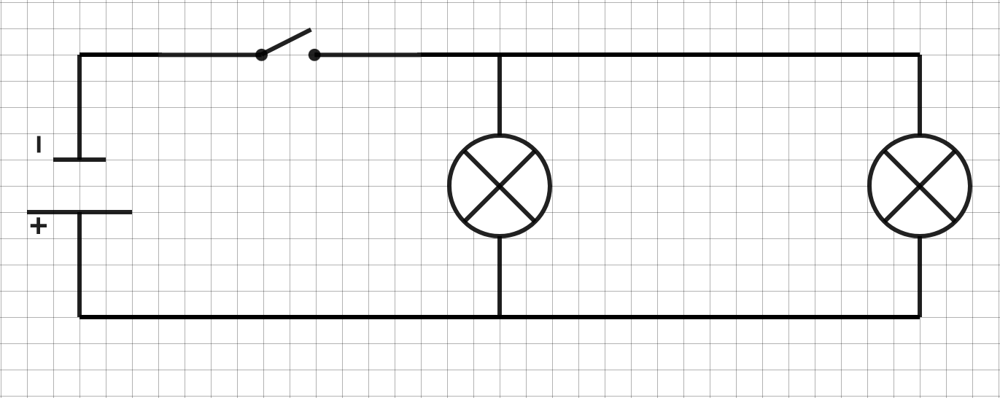

# Activité PC1.4

Circuit électrique d’une salle de classe

Vous vous lancez dans la réalisation des plans électriques de votre
salle de classe. Plusieurs contraintes sont à respecter :

1.  Il doit y avoir un seul générateur.

2.  Il doit y avoir deux lampes. Si une des ampoules grille, l’autre
    > doit continuer à briller quand même.

3.  Il doit y avoir un interrupteur pour allumer et éteindre les deux
    > ampoules en même temps.

<u>Problématique</u> :

Comment réaliser un circuit électrique répondant à toutes ces
contraintes ?

## <u>Le circuit dit “en série”</u>

<table>
<colgroup>
<col style="width: 50%" />
<col style="width: 50%" />
</colgroup>
<thead>
<tr class="header">
<th colspan="2"><ol type="1">
<li><blockquote>

Réaliser un schéma normalisé du circuit électrique répondant aux
contraintes. Représenter le sens du courant électrique.

</blockquote></li>
</ol></th>
</tr>
<tr class="odd">
<th colspan="2"></th>
</tr>
<tr class="header">
<th colspan="2"><ol start="2" type="1">
<li><blockquote>

Une fois le schéma validé par l’enseignant, réaliser le montage de ce
circuit.

</blockquote></li>
<li><blockquote>

Une fois le montage du circuit effectué, appeler l’enseignant pour
vérification.

</blockquote></li>
</ol>
<blockquote>

Fermer le circuit.

</blockquote>
<ol start="4" type="1">
<li><blockquote>

Que peut-on constater lorsqu’on dévisse l’une des deux ampoules ? Le
circuit respecte-t-il les contraintes ?

</blockquote></li>
</ol></th>
</tr>
</thead>
<tbody>
</tbody>
</table>

## <u>Le circuit dit “en dérivation”</u>

5)  Réaliser le montage du circuit suivant :

6)  Une fois validé par l’enseignant, fermer le circuit

7)  Que peut-on constater lorsqu’on dévisse l’une des deux ampoules ? Le
    > circuit respecte-t-il les contraintes ?

8)  Expliquer pourquoi le circuit suivant ne respecterait pas les
    > contraintes :  style="width:2.546in;height:0.94882in" />
