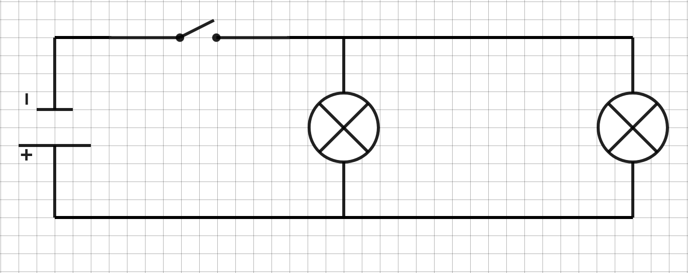
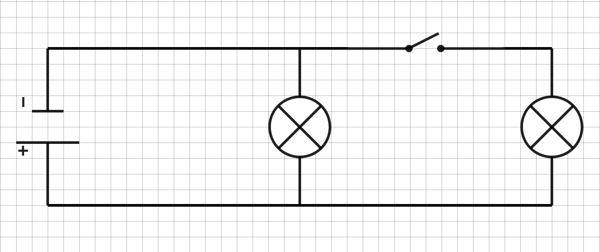

# Activité PC1.3 : Circuit électrique d’une salle de classe

!!! note "Compétences"
    - a

!!! warning "Consignes"
    Répondre aux différentes questions

!!! bug "Critères de réussite"
    -a 

## Le circuit dit “en série”

1. Réaliser un schéma normalisé du circuit électrique répondant aux contraintes. Représenter le sens du courant électrique.

2. Une fois le schéma validé par l’enseignant, réaliser le montage de ce circuit.

3. Une fois le montage du circuit effectué, appeler l’enseignant pour vérification.
Fermer le circuit.

4. Que peut-on constater lorsqu’on dévisse l’une des deux ampoules ? Le circuit respecte-t-il les contraintes ?	

## Le circuit dit “en dérivation"

5. Réaliser le montage du circuit suivant : 

6. Une fois validé par l’enseignant, fermer le circuit 
7. Que peut-on constater lorsqu’on dévisse l’une des deux ampoules ? Le circuit respecte-t-il les contraintes ?	

8. Expliquer pourquoi le circuit suivant ne respecterait pas les contraintes : 

