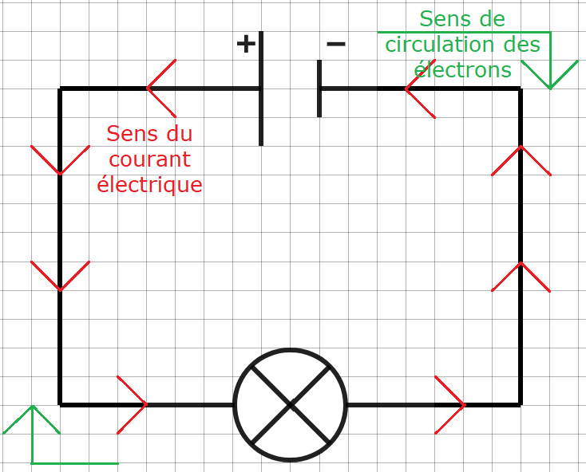
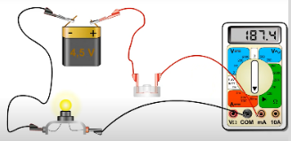
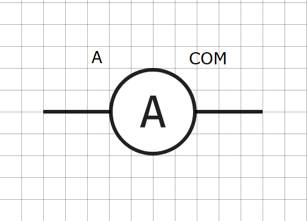

# Activité PC1.2 : Intensité du courant électrique

!!! note "Compétences"
    - Trouver et utiliser des informations
    - Manipuler
  
!!! warning "Consignes"
    Consigne 1 : Réaliser le schéma normalisé du circuit électrique du document 4. Représenter le sens du courant électrique.

    Consigne 2 : Pour mesurer l’intensité du courant électrique qui traverse les dipôles, suivre le protocole expérimental suivant :

    - Réaliser le montage du circuit électrique schématisé dans la question 1.
    - Mesurer l’intensité du courant électrique traversant chaque dipôle
    - Noter les valeurs sur le schéma

    Consigne 3 : Que peut-on dire de l’intensité du courant électrique circulant dans le circuit ?

    Consigne 4 : Y-a-t-il un risque d’électrocution avec la pile utilisée ? Justifier. 

??? bug "Critères de réussite"
    - bien respecter les normes apprises précédemment pour faire le schéma
    - attention à bien respecter les règles d'utilisation de l’ampèremètre.
    - Comparer toutes les valeurs d'intensité notées
    - Faire le lien entre l'intensité notée et les informations sur l'électrocution.

**Document 1 : Le courant électrique**

Définition : Charges électriques (électrons) en déplacement. Lorsque les électrons se déplacent, ils produisent un courant électrique.

**Document 2 : Intensité du courant électrique**

Définition : Quantité de charges électriques qui se déplacent pendant un temps donné. Son unité de mesure est l’ampère (notée A)

Dans circuit électrique, si nous avions la possibilité de regarder un point bien précis de ce circuit avec un appareil très performant à tel point que nous pourrions voir les électrons et que nous pouvions compter les électrons qui passent, dans ce cas, il suffirait de compter le nombre d’électron passant en une seconde et on obtiendrait l’intensité du courant électrique.

C’est exactement la même chose pour le débit d’une rivière: si à un endroit on observe 1000 L d’eau passer en une seconde, on obtient un débit de 1000 L par seconde : c’est l’intensité du courant de la rivière.

**Document 3 : Représentation du courant électrique**

{: style="width:500px"}

**Document 4 : L’ampèremètre**

 

{: style="width:1500px;"}

L'ampèremètre est est un appareil servant à mesurer l'intensité. Pour ne pas abîmer l'appareil, il faut toujours utiliser le calibrage le plus grand. Si la valeur affichée est plus petite que le calibre suivant on peut diminuer d'un cran.

**Document 5 : Symbole électrique normalisé**

{: style="width:150px"}

**Document 6 : Risques électriques**

Si nous touchons les bornes d'une pile, le courant qui traverse notre corps est très faible et nous ne ressentons rien. Si nous touchons les fils ou les prises du secteur, le courant est plus intense et nous ressentons son passage : c'est l'électrisation. L'électrisation peut provoquer un arrêt cardiaque ou respiratoire et donc la mort. Dans ce cas, c'est l'électrocution.
Le décès peut survenir lorsque le courant traversant le cœur dépasse 75 mA (=milliampères) pendant 1 seconde voire 30 mA pendant 30 secondes
