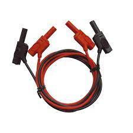

# Activité PC1.1 : Modélisation d'une lampe de poche

C’est en 1879 que l’américain Thomas Edison provoque une révolution dans le quotidien des gens. Grâce à lui, les bougies et les lampes à pétrole qui provoquaient de nombreux incendies dans les foyers ont été remplacées par les premières ampoules électriques. Aujourd’hui, une simple pression sur un bouton et nous pouvons avoir de la lumière.

!!! question "Problématique"
    Quels sont les composants électriques constituant la lampe aujourd'hui ?  
    Comment modéliser un circuit électrique ?

!!! note "Compétences"
    Extraire des informations

!!! bug Critères de réussite
    - avoir répondu aux questions
    - connaitre les règles pour faire un schéma de circuit électrique
    - avoir représenter correctement les symboles pour représenter les éléments dans un schéma électrique

## I. Composants et fonctions

!!! warning "Consigne"
    Consigne 1 : Indiquer pour chaque composant une utilité

**Document n°1 : Vue en coupe d’une lampe de poche**

  
  {: style="width:300px" }

## II. Récepteur et générateur

**Document 2 : Définitions**  
Générateur : objet fournisseur d’énergie électrique.  
Récepteur : objet receveur d’énergie électrique.

!!! warning "Consigne"
    Consigne 2 : Dans la liste suivante, indiquer pour chaque composants s'il s'agit de récepteurs ou de générateurs:

    Interrupteur, ampoule, verre, miroir, piles, ressort.

## III. Le circuit électrique, manipulation

**Document 3 : Définitions**
Circuit électrique : chaîne d’objet électrique composé de générateur et de récepteurs

!!! warning "Consignes"   
    Consigne 3 : À partir des exercices précédents, quels sont les éléments électrique de la lampe de poche qui sont indispensables pour produire de la lumière ? 

    Consigne 4 : À l’aide du matériel sur la paillasse, modéliser une lampe de poche en n’utilisant que les éléments essentiels à son fonctionnement.

## IV. Le circuit électrique, modélisation

**Document 4 : Les dipôles**  
di… = deux
…pôle = extrémité		
Élément d’un circuit électrique qui possède deux extrémités pour être branché.

**Document 5 : Méthode de schématisation électrique**  
1. Représenter un grand rectangle (il symbolise le circuit, les traits symbolisent les fils)  
2. Gommer, sur les traits du rectangles, l’emplacement des dipôles  
3. Ajouter dans les espaces gommés, le symbole des dipôles du circuit en respectant l’ordre

**Attention !**
Utiliser une règle et un crayon à papier
Ne pas représenter de dipôle dans les angles du rectangle

**Document 6 : Symboles normalisés des dipôles.**

<table markdown class="tg">
<thead>
<tr>
<th class="tg-nbj5" colspan="2">Nom</th>
<th class="tg-nbj5">Photographie</th>
<th class="tg-7yig">Symbole</th>
</tr>
</thead>
<tbody markdown>
<tr markdown>
<td class="tg-nbj5" colspan="2">Pile</td>
<td markdown class="tg-nbj5">
 {: style="width:50px" }
</td>
<td markdown class="tg-7yig"> {: style="width:50px" }</td>
  </tr>
<tr markdown>
<td class="tg-nbj5" colspan="2">Générateur idéal</td>
<td markdown class="tg-nbj5">
 {: style="width:50px" }
</td>
<td markdown class="tg-7yig"> {: style="width:50px" }</td>
  </tr>
<tr markdown>
<td class="tg-nbj5" colspan="2">Ampoule</td>
<td markdown class="tg-nbj5">
 {: style="width:50px" }
</td>
<td markdown class="tg-7yig"> {: style="width:50px" }</td>
  </tr>
<tr markdown>
<td class="tg-nbj5" rowspan="2">Interrupteur</td>
<td class="tg-nbj5">ouvert</td>
<td markdown class="tg-nbj5" rowspan="2"></td>
<td markdown class="tg-7yig"> {: style="width:100px" }</td>
  </tr>
<tr markdown>
<td class="tg-7yig">fermé</td>
<td markdown class="tg-7yig"> {: style="width:100px" }</td>
  </tr>
<tr markdown>
<td class="tg-7yig" colspan="2">Moteur</td>
<td markdown class="tg-nbj5">
 {: style="width:100px" }
</td>
<td markdown class="tg-7yig"> {: style="width:100px" }</td>
  </tr>
<tr markdown>
<td class="tg-7yig" colspan="2">Fil électrique</td>
<td markdown class="tg-nbj5">
 {: style="width:100px" }
</td>
<td markdown class="tg-7yig"> {: style="width:100px" }</td>
  </tr>
</tbody>
</table>

!!! warning "Consignes"   
    Consigne 5 : réaliser le schéma d'une lampe de poche

!!! warning "Consignes"   
    Consigne 6 : Complète le tableau en fonction de ce qu’il manque

<table markdown class="tg">
<thead>
<tr>
<th class="tg-baqh">Circuit électrique</th>
<th class="tg-baqh">Schéma électrique du circuit</th>
<th class="tg-baqh">Eléments du circuit</th>
</tr>
</thead>
<tbody markdown>
<tr markdown>
<td markdown class="tg-baqh">
{: style="width:100px" }
</td>
<td class="tg-0lax"></td>
<td class="tg-0lax">Pile Interrupteur ouvert Ampoule</td>
</tr>
<tr markdown>
<td markdown class="tg-baqh">{: style="width:100px" }</td>
<td class="tg-0lax"></td>
<td class="tg-0lax">   Interrupteur fermé Moteur</td>
  </tr>
<tr markdown>
<td markdown class="tg-baqh">{: style="width:100px" }</td>
<td class="tg-0lax"></td>
<td class="tg-0lax">                 </td>
</tr>
<tr markdown >
<td class="tg-0lax"></td>
<td markdown class="tg-baqh">{: style="width:100px" }</td>
<td class="tg-0lax">            </td></tr>
</tbody>
</table>

