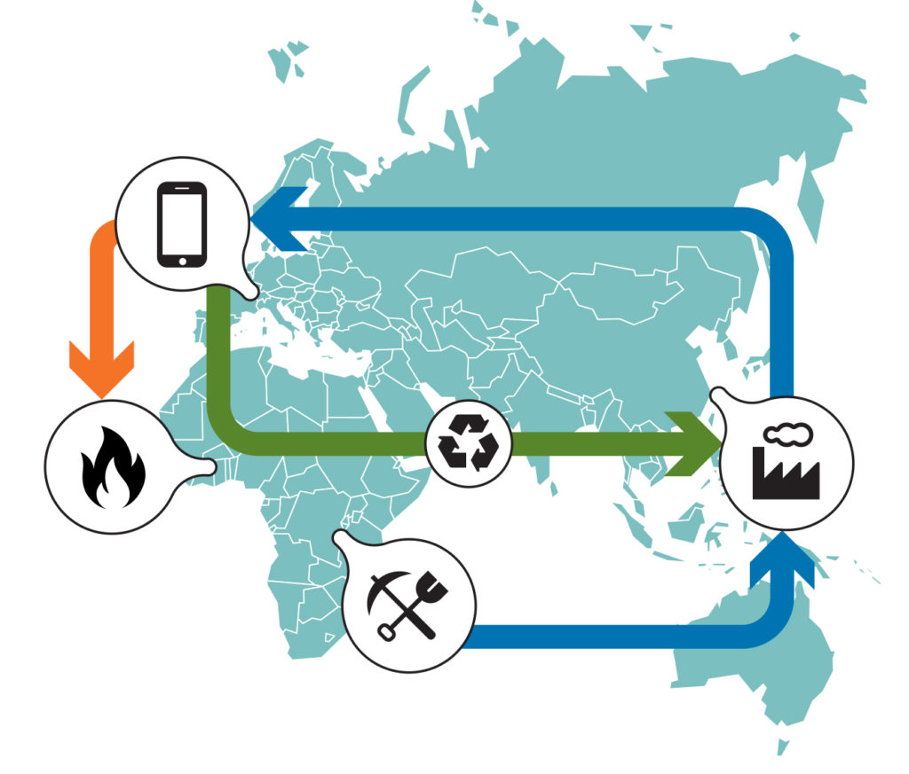

# Séquence : Évolution des objets techniques et cycle de vie

!!! note-prof
    si besoin d'infos

!!! question "Problématique"
    Comment évolue une famille d'objet ?
    

## Séance 1 : Les familles d’objets 

!!! question "Problématique"
    Qu'est-ce qu'une famille d'objets ?

[Activité Les familles d'objets techniques](../famillesObj)

??? abstract "Bilan"
    Les objets techniques peuvent être regroupés dans des familles d’objets. 
    Une famille d'objets regroupe les objets qui ont la même fonction d’usage.

## Séance 2 : Evolution d'une famille d'objets et lignées

!!! question "Problématique"
    Comment évolue une famille d'objets avec différentes lignées ? 
    
[Activité Evolution de la photographie](../evolPhoto)

??? abstract "Bilan"
    Une lignée d’objets montre dans un ordre chronologique, du plus ancien au plus récent, les objets d’une même famille qui fonctionnent sur le même principe technique.
    
    Pour répondre à nos besoins, les objets évoluent sans cesse, Les découvertes, les inventions et les innovations permettent les évolutions technologiques. Elles marquent de nettes améliorations dans de nombreux domaines, on appelle cela des ruptures technologiques. 

    Une découverte est une nouvelle connaissance, qui n’est pas utilisée telle quelle.
    Une invention est une nouvelle technique ou un nouveau matériau mis au point en utilisant une découverte.
    Une innovation est la commercialisation d’un objet technique que l’on a créé ou fait évoluer grâce à une invention

    Le contexte historique, social, environnemental, scientifique et économique permet d’expliquer l’évolution des objets.

## Séance 3 : Cycle de vie, impacts sociétaux et environnementaux 

!!! question "Problématique"
    Quel est le cycle de vie d’un appareil photo ?

    
[Activité Cycle de vie des objets techniques](../cycleVieObj)

??? abstract "Bilan"
    Le cycle de vie d’un objet est une succession de 5 étapes : l’extraction des matières premières, la fabrication, la distribution (transport + stockage), l’utilisation et la fin de vie.
    Toutes les étapes du cycle de vie d’un objet ont des impacts environnementaux (sur la nature : épuisement des ressources, pollutions de l’air, des eaux et du sol...) et sociétaux négatifs (sur l’être humain : santé, conditions de travail...). 
    Des solutions existent : comme le développement durable qui consiste à répondre aux besoins du présent sans compromettre la capacité des générations futures à répondre à leurs propres  besoins. Il doit permettre le développement économique et social et le respect de l’environnement.
    

## Séance 4 : Exercices

    
[Activité Exercices](../exercicesObjetsTech)

??? abstract "Bilan"

    

