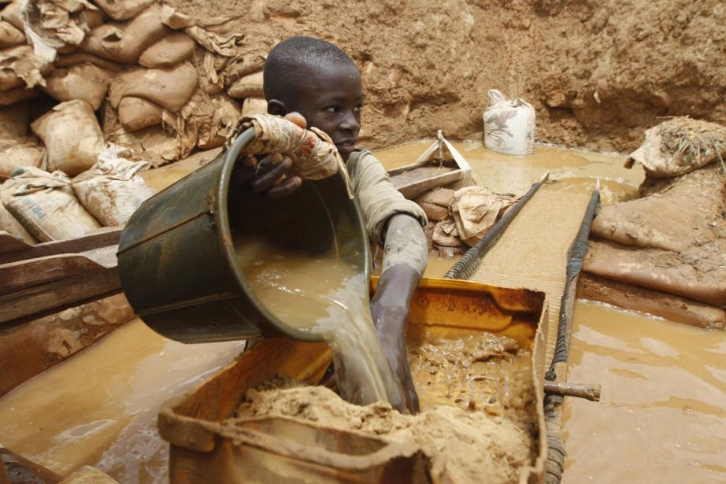
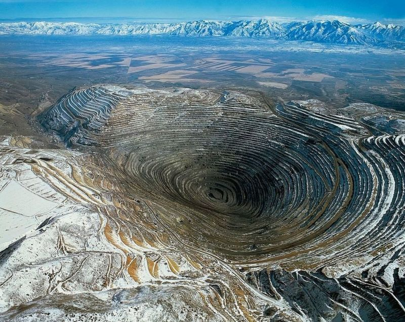
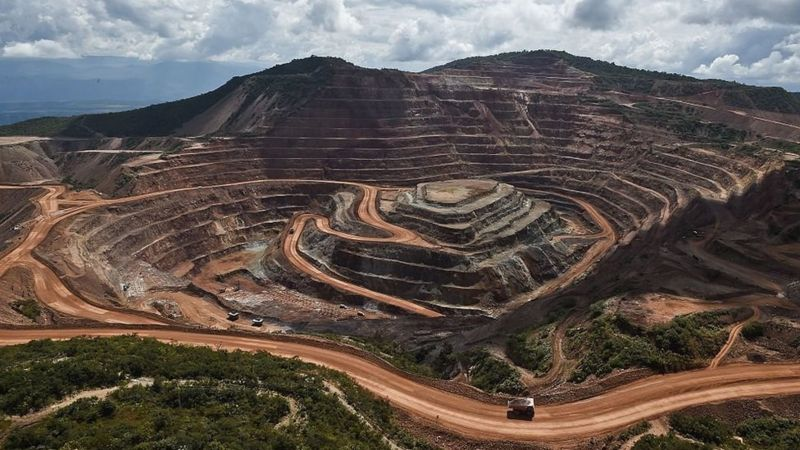
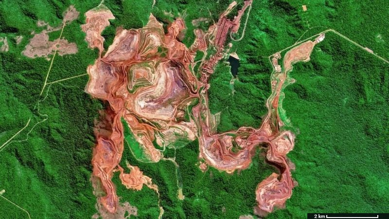
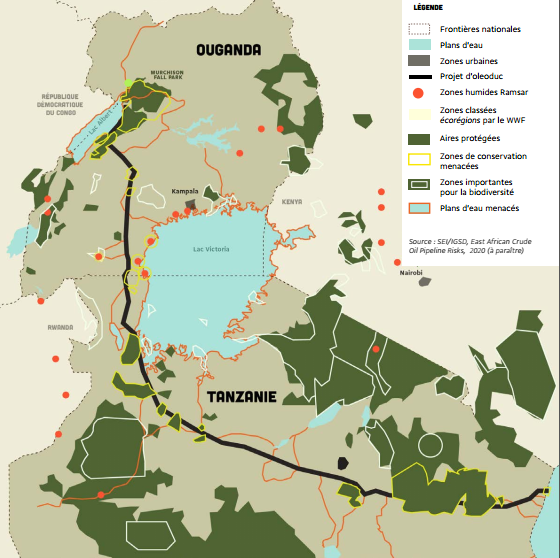
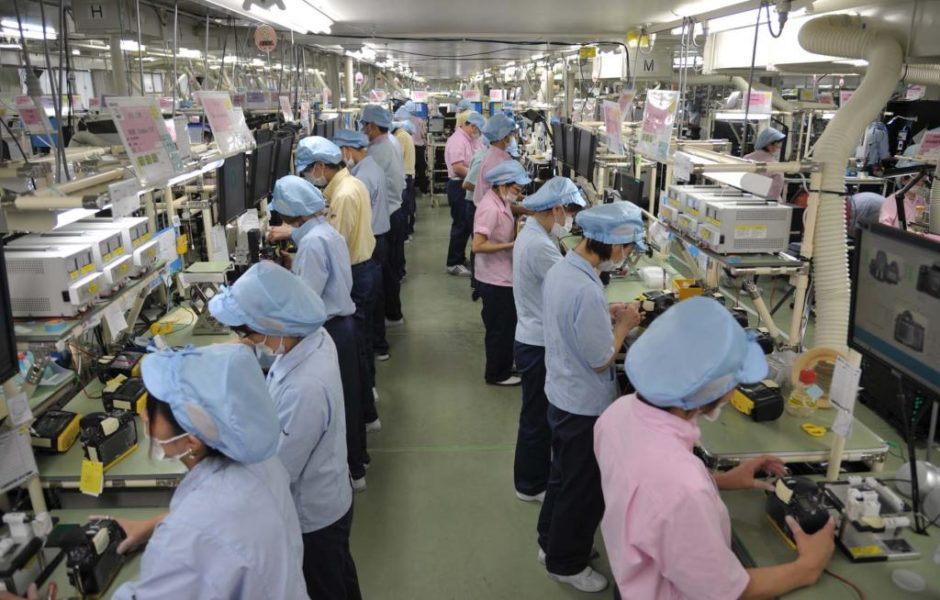
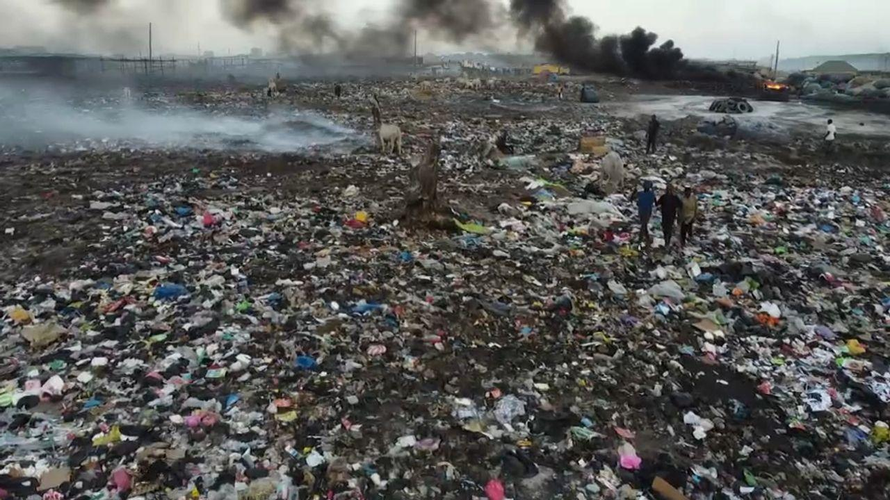

# Activité : Cycle de vie, impacts sociétaux et environnementaux

!!! note "Compétences"

    trouver et utiliser des informations. 

!!! warning "Consignes"

    1. A partir des différents documents, lister les étapes du cycle de vie d’un appareil photo.
    2. Proposer une schéma du cycle de vie d’un appareil photo. 
    3. Créer un tableau indiquant pour chaque étape l’impact sociétal et l’impact environnemental.   

??? bug "Critères de réussite"
    - Au moins 5 étapes.

**Document 1 Cycle de vie d'un objet technique.**

Le cycle de vie d’un produit correspond à l’ensemble des étapes de commercialisation qu’il traverse au cours du temps. De l’extraction des matières premières nécessaires à leur conception jusqu’à leur fin de vie, les appareils électroniques font partie intégrante de notre quotidien. Cette proximité nous fait oublier leur origine et leurs conditions de fabrication.

**Document 2 Les matières premières**

On retrouve, dans les appareils photos et comme dans de nombreux autres appareils électroniques, beaucoup de matières premières : du plastique, des métaux, etc. 

Le plastique est un dérivé du pétrole. Son exploitation nécessite un forage des sous-sols rocheux parfois par fracturation hydraulique. Ce procédé entraîne le rejet d’eaux polluées qui ne sont pas recyclées. 

Les métaux, difficiles à exploiter, constituent une grande partie “invisible” de la composition d’un appareil électronique. Leur extraction et leur purification sont généralement très nocives pour l’environnement, polluant les eaux à proximité, détruisant la biodiversité… Les eaux polluées entraînent des risques pour le personnel des sites miniers qui n’y sont pas protégés face aux substances toxiques, notamment en Afrique.

Un million d'enfants de 5 à 17 ans travailleraient dans des mines à travers le monde.

**Document 3 Conséquences sur les paysages de l'exploitation minière**
 / 

**Document 4 Mine de Carajas au Brésil, une des plus grandes mines de fer de la planète**

**Document 5 : Le transport**

Après extraction, les matières premières sont acheminées par divers moyens jusqu’aux usines, dont de nombreuses sont situées en Asie.  

Le transport du pétrole s’opère au moyen d’oléoduc, à savoir, de grandes et longues canalisations chauffées. Elles traversent, des zones à risque, privant de leurs terres des milliers de personnes, du point d’extraction jusqu’au lieu de transport maritime où un pétrolier prend le relais.

Le transport des métaux, des carrières aux usines de raffinage, se réalise par transport terrestre ou maritime, par camion ou bateau.

**Document 6 Projet EACOP, Total**

Le projet EACOP est un projet d'oléduc d'une longueur de 1443 km. Il traverse deux pays Ouganda et la Tanzanie.

100000 personnes ont été expropriées et le projet met en danger de nombreux écosystèmes.

**Document 7 Les usines**

Une fois arrivées, les matières premières sont travaillées, fabriquant ainsi les composants des appareils électroniques. Ces derniers sont assemblés dans une chaîne de montage, automatisée ou non. Les employés qui travaillent dans les usines d’Asie, avec des conditions de travail pénibles, gagnent généralement très peu d’argent. Le travail des enfants et des jeunes ouvriers dans ces usines est un autre aspect problématique de la fabrication des appareils électroniques. 

**Document 8 De l’usine à la maison**

Une fois le produit conçu et fabriqué, il est acheminé dans les différentes parties du monde à des fins commerciales.  

Dans les rayons des magasins, on retrouve énormément de modèles différents, répondant à des fonctions d’usage et d’estime toutes aussi variées. Le marketing et la vente de ces appareils prennent aussi place dans le processus (publicité, service après-vente, etc.) 

Une des fonctions d’estime des nouveaux smartphones est la qualité des photographies. En Europe, un téléphone portable est changé tous les 18 mois. Chez les 12-17 ans, ce changement passe à 9 mois. Près de 2 milliards de téléphones portables ont été fabriqués en 2018, soit 61 appareils chaque seconde.

En suisse, on estime à près de 8 millions de vieux téléphones inutilisés et l’ensemble des ordinateurs portables inutilisés contiennent plus de 300 kg d’or et près de 2 t d’argent.

**Document 9 Et après ? Décharge, incinération en Afrique ou recyclage en Asie ?**

Puisque les réserves de certaines matières premières seront bientôt épuisées, le recyclage permet d’en valoriser une partie pour construire de nouveaux équipements.
Cependant, le recyclage à un coût économique et tous les équipements ne peuvent pas être recyclés. Des appareils en provenance d’Europe s’entassent donc dans des décharges en Afrique (photo ci-contre).

Sur place, beaucoup de gens essaient de gagner de l’argent en brûlant les plastiques pour récupérer les métaux précieux comme le cuivre, l’argent ou l’or produisant par la même occasion des gaz toxiques qui s’échappent des pièces en plastique lorsqu’elles sont incinérées. 

