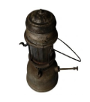
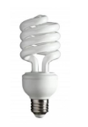
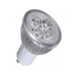

# Activité : Exercice d’application

!!! note "Compétences"

    Trouver et utiliser des informations 

!!! warning "Consignes"

    1. A quelle famille appartiennent ces objets ? 
    2. Remplacer tous les objets sur la frise chronologique.
    3. Séparer avec deux couleurs différentes deux lignées sur la frise chronologique et indiquer la rupture technologique.
    4. Sur quel principe de fonctionnement fonctionne la première lignée ?
    5. Expliquer en quoi les ampoules à incandescence peuvent être qualifiées d’invention. 
    6. Expliquer en quoi les ampoules LED sont une innovation qui répond à un besoin de développement durable.
    7. Expliquer en quoi les ampoules LED ont tout de même un impact écologique  et comment le limiter

    
??? bug "Critères de réussite"
    - 

**Document 1 Chandelle.**

La chandelle de graisse animale ou suif éclaire les campagnes tandis que la bougie faite de cire d’abeille est plus coûteuse. Les premières traces de chandelles ont 5000 ans.

**Document 2 Lampe à pétrole.**

À partir de 1853, la lampe à pétrole est constituée d’un réservoir de pétrole qui monte vers le bec grâce à une mèche.

**Document 3 lampe fluocompacte**

Par son tube miniaturisé et replié sur lui-même, dès 1970, cette lampe appelée aussi fluocompacte apparaît bien plus écologique et économique que ses concurrentes. Ce type d’ampoule consomme 15W pour un éclairement de 750 lumens et a une durée de vie de 10 ans.

**Document 4 Lampes à graisse**

Les lampes à graisses utilisent toutes sortes de graisses d'abord animales, puis des huiles végétales, plus fines et plus liquides mais également plus rares.  Les premières traces de lampes à graisse ont 27000 ans environ.
Les lampes à huile sont utilisées de l’Antiquité au Moyen Age. 

**Document 5 Ampoule à incandescence**

En 1879, Edison invente la lampe à incandescence à filament de carbone chauffé dans du vide : l’ampoule électrique. Ce type d’ampoule consomme 60W pour un éclairement de 750 lumens et a une durée de vie de 6 mois.

**Document 6 Lampes à DEL**

Les lampes à diodes électroluminescentes (DEL) équipent plus souvent les nouvelles habitations du fait de leur consommation réduite et de leur durée de vie plus longue. Ce type d’ampoule consomme 2W pour un éclairement de 750 lumens et a une durée de vie de 20 ans.

**Document 7 frise chronologique**

