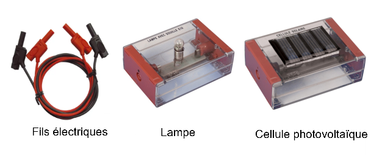

# Activité : Conversion d’énergie et unité

!!! note "Compétences"

    Manipuler
    Schématiser 

!!! warning "Consignes"

    1. À partir du matériel disponible dans le document 1, proposer un protocole expérimental permettant de montrer qu’un panneau solaire peut produire de l’électricité. Faire valider le protocole
    2. Mettre en place le protocole.
    3. Schématiser le circuit électrique.
    4. Compléter la chaîne énergétique suivante à l’aide du vocabulaire suivant : 
    Énergie électrique /  Énergie lumineuse / Soleil / Énergie thermique / Cellule photovoltaïque /  Énergie solaire /Environnement / Ampoule / Environnement / Énergie thermique / Environnement
   
??? bug "Critères de réussite"
    - 

**Document 1 Matériel utilisable.**

**Document 2 Dégradation et pollution.**
On donne le symbole de la cellule photovoltaïque :
{:style="width:250px;"}

**Document 3 Chaîne énergétique**

On appelle chaîne énergétique la modélisation des transferts d’énergie et les conversions d’énergie grâce à des convertisseurs : 

- Les rectangles symbolisent les réservoirs d’énergie ;
- Les ovales symbolisent les convertisseurs ;
- Les flèches symbolisent les transferts d’énergie.

**Document 4 Chaîne énergétique d'une centrale solaire**

