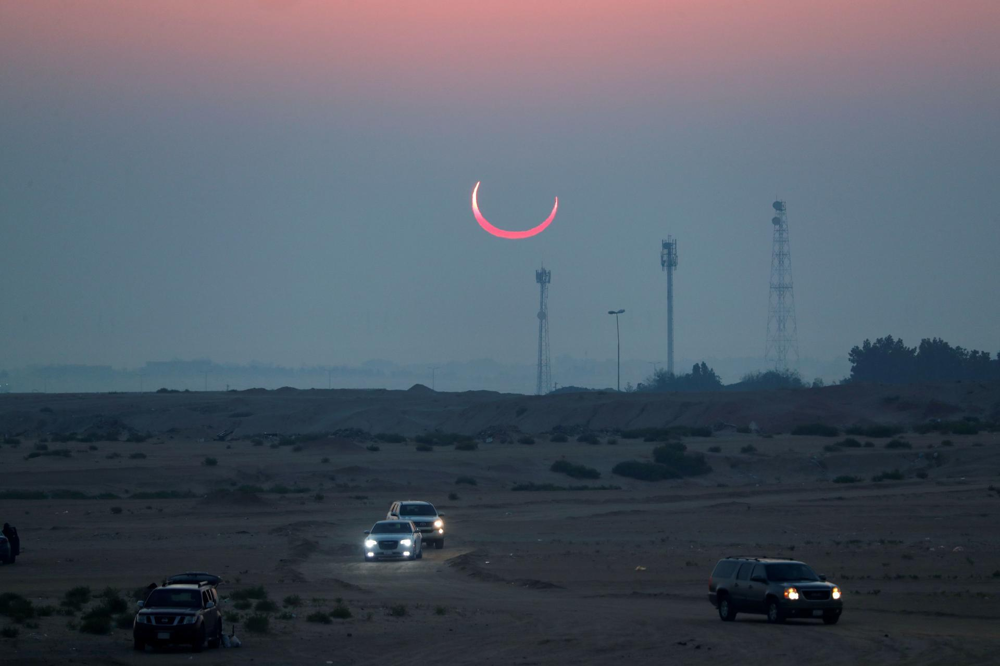

# Activité : Propagation de la lumière et éclipse

!!! note "Compétences"

    - manipuler
    - Schématiser

!!! warning "Consignes"
    1. Compléter le schéma en traçant deux rayons de lumineux émis par le Soleil. Un rayon issu de S1 et passant par N ; et un autre issu de S2 et passant par S. 
    2. Quelle est la source lumineuse ?
    3. Fait-il jour ou nuit aux points A, B et C ? Justifier. 
    4. En s’inspirant du schéma de l'éclipse de Lune, réaliser un schéma permettant d’expliquer la situation décrite en introduction de l’activité (cercle de feu à Al-Hufuf). Attention à respecter les tailles et distance du schéma. On considérera que Al-Hufuf est proche de l'équateur dans notre schéma
    5. Expliquer pourquoi, l'exlipse n'a pas été vu en France
    
??? bug "Critères de réussite"
    - 

Le 26 décembre 2019 en Asie s’est produit un phénomène rare que l’on appelle “cercle de feu”. Dans l’est de l’Arabie saoudite, à Al-Hufuf, on a pu observer ceci :

!!! question "Problématique"
    Comment peut-on en obtenir une telle photographie ?

**Document 1 Observation de l’Univers**

En sciences, on peut utiliser les ombres pour obtenir des informations que l'on ne voit pas directement (position de la source de lumière, présence d’un objet, etc.) C’est le cas de cette photographie de Jupiter. On observe trois ombres, mais seulement deux objets (satellites naturels de Jupiter).

**Document 2 Représentation d'une éclipse de Lune**

Lors d’une éclipse de Lune, cette dernière passe dans une zone que la lumière du Soleil ne peut pas atteindre, la Terre faisant obstacle.

