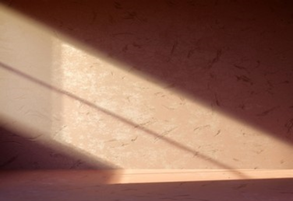

# Activité : Propagation de la lumière et éclipse

!!! note "Compétences"

    - manipuler
    - Schématiser

    
??? bug "Critères de réussite"
    - 

Le 26 décembre 2019 en Asie s’est produit un phénomène rare que l’on appelle “cercle de feu”. Dans l’est de l’Arabie saoudite, à Al-Hufuf, on a pu observer ceci :

!!! question "Problématique"
    Comment peut-on en obtenir une telle photographie  ?

## Partie 1 : Chemin suivi par la lumière

!!! warning "Consignes"

    1. Mettre en place le protocole du document 1.
    2. Schématiser la situation
    3. Déduire le trajet de la lumière. Préciser le point de départ, le chemin suivi ainsi que le point d'arrivée. 

**Document 1 Protocole**

- Placer le premier écran E1 percé devant la source primaire de lumière.
- Placer un autre écran E3 percé, parallèlement à E1 de manière à observer la source de lumière au travers du trou de E3
- Intercaler un autre écran, E2, entre E1 et E3
- Ajuster la position de E2 de manière à observer la source primaire de lumière au travers de E3
- Insérer un spaghetti dans les trous des trois écrans.

## Partie 2 : Modélisation de la propagation

!!! warning "Consignes"

    Représenter des rayons lumineux pour les 3 situations. 

**Document 1 Modélisation des rayons lumineux**

Un rayon lumineux est la modélisation (représentation) du trajet de la lumière lors de sa propagation. 
On le représente par une droite, et on précise le sens de propagation par une flèche.
La quasi-totalité des sources de lumière n’ont pas qu’un seul rayon mais une multitude de rayons lumineux. C’est ce qu’on appelle un faisceau de lumière. 

**Document 2 Situation 1**

Dans cette situation, représenter un des rayons lumineux permettant à l'œil de voir la source de lumière.

**Document 3 Situation 2**

Dans cette situation, représenter un des rayons lumineux permettant à l'œil de voir la source de lumière en rouge, et d’autre que l'œil ne peut pas voir en vert.

**Document 4 Rayons lumineux et objts diffusants**

Les objets diffusants reçoivent la lumière d’une source et nous renvoient une partie des rayons lumineux qu’ils ont reçus. 
Dans cette situation, la source primaire envoie des rayons à la fois à l'œil (qui nous permet de le voir) et à la fleur. Celle-ci va ensuite diffuser une partie des rayons qu’elle aura reçue et notre œil pourra les capter. 

**Document 5 Situation 3**

Les photographes utilisent parfois des parapluies blancs pour obtenir un éclairage uniforme et plus naturel lors d’une séance photo. 
Dans cette situation, tracer un rayon de lumière modélisant la propagation de la lumière du flash de l’appareil photo à l’objectif pour prendre en photo la pomme.  

 

## Partie 3 : Les ombres

!!! warning "Consignes"
    1. Compléter le schéma en traçant deux rayons de lumineux émis par le Soleil. L’un issu de S1 et passant par N; et L’autre issu de S2 et passant par S. 
    2. Quelle est la source lumineuse ?
    3. Fait-il jour ou nuit aux points A, B et C ? Justifier. 
    4. En s’inspirant du schéma de l'éclipse de Lune, réaliser un schéma permettant d’expliquer la situation décrite en introduction de l’activité (cercle de feu à Al-Hufuf).

**Document 1 Milieux transparents et opaques**

La lumière ne se propage que dans les milieux transparents. Autrement dit, la lumière ne traverse pas les objets opaques. 
Ici, la lumière traverse le verre de la fenêtre mais ne traverse pas les murs. On observe alors des zones d’ombre.

**Document 2  Ombre et dessin**

Pour connaître la position de l’ombre du cube par rapport à la source de lumière, on trace les rayons lumineux partant de la source jusqu’aux extrémités (sommets) du cube jusque sur le sol puis on les relie  à la base du cube. 

**Document 3 Observation de l’Univers**

En sciences, on peut utiliser les ombres pour obtenir des informations que l'on ne voit pas directement (position de la source de lumière, présence d’un objet, etc.) C’est le cas de cette photographie de Jupiter. On observe trois ombres mais seulement deux objets (satellites naturels de Jupiter).

**Document 4 Représentation eclipse de Lune**

Lors d’une éclipse de Lune, cette dernière passe dans une zone que la lumière du Soleil ne peut pas atteindre, la Terre faisant obstacle.

