# Activité : Sources lumineuses

!!! note "Compétences"

    - Trouver et utiliser des informations
    - Proposer un protocole expérimental 

!!! warning "Consignes"

    1. Comparer la théorie de Démocrite et d’Euclide. 
    2. Rédiger un protocole expérimental que Alhazen a pu suivre pour réaliser ses conclusions.
    3. Classer les objets du document 2 selon la description d’Alhazen
    
??? bug "Critères de réussite"
    - 

**Document 1 Histoire des sciences sur la compéhension de la lumière.**

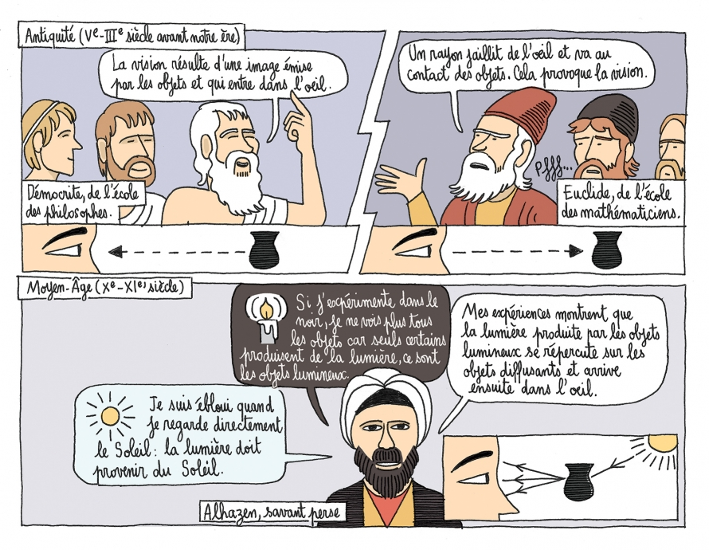

**Document 2 Quelques objets**

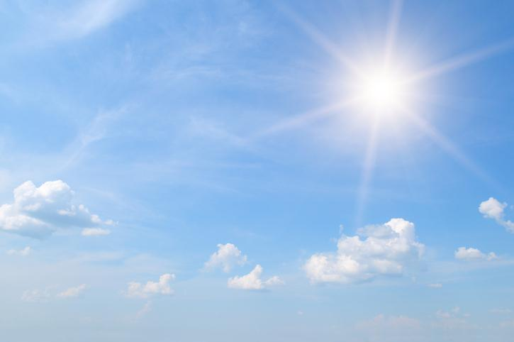{:style="width:250px; margin:10px;"}
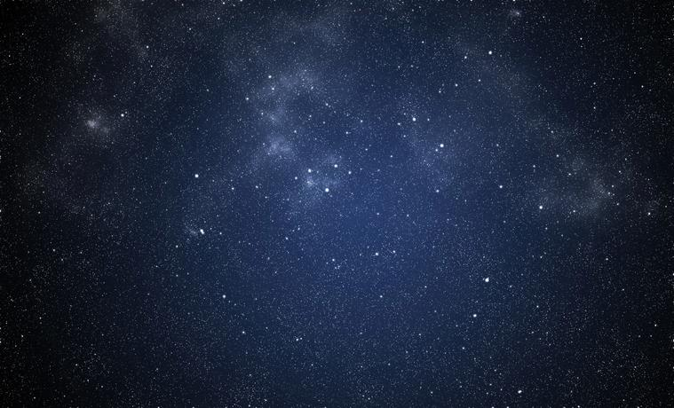{:style="width:250px; margin:10px;"}
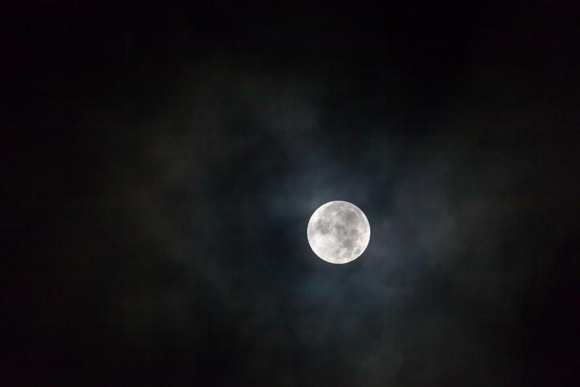{:style="width:250px; margin:10px;"}

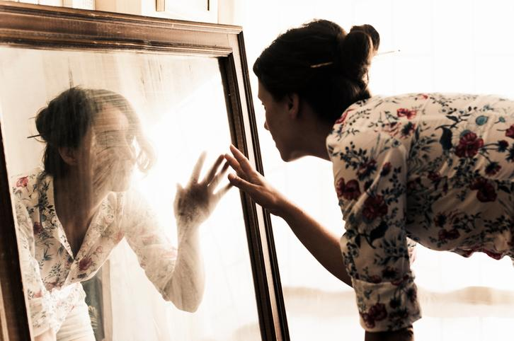{:style="width:250px;margin:10px; "}

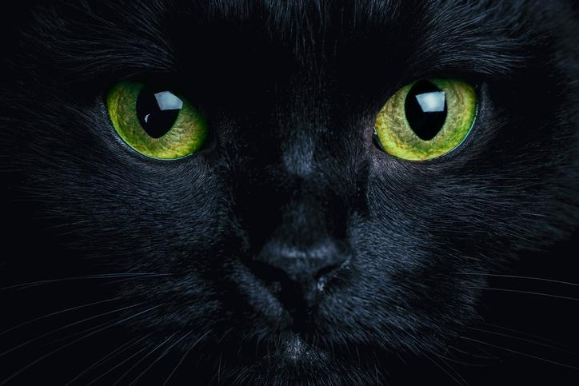{:style="width:250px; margin:10px;"}
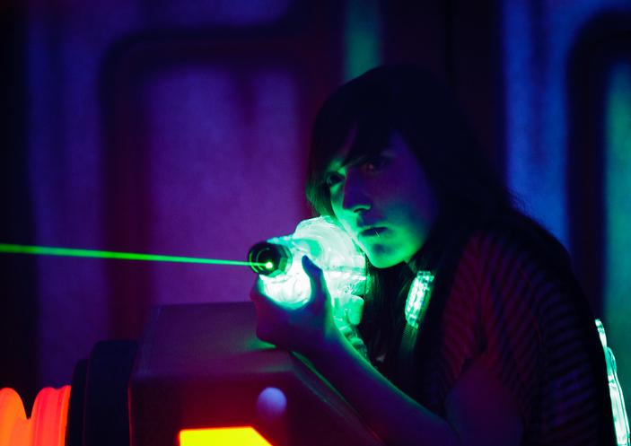{:style="width:250px;margin:10px; "}

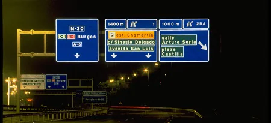{:style="width:250px;margin:10px; "}
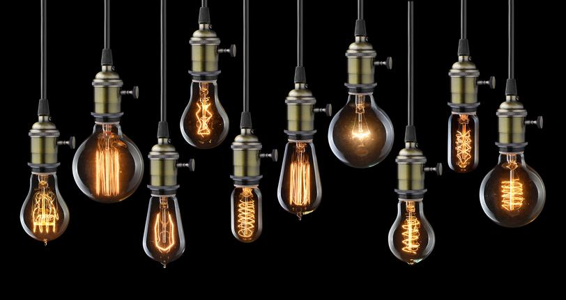{:style="width:250px; margin:10px;"}

{:style="width:250px;margin:10px; "}

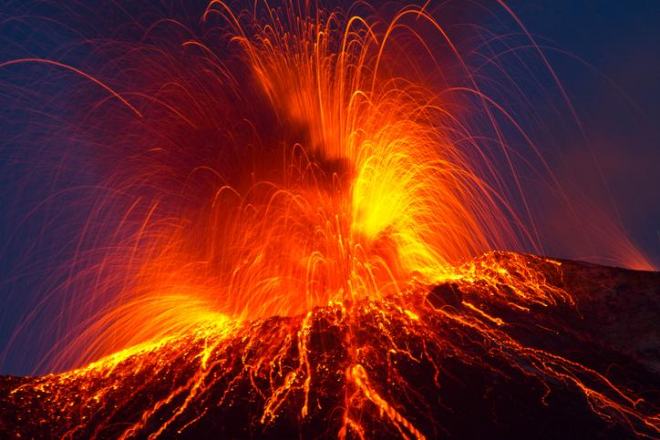{:style="width:250px; margin:10px;"}
{:style="width:250px; margin:10px;"}
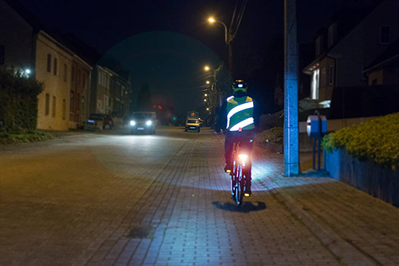{:style="width:250px;margin:10px; "}

