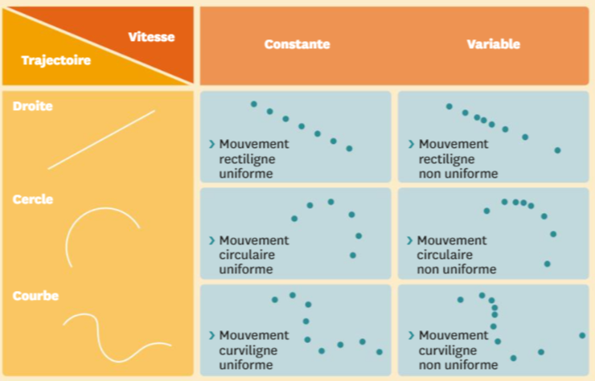

# Séquence : Mécanique

!!! note-prof
    si besoin d'infos

La mécanique est une branche de la physique consacrée à l'étude du mouvement. Elle permet d'étudier le déplacement d'un objet.

!!! question "Problématique"
    Comment décrire le mouvement d’un objet ? 

    
### Document d’appel :

## Séance 1 : Trajectoire et mouvement

Le mouvement d’un objet correspond à sa trajectoire et sa vitesse. On peut suivre la trajectoire d’un objet en pointant, image par image, à intervalle de temps régulier, sa position dans l’espace. Un objet qui se déplace suit une trajectoire, c’est-à-dire qu’il suit une succession ponctuelle de plusieurs positions dans l’espace. On repère ces positions sur une chronophotographie.

??? abstract "Bilan"

    Le mouvement est le déplacement au cours du temps d'un objet dans
    l'espace.

    Pour décrire le mouvement d'un objet il faut connaître sa
    trajectoire et l'évolution de sa vitesse.

    La trajectoire correspond à l'ensemble des positions prises au cours
    du temps par l'objet en mouvement.

    On étudie le mouvement d'un objet grâce à une chronophotographie.
    C'est une succession de photographies superposées, prises à
    intervalle de temps régulier.

    Si la trajectoire est :

    -   une droite, le mouvement est rectiligne
    -   un cercle ou un arc de cercle, le mouvement est circulaire
    -   une courbe quelconque, le mouvement est curviligne

!!! question "Problématique"
    Comment analyser la trajectoire d’un objet ?

[Activité Trajectoire et mouvement](../trajectoire)

## Séance 2 : Vitesse et mouvement

Un mouvement s'étudie pleinement grâce à une chronophotographie. Cette dernière nous donne non seulement une information sur la position de l'objet dont on étudie le mouvement mais aussi une information sur le temps de parcours. En effet, chaque image, chaque position, est représentée à intervalle de temps réguliers. Autrement dit, on peut connaître le temps qui sépare deux positions. Si on connaît la distance séparant deux points et la durée du parcours entre ces deux points, on peut déterminer une vitesse.

!!! question "Problématique"
    Comment analyser le mouvement d'un objet grâce à une chronophotographie ?
    
[Activité Vitesse et mouvement](../vitesse)

??? abstract "Bilan"
    La vitesse correspond au rapport de la distance par un temps.

    $v = \frac{distance}{variation temps} =\frac{d}{Δt}$

    Si la vitesse augmente, l’objet accélère. Si la vitesse diminue, l’objet ralentit.

    Si la vitesse :
    
    - augmente, le mouvement est accéléré
    - ne varie pas, le mouvement est uniforme
    - diminue, le mouvement est ralenti
  
    <table>
    <thead>
    <tr>
        <th colspan="2" rowspan="2">MOUVEMENT</th>
        <th colspan="3">Vitesse</th>
    </tr>
    <tr>
        <th>Augmente</th>
        <th>Diminue</th>
        <th>Constante</th>
    </tr>
    </thead>
    <tbody>
    <tr>
        <td rowspan="3">Trajectoire</td>
        <td>Droite</td>
        <td></td>
        <td></td>
        <td></td>
    </tr>
    <tr>
        <td>Cercle</td>
        <td></td>
        <td></td>
        <td></td>
    </tr>
    <tr>
        <td>Courbe quelconque</td>
        <td></td>
        <td></td>
        <td></td>
    </tr>
    </tbody>
    </table>

    

## Séance 3 : Le référentiel

Un phénomène que nous pouvons voir tous les jours, c'est le lever et le coucher du Soleil. De fait, on observe le Soleil se déplacer dans le ciel se levant à l'Est et se couchant à l'Ouest. On observe donc le Soleil en mouvement.

!!! question "Problématique"
    Pourquoi dit-on alors que c'est la Terre qui tourne autour du Soleil ?

[Activité Le référentiel](../referentiel)

??? abstract "Bilan"
    Un mouvement peut être perçu différemment en fonction de l’endroit où on se situe pour l’observer. Cet endroit est appelé référentiel. 

## Séance 4 : Exercices

[Activité Exercices sur le mouvement](../exercices)