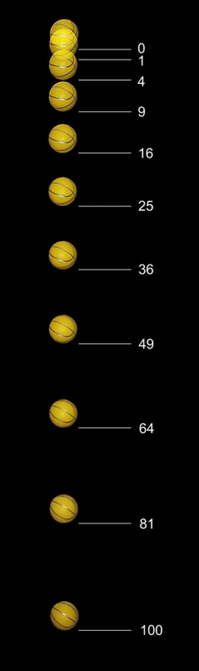
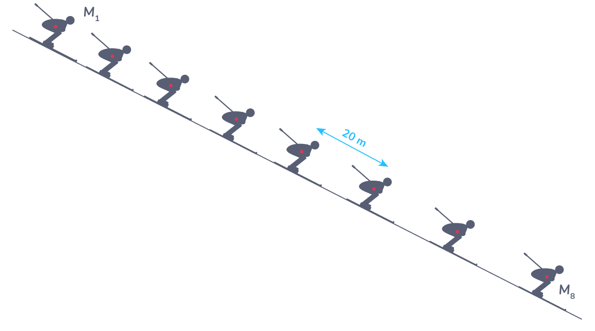

[]{#anchor}Activité PC2.1

Trajectoire et mouvement

Le mouvement d'un objet correspond à sa trajectoire et sa vitesse. On
peut suivre la trajectoire d'un objet en pointant, image par image, à
intervalle de temps régulier, sa position dans l'espace. Un objet qui se
déplace suit une trajectoire, c'est-à-dire qu'il suit une succession
ponctuelle de plusieurs positions dans l'espace. On repère ces positions
sur une chronophotographie.

*Problématique* :

> Comment analyser la trajectoire d'un objet ?

+----------------------------------+----------------------------------+
| *Document n°1* : *Trajectoire*   | *Document n°3* :                 |
|                                  | *Chronophotographie*             |
+----------------------------------+----------------------------------+
| Définition : ensemble des        | Définition : méthode d'analyse   |
| positions successives occupées   | d'un mouvement qui est décomposé |
| par un objet en mouvement au     | par une succession de            |
| cours du temps                   | photographies prises à échelle   |
|                                  | de temps régulier. Cela permet   |
|                                  | de connaître la trajectoire      |
|                                  | suivie par l'objet.              |
|                                  |                                  |
|                                  |  |
+----------------------------------+----------------------------------+
| *Document n°2* : *Les types de   |                                  |
| trajectoire et les types de      |                                  |
| mouvement*                       |                                  |
+----------------------------------+----------------------------------+
| Les trajectoires suivies par un  |                                  |
| objet en mouvement sont des      |                                  |
| formes géométriques : droite,    |                                  |
| cercle ou d'autres.              |                                  |
|                                  |                                  |
| On dira alors que :              |                                  |
+----------------------------------+----------------------------------+

1)  

    **Consigne 1 : À partir des photographies, décrire le type de
    mouvement de ces 3 objets, en vous aidant des informations du
    tableau.**

+----------------+----------------+----------------+----------------+
| Objet          | Balle de       | Nacelle d'une  | Oiseau en vol  |
|                | basket         | grande roue    |                |
+----------------+----------------+----------------+----------------+
| Chro           | {w | 841F03C.png){w | 06BF65E.png){w |

+----------------+----------------+----------------+----------------+
| Dessin de la   |                |                |                |
| trajectoire    |                |                |                |
+----------------+----------------+----------------+----------------+
| Type de        |                |                |                |
| trajectoire    |                |                |                |
+----------------+----------------+----------------+----------------+
| Type de        |                |                |                |
| mouvement      |                |                |                |
+----------------+----------------+----------------+----------------+

Consigne 2 : Le robot a été programmé pour effectuer différents
mouvements en fonction du bouton sur lequel on appuie.

Pour chaque bouton, indiquer en justifiant le type de mouvement

+--------------------------------+-------------------+---------------+
| Programme                      | Type de mouvement | Justification |
+--------------------------------+-------------------+---------------+
| {width="3.101cm" |                   |               |
| height="1.924cm"}              |                   |               |
+--------------------------------+-------------------+---------------+
| {width="3.101cm" |                   |               |
| height="1.924cm"}              |                   |               |
+--------------------------------+-------------------+---------------+
| {width="3.101cm" |                   |               |
| height="1.924cm"}              |                   |               |
+--------------------------------+-------------------+---------------+
| {width="3.101cm" |                   |               |
| height="1.924cm"}              |                   |               |
+--------------------------------+-------------------+---------------+

1)  

    Bilan :

    Le mouvement est le déplacement au cours du temps d'un objet dans
    l'espace.

    Pour décrire le mouvement d'un objet il faut connaître sa
    trajectoire et l'évolution de sa vitesse.

    La trajectoire correspond à l'ensemble des positions prises au cours
    du temps par l'objet en mouvement.

    On étudie le mouvement d'un objet grâce à une chronophotographie.
    C'est une succession de photographies superposées, prises à
    intervalle de temps régulier.

Si la trajectoire est :

-   une droite, le mouvement est rectiligne
-   un cercle ou un arc de cercle, le mouvement est circulaire
-   une courbe quelconque, le mouvement est curviligne

1)  Exercice d'application :

    Pour chaque situation décrire la trajectoire de l'objet à partir de
    sa chronophotographie et donner le type de mouvement

{width="4.233cm"
height="14.273cm"}{width="12.356cm"
height="5.583cm"}{width="9.049cm"
height="5.043cm"}{width="12.39cm"
height="7.874cm"}{width="8.07cm"
height="4.022cm"}Balle de Tennis Etoiles

Vélo

Pâle éolienne Skieur
