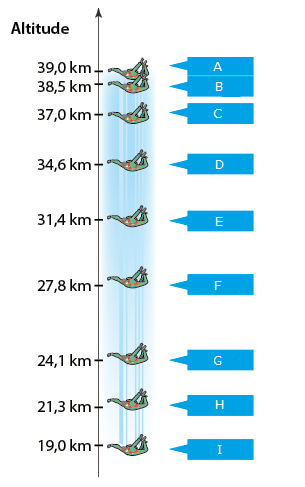
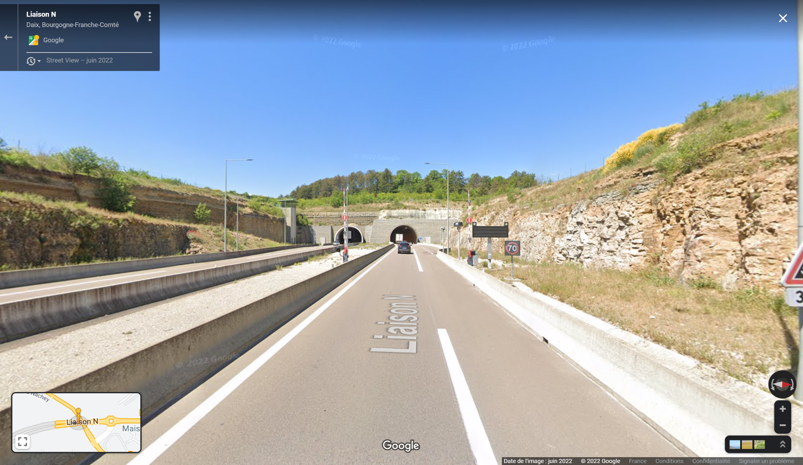

[]{#anchor}Activité PC2.2

Vitesse et mouvement

Un mouvement s'étudie pleinement grâce à une chronophotographie. Cette
dernière nous donne non seulement une information sur la position de
l'objet dont on étudie le mouvement mais aussi une information sur le
temps de parcours. En effet, chaque image, chaque position, est
représentée à intervalle de temps réguliers. Autrement dit, on peut
connaître le temps qui sépare deux positions. Si on connaît la distance
séparant deux points et la durée du parcours entre ces deux points, on
peut déterminer une vitesse.

*Problématique* :

> Comment analyser le mouvement d'un objet grâce à une
> chronophotographie ?

> {width="2.009cm"
> height="5.868cm"}

+----------------------------------+----------------------------------+
| *Document n°1* : *Les types de   | *Document n°2* :                 |
| trajectoire et les types de      | *Chronophotographie*             |
| mouvement*                       |                                  |
+----------------------------------+----------------------------------+
| Les trajectoires suivies par un  | Définition : méthode d'analyse   |
| objet en mouvement sont des      | d'un mouvement qui est décomposé |
| formes géométriques : droite,    | par une succession de            |
| cercle ou d'autres.              | photographie prises à échelle de |
|                                  | temps régulier. La distance      |
| On dira alors que :              | entre deux positions             |
|                                  | consécutives dépend de la        |
|                                  | vitesse de l'objet. Dans le cas  |
|                                  | d'un mouvement uniforme          |
|                                  | (c'est-à-dire avec une vitesse   |
|                                  | constante), la distance est      |
|                                  | constante. SI la distance        |
|                                  | augmente, c'est que la vitesse   |
|                                  | augmente et si la distance       |
|                                  | diminue c'est que la vitesse     |
|                                  | diminue.                         |
+----------------------------------+----------------------------------+

1)  **Consigne 1 : À partir des photographies, déterminer le type de
    mouvement de ces objets.**

{width="9.694cm"
height="10.818cm"}

***Exercice n°****1***

+----------------------------------+----------------------------------+
| *Document n°1* : *Réglementation | *Document n°2* : *Evolution de   |
| de la vitesse sur route en       | la vitesse en fonction du temps  |
| France*                          | de trajet*                       |
+----------------------------------+----------------------------------+
| {width="2.678cm" | D34010A0AFE.png){width="6.216cm" |
| height                           | height="3.858cm"}                |
| ="3.907cm"}{width="0.921cm" | sur le trajet est de 88 km/h     |
| height="0.921cm"}                |                                  |
|                                  |                                  |
| La réglementation peut varier en |                                  |
| fonction du type de véhicule.    |                                  |
| Ici on ne parlera que des        |                                  |
| véhicules légers (voiture)       |                                  |
+----------------------------------+----------------------------------+
|                                  |                                  |
+----------------------------------+----------------------------------+
|                                  |                                  |
+----------------------------------+----------------------------------+

1.  Quelle est la vitesse moyenne sur la totalité du trajet ?
2.  Quelle est la vitesse que l'automobiliste ne devait pas dépasser ?
    Sur quel type de route se trouvait-il ?
3.  La vitesse instantanée de l'automobiliste était-elle toujours
    supérieure ou inférieure à la limite autorisée ? Justifier.
4.  Après combien de minutes de trajet l'automobiliste a-t-il enclenché
    son régulateur de vitesse pour maintenir une vitesse constante ?
5.  Dans l'hypothèse où le véhicule suit une ligne droite et sachant que
    la vitesse est constante : comment qualifie-t-on le mouvement
    (trajectoire + vitesse)

***Exercice n°****2***

+----------------------------------+----------------------------------+
| *Document n°1* : *Vitesse        | *Document n°2* : *Un trajet sur  |
| moyenne ou instantanée*          | Dijon*                           |
+----------------------------------+----------------------------------+
| *Définition* : vitesse que       | Un automobiliste circule sur la  |
| l'objet a sur tout un trajet.    | route N274 aux abords de Dijon.  |
| Elle correspond au rapport de la | Cette route possède un radar     |
| distance parcourue par un temps  | tronçon.                         |
| donné.                           |                                  |
|                                  | {width="5.188cm" |
|                                  | height="2.568cm"}                |
| $$v_{\mat                        |                                  |
| hit{moy}} = \frac{d}{\Delta t}$$ | Il rencontre un premier radar à  |
|                                  | 8h05min53 s, roule pendant       |
| avec :                           | 1,5 km et arrive devant le       |
|                                  | second radar à 8h06min58 s.      |
| C'est le principe utilisé pour   |                                  |
| les radars "tronçons".           | Comme pour les radars            |
|                                  | classiques, les radars tronçon   |
| {width="8.44cm" | de 100 km/h sur la vitesse       |
| height="3.341cm"}                | moyenne.                         |
|                                  |                                  |
| La vitesse instantanée est la    |                                  |
| vitesse d'un objet à un instant  |                                  |
| donné. La durée du parcours est  |                                  |
| alors infiniment petite. C'est   |                                  |
| le principe du radar classique.  |                                  |
|                                  |                                  |
| {width="8.44cm" |                                  |
| height="2.953cm"}                |                                  |
+----------------------------------+----------------------------------+
|                                  |                                  |
+----------------------------------+----------------------------------+
|                                  |                                  |
+----------------------------------+----------------------------------+
| *Document n°3* : *Barème et      |                                  |
| sanctions en cas d'excès de      |                                  |
| vitesse (en km/h)*               |                                  |
+----------------------------------+----------------------------------+
|                                  |                                  |
+----------------------------------+----------------------------------+

***Question***** : En le justifiant : est-ce que l'automobiliste risque
une contravention ? Si oui, laquelle ?**

Critères de réussite :

-   avoir trouvé la vitesse maximale autorisée
-   avoir calculé la vitesse de l'automobiliste en m/s
-   avoir converti la vitesse en km/s puis en km/h
-   avoir indiquer si l'automobiliste allait avoir une contravention et
    si oui laquelle

**

**

Bilan :

La vitesse correspond au rapport de la distance par un temps.

{width="6.562cm"
height="0.847cm"}

$$$$

Si la vitesse augmente, l'objet accélère. Si la vitesse diminue, l'objet
ralentit.

Si la vitesse :

-   augmente, le mouvement est accéléré
-   ne varie pas, le mouvement est uniforme
-   **diminue, le mouvement est ralenti**

***Exercice n°****3***

{width="8.07cm"
height="12.885cm"}

Felix Baumgartner a effectué un saut historique en parachute d'une
altitude de 39 km contre 3 km pour un saut normal. On considérera Felix
Baumgartner comme l'objet d'étude. La chronophotographie ci-contre
représente l'objet toutes les 10sec. Le saut a duré environ 4min19 s

1.  Déterminer le type de mouvement entre les positions :

-   a)  A et G

    b)  G et I

1.  Dans cette situation, on considérera la vitesse instantanée comme
    étant la vitesse entre deux positions successives. Justifier que la
    vitesse instantanée maximale de l'objet est de 1 332 km/h.

1.  L'ouverture du parachute entraîne le freinage de la chute. À quelle
    position le parachute a-t-il été ouvert ? Justifier.

1.  Calculer la vitesse moyenne en km/s sur la totalité de la chute.

1.  Convertir votre résultat en km/h

Bilan :

La vitesse correspond au rapport de la distance par un temps.

{width="6.562cm"
height="0.847cm"}

$$$$

Si la vitesse augmente, l'objet accélère. Si la vitesse diminue, l'objet
ralentit.

Si la vitesse :

-   augmente, le mouvement est accéléré
-   ne varie pas, le mouvement est uniforme
-   diminue, le mouvement est ralenti

***Exercice n°****2***

+----------------------------------+----------------------------------+
| *Document n°1* : *Réglementation | *Document n°2* : *Evolution de   |
| de la vitesse sur route en       | la vitesse en fonction du temps  |
| France*                          | de trajet*                       |
+----------------------------------+----------------------------------+
| {width="2.678cm" | D34010A0AFE.png){width="6.216cm" |
| height                           | height="3.858cm"}                |
| ="3.907cm"}{width="0.921cm" | sur le trajet est de 88 km/h     |
| height="0.921cm"}                |                                  |
|                                  |                                  |
| La réglementation peut varier en |                                  |
| fonction du type de véhicule.    |                                  |
| Ici on ne parlera que des        |                                  |
| véhicules légers (voiture)       |                                  |
+----------------------------------+----------------------------------+
|                                  |                                  |
+----------------------------------+----------------------------------+
|                                  |                                  |
+----------------------------------+----------------------------------+

1.  Quelle est la vitesse moyenne sur la totalité du trajet ?
2.  Quelle est la vitesse que l'automobiliste ne devait pas dépasser ?
    Sur quel type de route se trouvait-il ?
3.  La vitesse instantanée de l'automobiliste était-elle toujours
    supérieure ou inférieure à la limite autorisée ? Justifier.
4.  Après combien de minutes de trajet l'automobiliste a-t-il enclenché
    son régulateur de vitesse pour maintenir une vitesse constante ?
5.  Dans l'hypothèse où le véhicule suit une ligne droite et sachant que
    la vitesse est constante : comment qualifie-t-on le mouvement
    (trajectoire + vitesse)

***Exercice n°****3***

+----------------------------------+----------------------------------+
| *Document n°1* : *Vitesse        | *Document n°2* : *Un trajet sur  |
| moyenne ou instantanée*          | Dijon*                           |
+----------------------------------+----------------------------------+
| *Définition* : vitesse que       | Un automobiliste circule sur la  |
| l'objet a sur tout un trajet.    | route N274 aux abords de Dijon.  |
| Elle correspond au rapport de la | Cette route possède un radar     |
| distance parcourue par un temps  | tronçon.                         |
| donné.                           |                                  |
|                                  | {width="5.188cm" |
|                                  | height="2.568cm"}                |
| $$v_{\mat                        |                                  |
| hit{moy}} = \frac{d}{\Delta t}$$ | Il rencontre un premier radar à  |
|                                  | 8h05min53 s, roule pendant       |
| avec :                           | 1,5 km et arrive devant le       |
|                                  | second radar à 8h06min58 s.      |
| C'est le principe utilisé pour   |                                  |
| les radars "tronçons".           | Comme pour les radars            |
|                                  | classiques, les radars tronçon   |
| {width="8.44cm" | de 100 km/h sur la vitesse       |
| height="3.341cm"}                | moyenne.                         |
|                                  |                                  |
| La vitesse instantanée est la    |                                  |
| vitesse d'un objet à un instant  |                                  |
| donné. La durée du parcours est  |                                  |
| alors infiniment petite. C'est   |                                  |
| le principe du radar classique.  |                                  |
|                                  |                                  |
| {width="8.44cm" |                                  |
| height="2.953cm"}                |                                  |
+----------------------------------+----------------------------------+
|                                  |                                  |
+----------------------------------+----------------------------------+
|                                  |                                  |
+----------------------------------+----------------------------------+
| *Document n°3* : *Barème et      |                                  |
| sanctions en cas d'excès de      |                                  |
| vitesse (en km/h)*               |                                  |
+----------------------------------+----------------------------------+
|                                  |                                  |
+----------------------------------+----------------------------------+

***Question***** : En le justifiant : est-ce que l'automobiliste risque
une contravention ? Si oui, laquelle ?**

Critères de réussite :

-   avoir trouvé la vitesse maximale autorisée
-   avoir calculé la vitesse de l'automobiliste en m/s
-   avoir converti la vitesse en km/s puis en km/h
-   avoir indiquer si l'automobiliste allait avoir une contravention et
    si oui laquelle
-   {width="15.247cm"
    height="7.537cm"}
