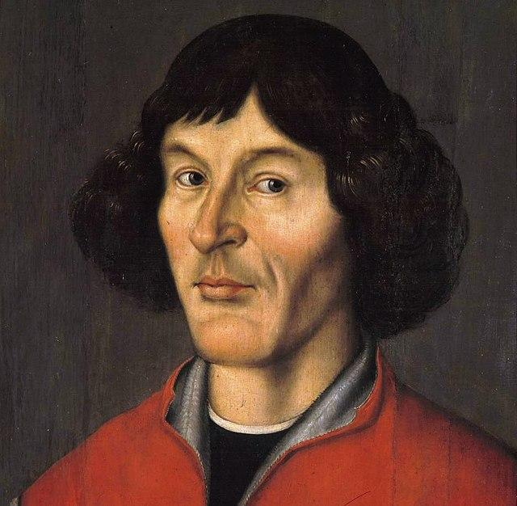

[]{#anchor}Activité PC2.3

[]{#anchor-1}Le référentiel

Un phénomène que nous pouvons voir tous les jours, c'est le lever et le
coucher du Soleil. De fait, on observe le Soleil se déplacer dans le
ciel se levant à l'Est et se couchant à l'Ouest. On observe donc le
Soleil en mouvement.

*Problématique* :

> Pourquoi dit-on alors que c'est la Terre qui tourne autour du Soleil ?

+----------------------------------+----------------------------------+
| *Document n°1* : *Les premiers   | *Document n°2* : *Et les autres  |
| astronomes*                      | astres ?*                        |
+----------------------------------+----------------------------------+
| S'intéressant à deux astres en   | En observant les autres astres,  |
| particulier, le Soleil et la     | les astronomes se sont rendu     |
| Lune, les premiers astronomes se | compte qu'ils ne bougeaient pas  |
| sont facilement rendu compte     | les uns par rapport aux          |
| qu'il se produisait un phénomène | autres... sauf certains.         |
| cyclique. Pour la Lune par       | Semblant dériver dans le ciel,   |
| exemple, on peut voir ce qu'on   | ces astres ont été nommés        |
| appelle ses phases.              | « étoiles errante » qui, en      |
|                                  | grec, est la traduction de       |
| {width="8.44cm" | de ces planètes qu'ils ont       |
| height="3.246cm"}                | nommées en référence à leurs     |
|                                  | dieux : Mercure, Vénus, Mars,    |
| Ces observations cycliques sont  | Jupiter et Saturne.              |
| considérées alors comme          |                                  |
| élégantes, jolies. C'est-à-dire  | {width="8.837cm" |
| et la Lune, on obtient deux      | height="3.951cm"}                |
| objets dont la trajectoire est   |                                  |
| un cercle. Si c'est facile à     | En étudiant le mouvement de ces  |
| comprendre ça devient facile et  | planètes, les astronomes se sont |
| à prédire.                       | rendu compte que leur mouvement  |
|                                  | n'était pas circulaire comme le  |
| {width="6.932cm" |                                  |
| height="6.528cm"}                | {width="8.149cm" |
|                                  | height="7.154cm"}                |
+----------------------------------+----------------------------------+
|                                  |                                  |
+----------------------------------+----------------------------------+
|                                  |                                  |
+----------------------------------+----------------------------------+

> {width="3.15cm"
> height="3.078cm"}

+----------------------------------+----------------------------------+
| *Document n°4* : *Johannes       | *Document n°3* : *Le changement  |
| Ke*{width="2.669cm" |                                  |
| height="3                        |                                  |
| .655cm"}*p*{width="2.769cm" |                                  |
| height="3.383cm"}*ler*           |                                  |
+----------------------------------+----------------------------------+
| Nicolas Copernic propose de      |                                  |
| changer de point de vue. En      |                                  |
| effet, en reprenant les études   |                                  |
| sur le mouvement de ces 5        |                                  |
| planètes, il imagine un système  |                                  |
| dans lequel ce ne serait pas la  |                                  |
| Terre au centre mais le Soleil.  |                                  |
| Il se rend alors compte que      |                                  |
| toutes les planètes tournent     |                                  |
| bien en mouvement circulaire.    |                                  |
|                                  |                                  |
| Mais il ne publiera ses travaux  |                                  |
| que lors de ces derniers         |                                  |
| instants de vie.                 |                                  |
|                                  |                                  |
| {width="8.837cm" |                                  |
| height="7.902cm"}                |                                  |
+----------------------------------+----------------------------------+
| Initialement prêtre pour         |                                  |
| l'Église, Kepler reprend les     |                                  |
| travaux de Copernic en les       |                                  |
| corrigeant légèrement pour       |                                  |
| augmenter la précision des       |                                  |
| mesures et les prédictions. Il   |                                  |
| trouve alors que le modèle       |                                  |
| héliocentrique (Soleil au        |                                  |
| centre) fonctionne mieux.        |                                  |
+----------------------------------+----------------------------------+
| *Document n°5* : *Albert         |                                  |
| Einstein*                        |                                  |
+----------------------------------+----------------------------------+
| Au XXe siècle, Einstein commence |                                  |
| à parler de relativité et        |                                  |
| affirme que : pour qu'un         |                                  |
| observateur puisse observer      |                                  |
| quelque chose, il faut qu'il     |                                  |
| soit à un endroit duquel il      |                                  |
| observe. Dit autrement, selon    |                                  |
| l'endroit où se situe            |                                  |
| l'observateur, il ne verra pas   |                                  |
| la même chose.                   |                                  |
+----------------------------------+----------------------------------+
| *Document n°6* : *le             |                                  |
| référentiel*                     |                                  |
|                                  |                                  |
| *Le mouvement d'un objet n'est   |                                  |
| pas perçu de la même façon selon |                                  |
| les observateurs. La vitesse et  |                                  |
| la trajectoire sont perçues      |                                  |
| différemment. Le mouvement d'un  |                                  |
| objet dépend de l'objet de       |                                  |
| référence qui est appelé         |                                  |
| référentiel.*                    |                                  |
|                                  |                                  |
| Par exemple ; une personne       |                                  |
| assise dans un bus pourra être   |                                  |
| perçue comme immobile pour une   |                                  |
| personne dans le bus, mais comme |                                  |
| en mouvement pour une personne   |                                  |
| qui est à l'extérieur du bus.    |                                  |
+----------------------------------+----------------------------------+
|                                  |                                  |
+----------------------------------+----------------------------------+

Consigne : Expliquer en quelques lignes, pourquoi les deux points de vue
(Soleil ou Terre au centre) se valent ?

Critère de réussite :

-   Avoir décrit le mouvement des astres depuis deux points.
-   Avoir fait le lien avec le terme de référentiel

Exercice 1 :

Ahmed et Charles prennent place dans un TGV. Leur ami Boris les a
accompagnés jusqu'au quai. Ahmed s'assoit à sa place. Lorsque le train
démarre, Charles encore debout, veut voir le plus longtemps possible
Boris, qui est immobile par rapport au quai. Charles se déplace alors
vers Ahmed en restant dans le même alignement que Boris et son sac.

{width="18.461cm"
height="7.44cm"}

1.  Charles est-il immobile ou en mouvement par rapport à Ahmed ?
    Justifie.

1.  Charles est-il immobile ou en mouvement par rapport à Boris ?
    Justifie.

1.  Complète le tableau suivant en indiquant « en mouvement » ou
    « immobile »

  ----------- ------- ------- ---------
  ↗ Voit →    Boris   Ahmed   Charles
  Boris                       
  Ahmed                       
  Charles                     
  ----------- ------- ------- ---------

1.  Pour pour pouvoir décider du caractère immobile ou en mouvement d'un
    objet ou d'un personnage, quelle précision est nécessaire ?
