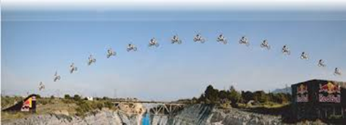

# Activité : Exercices

!!! note "Compétences"

    - Trouver et extraire des informations 

## Exercice 1 :

!!! warning "Consignes"

    Pour chaque situation décrire la trajectoire de l’objet à partir de sa chronophotographie et donner le type de mouvement

{: style="width: 150px"}
 {: style="width: 300px"} 
 {: style="width: 300px"} 
 {: style="width: 300px"}
  {: style="width:300px"}

## Exercice 2 :

!!! warning "Consignes"

    1. Quelle est la vitesse moyenne sur la totalité du trajet ?
    2. Quelle est la vitesse que l’automobiliste ne devait pas dépasser ? Sur quel type de route se trouvait-il ?
    3. La vitesse instantanée de l’automobiliste était-elle toujours supérieure ou inférieure à la limite autorisée ? Justifier.
    4. Après combien de minutes de trajet l’automobiliste a-t-il enclenché son régulateur de vitesse pour maintenir une vitesse constante ?
    5. Dans l’hypothèse où le véhicule suit une ligne droite et sachant que la vitesse est constante : comment qualifie-t-on le mouvement (trajectoire + vitesse)

**Document n°1 : Réglementation de la vitesse sur route en France**

{: style="width: 200px"}

La réglementation peut varier en fonction du type de véhicule. Ici on ne parlera que des véhicules légers (voiture)

**Document n°2 : Evolution de la vitesse en fonction du temps de trajet**

{: style="width: 400px"}

La vitesse moyenne du conducteur sur le trajet est de 88 km/h

## Exercice 3

!!! warning "Consignes"
    1. Déterminer le type de mouvement entre les positions :
        a) A et G
        b) G et I
    2. Dans cette situation, on considérera la vitesse instantanée comme étant la vitesse entre deux positions successives. Justifier que la vitesse instantanée maximale de l’objet est de 0.37 km/s.
    3. L’ouverture du parachute entraîne le freinage de la chute. À quelle position le parachute a-t-il été ouvert ? Justifier.
    4. Calculer la vitesse moyenne en km/s sur la totalité de la chute.
    5. Convertir votre résultat en km/h

Felix Baumgartner a effectué un saut historique en parachute d’une altitude de 39 km contre 3 km pour un saut normal. On considérera Felix Baumgartner comme l’objet d’étude. La chronophotographie ci-contre représente l’objet toutes les 10sec. Le saut a duré environ 4min19 s

## Exercice 4

!!! warning "Consignes"
    1.  Charles est-il immobile ou en mouvement par rapport à Ahmed ? Justifie.
    2.  Charles est-il immobile ou en mouvement par rapport à Boris ? Justifie.
    3.  Complète le tableau en indiquant « en mouvement » ou « immobile »
    4.  Pour pouvoir décider du caractère immobile ou en mouvement d'un objet ou d'un personnage, quelle précision est nécessaire ?

Ahmed et Charles prennent place dans un TGV. Leur ami Boris les a accompagnés jusqu'au quai. Ahmed s'assoit à sa place. Lorsque le train démarre, Charles encore debout, veut voir le plus longtemps possible Boris, qui est immobile par rapport au quai. Charles se déplace alors vers Ahmed en restant dans le même alignement que Boris et son sac.

 | ↗ Voit → |   Boris |  Ahmed  |Charles|
 | -----------| -------| -------| ---------|
  |Boris    |          |         | |
 |  Ahmed         |          |         | |               
 |  Charles        |          |         | |              
