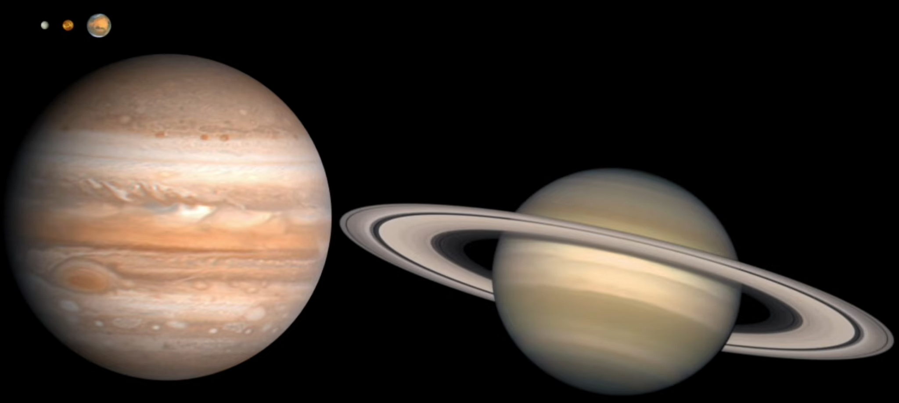
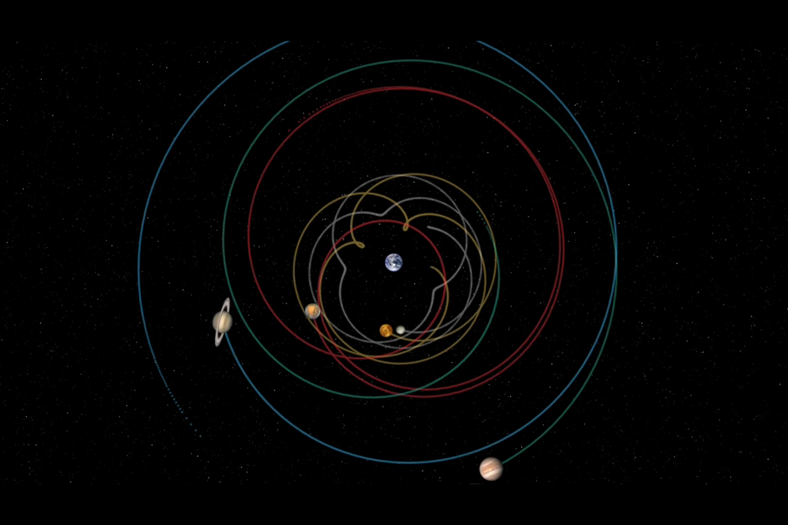
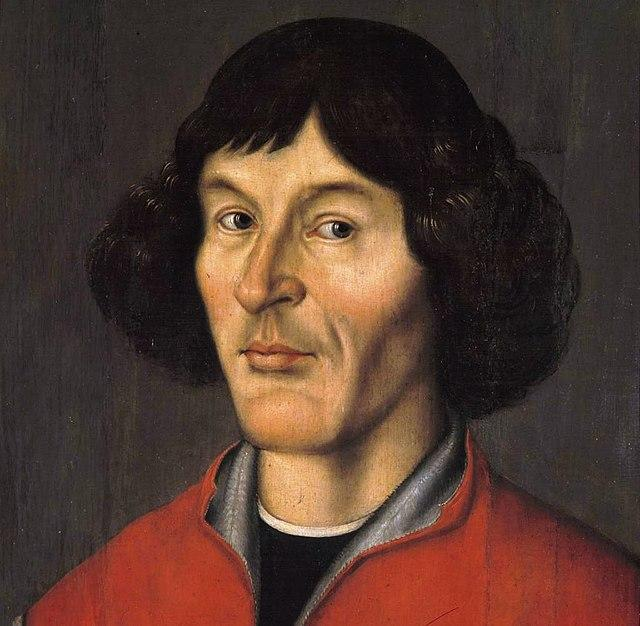
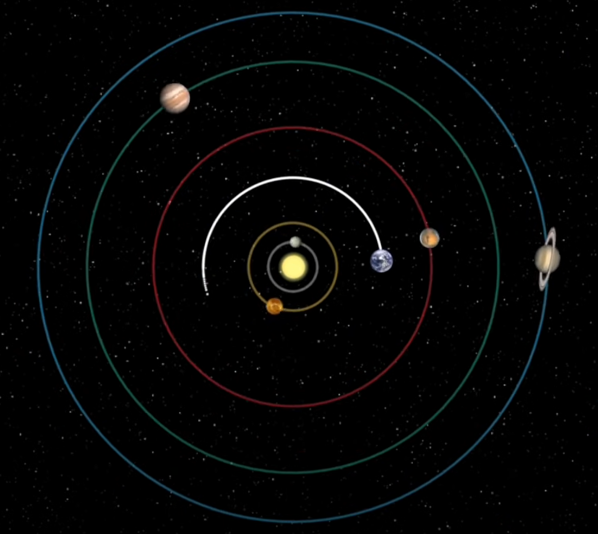
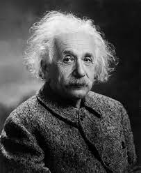

# Activité : Le référentiel

!!! note "Compétences"

    Trouver et exploiter des informations 

!!! warning "Consignes"
    Expliquer en quelques lignes, pourquoi les deux points de vue (Soleil ou Terre au centre) se valent ?

??? bug "Critères de réussite"
    - Avoir décrit le mouvement des astres depuis deux points.
    - Avoir fait le lien avec le terme de référentiel

**Document 1 Les premiers astronomes**

S’intéressant à deux astres en particulier, le Soleil et la Lune, les premiers astronomes se sont facilement rendu compte qu’il se produisait un phénomène cyclique. Pour la Lune par exemple, on peut voir ce qu’on appelle ses phases.

{: style="width: 500px"}

Ces observations cycliques sont considérées alors comme élégantes, jolies. C’est-à-dire que si l’on se positionne sur Terre et qu’on observe le Soleil et la Lune, on obtient deux objets dont la trajectoire est un cercle. Si c’est facile à comprendre ça devient facile et à prédire.

{: style="width: 300px"}

**Document 2 Et les autres astres ?**

En observant les autres astres, les astronomes se sont rendu compte qu’ils ne bougeaient pas les uns par rapport aux autres… sauf certains. Semblant dériver dans le ciel, ces astres ont été nommés « étoiles errantes » qui, en grec, est la traduction de “πλανήτης”, planêtês. Les Grecs de l’époque dénombrent 5 de ces planètes qu’ils ont nommées en référence à leurs dieux : Mercure, Vénus, Mars, Jupiter et Saturne.

En étudiant le mouvement de ces planètes, les astronomes se sont rendu compte que leur mouvement n’était pas circulaire comme le pouvait être celui du Soleil et de la Lune.

**Document 3 Le changement de modèle**

{: style="width: 100px"}

Nicolas Copernic propose de changer de point de vue. En effet, en reprenant les études sur le mouvement de ces 5 planètes, il imagine un système dans lequel ce ne serait pas la Terre au centre, mais le Soleil. Il se rend alors compte que toutes les planètes tournent bien en mouvement circulaire.
Mais il ne publiera ses travaux que lors de ces derniers instants de vie.

**Document 4 Johannes Kepler**

Initialement prêtre pour l’Église, Kepler reprend les travaux de Copernic en les corrigeant légèrement pour augmenter la précision des mesures et les prédictions. Il trouve alors que le modèle héliocentrique (Soleil au centre) fonctionne mieux.

{: style="width: 100px"}

**Document 5 Albert Einstein**

Au XXe siècle, Einstein commence à parler de relativité et affirme que : pour qu’un observateur puisse observer quelque chose, il faut qu’il soit à un endroit duquel il observe. Dit autrement, selon l’endroit où se situe l’observateur, il ne verra pas la même chose.

{: style="width: 100px"}

**Document 6 le référentiel**

Le mouvement d’un objet n’est pas perçu de la même façon selon les observateurs. La vitesse et la trajectoire sont perçues différemment. Le mouvement d’un objet dépend de l’objet de référence qui est appelé référentiel.

Par exemple ; une personne assise dans un bus pourra être perçue comme immobile pour une personne dans le bus, mais comme en mouvement pour une personne qui est à l’extérieur du bus.

