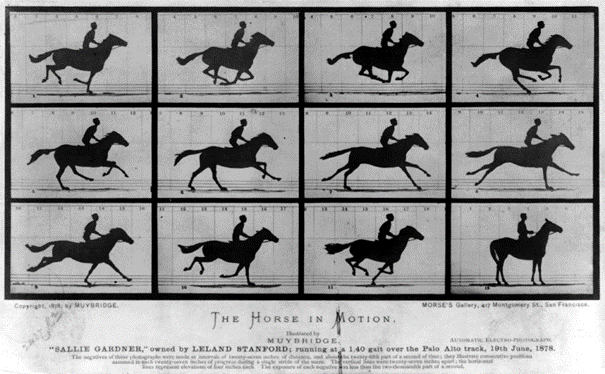
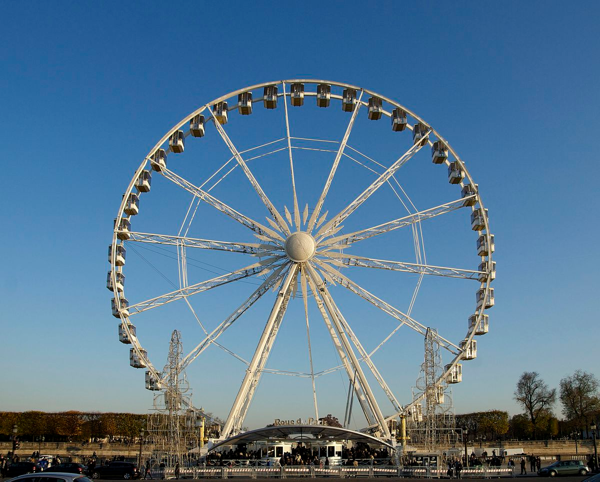
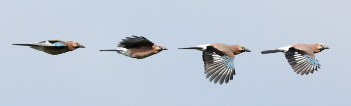
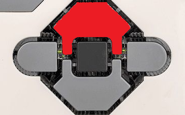
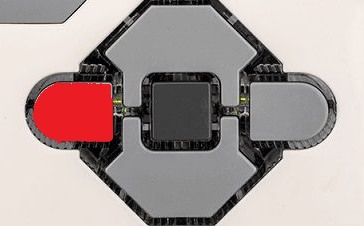
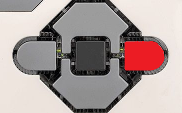
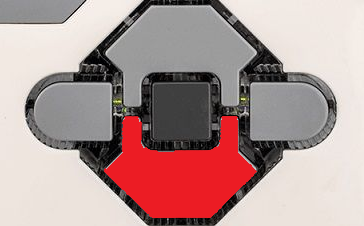

# Activité : Trajectoire et mouvement

!!! note "Compétences"

    Trouver et extraire des informations 

!!! warning "Consignes"

    1. À partir des photographies du document 4, décrire le type de mouvement de ces 3 objets, en vous aidant des informations du tableau.
    2. Le robot a été programmé pour effectuer différents mouvements en fonction du bouton sur lequel on appuie. Pour chaque bouton, indiquer en justifiant le type de mouvement dans le document 5.
    
??? bug "Critères de réussite"
    - 

**Document 1 Trajectoire.**

Définition : ensemble des positions successives occupées par un objet en mouvement au cours du temps

**Document 2 Les types de trajectoire et les types de mouvement.**

Les trajectoires suivies par un objet en mouvement sont des formes géométriques : droite, cercle ou d’autres.
On dira alors que :

- Si la trajectoire est une droite alors le mouvement est rectiligne
- Si la trajectoire est un cercle est un cercle alors le mouvement est circulaire
- Si la trajectoire est une courbe quelconque alors le mouvement est curviligne.

**Document 3 Chronophotographie**

Définition : méthode d’analyse d’un mouvement qui est décomposé par une succession de photographies prises à échelle de temps régulier. Cela permet de connaître la trajectoire suivie par l’objet. 

**Document 4 Exemples d'analyses de mouvement**

<table markdown>

<thead>
<tr>
<th>Objet</th>
<th>Balle de&nbsp;&nbsp;basket</th>
<th>Nacelle d'une grande roue</th>
<th>Oiseau en vol</th>
</tr>
</thead>
<tbody markdown>
<tr markdown>
<td markdown>Chronophotographie</td>
<td markdown>{: style="width: 500px"}</td>
<td markdown>{: style="width: 500px"}</td>
<td markdown>{: style="width: 500px"}</td>

</tr>
  <tr style="height: 200px">
    <td>Dessin de la&nbsp;&nbsp;&nbsp;trajectoire</td>
    <td></td>
    <td></td>
    <td></td>

  </tr>
  <tr>
    <td>Type de&nbsp;&nbsp;trajectoire</td>
    <td></td>
    <td></td>
    <td></td>

  </tr>
  <tr>
    <td>Type de&nbsp;&nbsp;mouvement</td>
    <td></td>
    <td></td>
    <td></td>

  </tr>
</tbody>
</table>

**Document 5 Analyses de mouvement d'un robot**

<table markdown>
<colgroup>
<col style="width: 200px">
<col style="width: 400px">
<col style="width: 400px">
</colgroup>
<thead>
<tr>
<th>Programme</th>
<th>Type de mouvement</th>
<th>Justification</th>
</tr>
</thead>
<tbody markdown>
<tr markdown>
<td markdown>{: style="width: 200px"}</td>
<td></td>
<td></td>
</tr>
<tr markdown>
<td markdown>{: style="width: 200px"}</td>
<td></td>
<td></td>
</tr>
<tr markdown>
<td markdown>{: style="width: 200px"}</td>
<td></td>
<td></td>
</tr>
<tr markdown>
<td markdown>{: style="width: 200px"}</td>
<td></td>
<td></td>
</tr>
</tbody>
</table>

