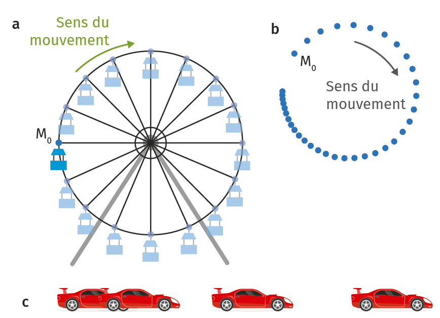

# Activité : Vitesse et mouvement

!!! note "Compétences"

    - Trouver et extraire des informations 
    - utiliser l'outil mathématique
    - argumenter

!!! warning "Consignes"

    1. A partir des photographies du document 3, déterminer le type de mouvement de ces objets.
    2. En utilisant les documents 4,5 et 6, est-ce que l’automobiliste risque une contravention ? Si oui, laquelle ? Justifier votre réponse
    
??? bug "Critères de réussite"
    - avoir trouvé la vitesse maximale autorisée
    - avoir calculé la vitesse de l’automobiliste en m/s
    - avoir converti la vitesse en km/s puis en km/h
    - avoir indiqué si l’automobiliste allait avoir une contravention et si oui laquelle

**Document 1 Les types de trajectoire et les types de mouvement**

Les trajectoires suivies par un objet en mouvement sont des formes géométriques : droite, cercle ou d’autres.
On dira alors que :

- Si la vitesse est constante alors le mouvement est uniforme
- Si la vitesse augmente alors le mouvement est accéléré
- Si la vitesse diminue alors le mouvement est ralenti.

**Document 2 Chronophotographie**

Définition : méthode d’analyse d’un mouvement qui est décomposé par une succession de photographies prises à échelle de temps régulier. La distance entre deux positions consécutives dépend de la vitesse de l’objet. Dans le cas d’un mouvement uniforme (c’est-à-dire avec une vitesse constante), la distance est constante. Si la distance augmente, c’est que la vitesse augmente et si la distance diminue, c’est que la vitesse diminue.

{: style="width:300px;"}

**Document 3 Exemples de chronophotographies**

**Document 4 Vitesse moyenne ou instantanée**

Définition : vitesse que l’objet a sur tout un trajet. Elle correspond au rapport de la distance parcourue par un temps donné.

Ainsi, la vitesse est reliée à la distance et au temps par 

$v= d \div Δt$

avec :

- d : la distance du parcours en mètre (m)
- Δt : la durée du trajet en seconde (s)
- v : la vitesse en mètre par seconde (m/s)

C’est le principe utilisé pour les radars “tronçons”.

La vitesse instantanée est la vitesse d’un objet à un instant donné. La durée du parcours est alors infiniment petite. C’est le principe du radar classique.

**Document 5 Un trajet sur Dijon**

Un automobiliste circule sur la route N274 aux abords de Dijon. Cette route possède un radar tronçon.

Il rencontre un premier radar à 8h05min53s, roule pendant 1,5 km et arrive devant le second radar à 8h06min58s.
Comme pour les radars classiques, les radars tronçon bénéficient d’une marge d’erreur technique de 5 km/h en dessous de 100 km/h sur la vitesse moyenne.

**Document 6 Barème et sanctions en cas d’excès de vitesse (en km/h)**

| v	< 20 | 20 ≤ v < 30 | 30 ≤ v < 40 | 40 ≤ v < 50 | v ≤ 50 |
|-----------|---------------|---------------------------------|---------------------------------|---------------------------------|
| 135 € | 135 € | 135 € | 135 € | 1 500 € |
| 1 point | 2 points | 3 points | 4 points | 6 points |
| | | Suspension de 3 ans du permis | Suspension de 3 ans du permis | Suspension de 3 ans du permis |
| | | | | confiscation du véhicule |

