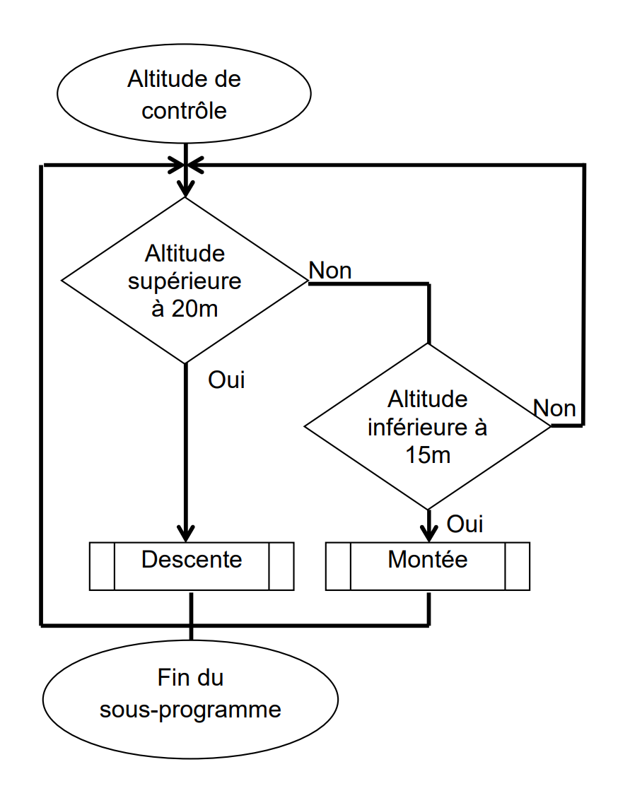
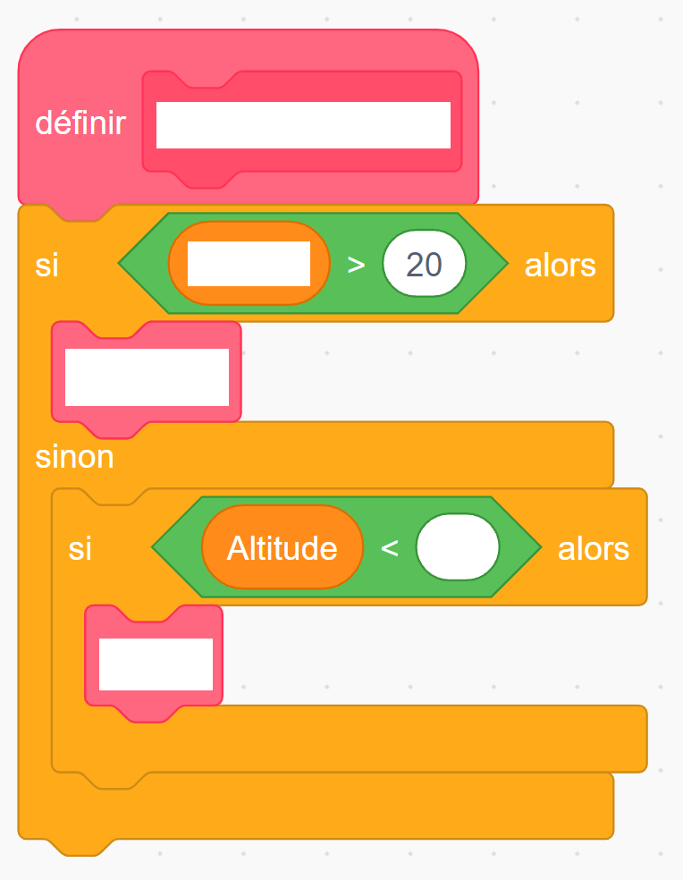

# Activité : Étude d’objets programmés, le cas d'un drone pour l'agriculture

!!! note "Compétences"

    Interpréter 

!!! warning "Consignes"

    1. Expliquer pourquoi l’emploi des drones est un progrès pour l’agriculture.

    2. Sachant que la durée nécessaire d’un vol a été estimée à 1h30 et que la consommation moyenne en vol de l’appareil est de 500mA/h, est-il possible de survoler la totalité du champ sans recharger la batterie ? Justifier.

    3. À l’aide du document 3, compléter le programme du document 5.
    
??? bug "Critères de réussite"
    - 

Document n°1 : Développer l’agriculture de précision
Au mondial des fournisseurs de l’agriculture et de l’élevage, les drones ont une place de choix dans les allées du pôle de l’innovation. Ces petits engins volants vont devenir des alliés précieux pour les agriculteurs qui souhaitent surveiller leurs champs à l’aide de caméras. En effet, pour l’agriculture, le drone permet :
    • de repérer et reconnaître les plantes
    • d’établir avec précision les besoins des plantations (eau, nutriments)
    • de connaître rapidement les dommages sur une parcelle et leurs causes (gibier, dégâts des eaux, sécheresse…)
Ces survols rapides, moins chers et moins polluants que ceux en avion vont permettre d’améliorer les rendements des parcelles et de les protéger contre les aléas environnementaux. À terme, l’objectif est de pouvoir semer et traiter avec une précision qui permettra d’éviter le gaspillage en eau et en nutriment et également de réduire l’impact environnemental des pesticides.

Document n°2 : Programme de survol

Pour l’acquisition optimale des données utiles à l’activité agricole, l’altitude de l’appareil doit être comprise entre 15 et 20 mètres.

Document n°3 : Algorigramme

Document n°4 : Une batterie LiPo

Une batterie LiPo fournit l’énergie nécessaire au fonctionnement des moteurs.

| Type | Lithium Polymère |
|---|---|
| Tension (volt) | 11,1 |
| Réserve de charge électrique (mA) | 1 000 |
| Temps de charge (min) | 90 |

Document 5 : extrait du programme
