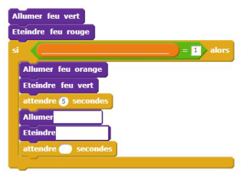
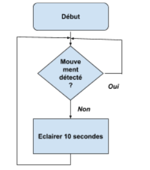
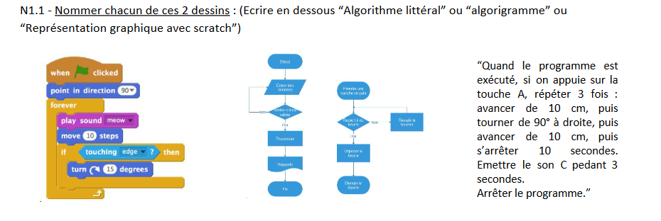
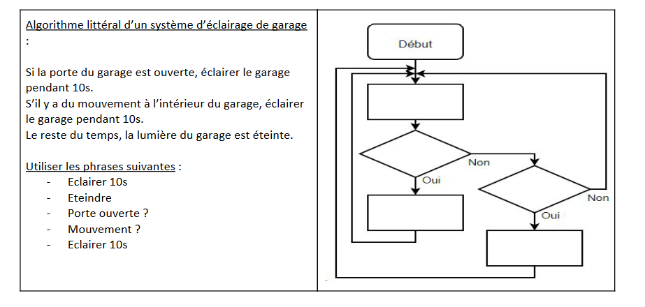
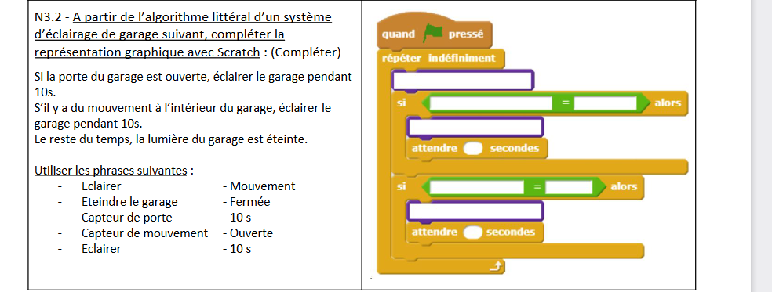

# Activité : Exercices d'entraînement

!!! note "Compétences"

    Interpréter 

!!! warning "Consignes"

    Consigne 1 : 
    
??? bug "Critères de réussite"
    - 

Exercice 1

Consigne 1 : Compléter la programmation en blocs suivant en fonction du besoin et de l’algorithme
Besoin : On souhaite créer un feu de carrefour intelligent avec un appel piéton.
Algorithme : Le feu vert reste tout le temps allumé, si un piéton appuie sur un appel piéton, le feu passe à l’orange 5 secondes, puis rouge pendant 60 secondes. Ensuite, le feu repasse au vert.
Consigne 2 : Que faut-il ajouter pour que cet algorithme fonctionne en permanence ?

Exercice 2

Consigne 1: Quelle est la condition de cet algorigramme ? 

Consigne 2 : Quels sont les 2 cas possibles de la condition ? 

Consigne 3 : Quelle est l’action à réaliser ? 

Consigne 4 : Que se passe-t-il après l’action ? 

Exercice 3 
Consigne : Indiquer pour chacun de ces exemples s'il s'agit d’un algorithme littéral, d’un algorigramme ou d’une programmation en blocs.

Exercice 4
Consigne 1 : Compléter l’algorigramme

Consigne 2 : Compléter la programmation en blocs à l’aide de l'algorithme littéral.
Utiliser les termes suivant : Éclairer, éteindre le garage, 10s, Capteur de porte, Mouvement, Ouverte, Capteur de mouvement, 10 s

Algorithme littéral:
Si la porte du garage est ouverte, éclairer le garage pendant 10s. 
S’il y a du mouvement à l’intérieur du garage, éclairer le garage pendant 10s. 
Le reste du temps, la lumière du garage est éteinte.

Exercice 5
Consigne : Dessiner le parcours d’un robot suivant le programme ci-dessous. Echelle 10 pas = 1 mm.
