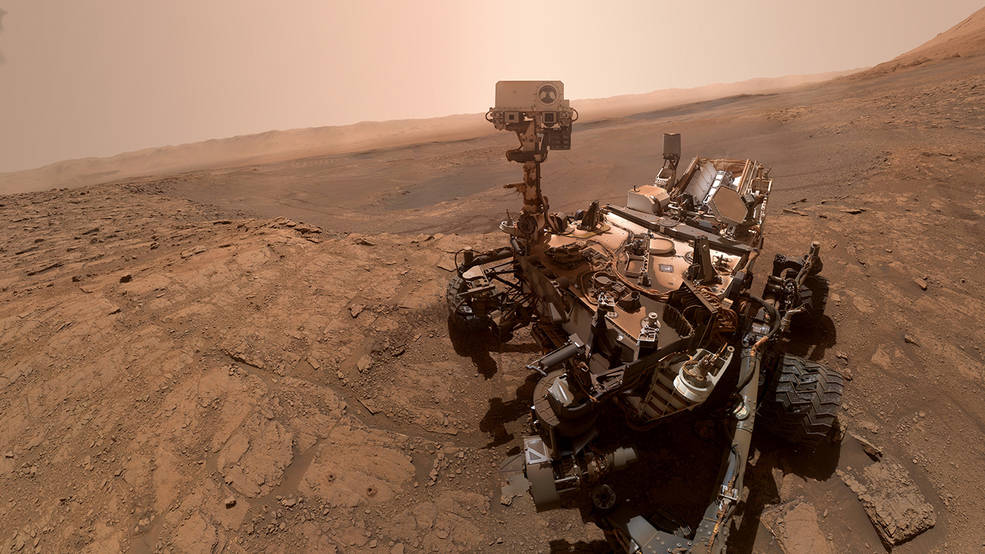
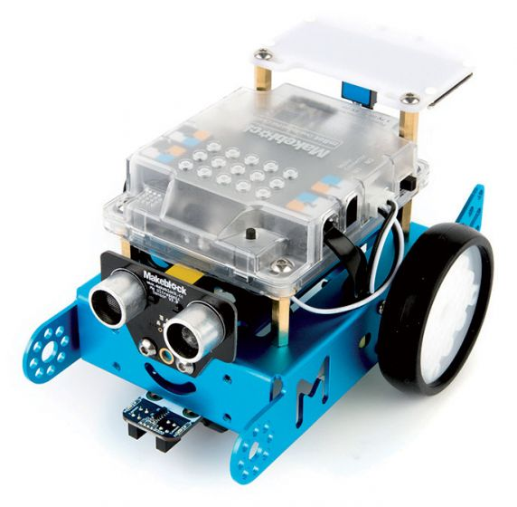

# Activité : Programmer un robot

!!! note "Compétences"

    Interpréter 

!!! warning "Consignes"

    Pour chaque défi du document 5 compléter l’algorigramme correspondant et programmer le robot pour qu’il réalise le défi.
    
??? bug "Critères de réussite"
    - 

En prévision d’un voyage sur Mars, les scientifiques ont développé des engins capables de les aider à explorer cette planète à la recherche de traces de vie microbienne en explorant le sol martien. La mission Mars Science Laboratory (MSL), avec à son bord le rover Curiosity, fut lancée le samedi 26 novembre par une fusée Atlas V depuis Cap Canaveral en Floride et atteignit la surface de Mars le 6 août 2012.

Pour préparer ces missions, des études sont menées en laboratoire. Le robot mBot sert de modèle expérimental.

Document n°1 : Le rover Curiosity
Le rover Curiosity est un vrai laboratoire d’analyse : 900 kg dont 80 uniquement en instruments scientifiques, 3 m de long, 2,7 m de large et 2,1m de haut soit environ les proportions d’une petite voiture.
Il peut se déplacer grâce à six roues (à une vitesse moyenne de l’ordre de quelques dizaines de centimètres par heure) et un générateur d’énergie nucléaire au plutonium. 

Document n°2 : Curiosity sur Mars 

Document n°3 : Les éléments des robots

1. Caméra
2. Capteur
3. Carte électronique
4. Moteur
5. Roues
6. Antenne
7. Générateur 
8. Source d’énergie

Document n°4 : Le robot mBot

dDcument 5  : lister des défis
    1. Au démarrage du robot, faire clignoter 5 fois en rouge puis vert les LED RGB du robot à gauche et à droite. (laisser chaque lumière allumée une seconde)
    2. Faire avancer un robot à 50% de sa vitesse
    3. Faire avancer un robot et s'arrêter devant un obstacle, lorsque la distance est plus petite que 10 cm.
    4. Créer un programme infini qui fait avancer un robot  puis tourner à droite quand il rencontre un obstacle (attention il faudra le laisser tourner pendant 1 seconde, donc attendre une seconde avant de faire autre chose)
    5. Créer un programme infini qui fait suivre une ligne au robot.

défi 1

défi 2

défi 3

défi 4

défi 5
